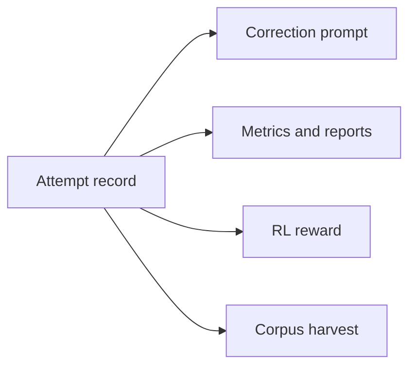
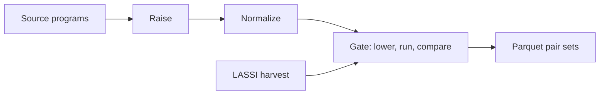

# LASSI Project Bible

Repository mirror of the project bible, master revision 89 (2026-09-24). The owner keeps the master copy; AGENTS.md describes how edits are mirrored. The Local Tooling section is kept outside the repository.

## Purpose And Scope

This document is the authoritative reference for one codebase that reproduces LASSI, reproduces LASSI-EE, and builds LASSI-DF. When code, prompts, or agent behavior conflict with it, this document wins; change the document first, then the code.

| Project | Goal | Source and target | Execution |
| --- | --- | --- | --- |
| LASSI reproduction | Rerun the Dearing et al. 2024 protocol with LLM inference on Furiosa RNGD | OpenMP offload <-> CUDA, 10 HeCBench apps | Compile-only on the RNGD host; NVIDIA A100 for the full reproduction |
| LASSI-EE reproduction | Rerun the energy-aware refactoring pipeline (Dearing et al., arXiv:2505.02184 v3) | CUDA -> CUDA and HIP -> HIP, 22 apps | GPU with power telemetry; MI300X once access is granted |
| LASSI-DF | Transpile between major languages and dataflow accelerators through an MLIR hub, with agents, judges, and optional RL training on the feedback loop | C, C++, C#, Rust, Python, and more <-> Tenstorrent, Cerebras, Furiosa, and more; the project's own dataflow dialect later | Native CPU, ttsim, and the Cerebras simulator; silicon where available |

Non-goals:

- Replacing compilers. Deterministic lowering stays in MLIR passes; the model handles what compilers do not.
- Performance claims from ttsim. The simulator is for correctness only.
- Training on evaluation splits, under any method.

How to use this document:

1. Agents read Agent Rules before any action, then the section that owns their task.
2. The repository mirrors this document, minus Local Tooling, as `docs/BIBLE.md`; `AGENTS.md` at the repo root points to it and restates Agent Rules.
3. Every change to a rule, interface, or default gets a dated Decision Log entry.

## Agent Rules

These rules bind every coding agent and every human contributor; `AGENTS.md` restates them verbatim.

Status tags used throughout this document and the repo:

| Tag | Meaning |
| --- | --- |
| [MEASURED] | From a logged run, with provenance |
| [JUDGED] | From an LLM judge; never presented as a measurement |
| [DESIGN] | Decided here; change only by editing this document and logging why |
| [OPEN] | Unresolved; never pick an answer silently; resolve with a spike and record the result |
| PLACEHOLDER, PROJECTED | Required inside any artifact that shows a value not yet measured |

Hard rules:

1. Never fabricate, relabel, or extrapolate a measurement. Every number carries commit, toolchain pins, device, SDK or driver version, and date.
2. Simulator results name the simulator as the device (ttsim, Cerebras fabric simulator). Never report a simulator result as silicon, and never report simulator timing as performance.
3. Projects are recipes. No project-specific code enters the `lassi/` package; new behavior is a component behind an existing interface.
4. Faithful mode reproduces upstream behavior, quirks included. Fixes are separate named toggles, off in faithful recipes.
5. Evaluation splits are untouchable: no training, prompt tuning, or corpus harvest on eval items, under any method.
6. Model-generated code runs only through the sandbox executor, never directly in a shell.
7. Nothing on the alpha01 root filesystem. Builds, venvs, HF caches, JIT caches, SDK containers, and results live under `/mnt/nvme10/joseph_ufl`; check free space before large runs.
8. Before claiming NPUs, run `furiosa-smi ps`. Never claim npu0 (another tenant). Serve on port 8123 and confirm `/v1/models` returns the expected id. Wait for full process exit before relaunching (EBUSY).
9. Tenstorrent silicon: one placement at a time, never looped device opens (they have taken alpha01's network down twice). RL rewards never execute on silicon; silicon runs are evaluation runs a human starts.
10. Every run records its resolved recipe and toolchain pins. Never upgrade a pinned toolchain mid-run; changing a pin is a Decision Log entry.
11. IR is committed in custom assembly format only, never generic form. Corpus IR is never truncated to fit a limit; split it by function or drop it.
12. No credentials in the repo. API keys come from environment variables.
13. RNGD cards that execute Furiosa target candidates are never the cards serving a model arm.
14. Measured beats judged. A judge never overrides an oracle outcome or a profiler measurement, and judged values carry [JUDGED].
15. Every repository surface follows the Attribution Policy: no reference to any AI vendor, assistant, or coding tool, or to AI assistance in design or implementation, in commits, branch names, docs, comments, PRs, issues, or releases.
16. The repository keeps a vendor-neutral `AGENTS.md` at the root, with nested ones where useful. Vendor-named agent files and tool config directories stay local and uncommitted.

Agent workflow:

- Agents are coding-agent sessions on J's local machines. They reach alpha01 only through `tools/rx.py` and the project gate, since no further SSH keys can be added; J's SSH alias for alpha01 is `ionx`. Tool-specific setup lives in Local Tooling.
- `main` holds `docs/BIBLE.md`, `AGENTS.md`, and the vendor-neutral agent kit. Agent work happens on one feature branch per roadmap phase (for example `p0-core`); a phase branch starts from the previous phase branch while that one awaits merge.
- Agents commit under J's identity, with messages that describe the change and nothing else. They work unattended through the roadmap work order: [OPEN] items and owner reviews go to `plans/OWNER-QUEUE.md` with evidence while work continues on unblocked tasks, and only J merges into `main`.
- Done means: the phase gate passes, the text-policy check passes, results are logged with provenance under `results/`, this document reflects any design change, and every touched [OPEN] item is resolved in writing or carried forward.
- Repository: the local clone is `C:\dev\lassi` on J's Windows machine, and `origin` is `https://github.com/JoeMad21/lassi`, public while development needs it (J's decision) and private once possible. Agents push their branches to `origin` regularly to keep it aligned.

## Source Papers

Both papers come from Dearing, Tao, Wu, Lan, and Taylor (UIC and Argonne). LASSI established the self-correcting translation loop; LASSI-EE added energy feedback, an LLM judge, and multi-trial statistics.

### LASSI

[arXiv:2407.01638](https://arxiv.org/abs/2407.01638), CLUSTER 2024 LLMxHPC workshop. Bidirectional OpenMP target offload <-> CUDA on 10 HeCBench apps across 9 categories, run on an A100.

Pipeline:

1. Compile and run the original source and target-language versions to validate the toolchain and capture reference stdout. Halt on failure.
2. Load language context: the OpenMP 4.0 C/C++ quick reference card (7,290 tokens) or Chapter 5 of the CUDA C++ Programming Guide 12.5 (4,053 tokens).
3. Self-prompt: the LLM summarizes the context, then describes the source code. Both go into the translation prompt.
4. Generate, extract the first fenced block, compile. Compile errors return with the code, compiler command, and stderr. Then execute; runtime errors return the same way. Loop until clean.
5. Store stdout for manual comparison.

Setup: GPT-4 via a private API; Codestral 22B (8-bit), WizardCoder 33B (8-bit), and DeepSeek-Coder-V2 16B (F16) on Ollama; two A100 40 GB. Temperature 0.2, top_p 0.9.

| Direction | Correct output | Within 10% or faster | First try | Sim-T >= 0.6 |
| --- | --- | --- | --- | --- |
| OMP -> CUDA | 80% | 78.1% | 65.6% | 40.6% |
| CUDA -> OMP | 85% | 61.8% | 55.9% | 47.1% |

Per-model successes: WizardCoder 9/10 OMP->CUDA and 10/10 CUDA->OMP; DeepSeek-Coder-V2 7/10 each way.

Fidelity findings that bind the reproduction:

- One generation per scenario (80 total); no variance estimate.
- Correctness was judged by manual stdout inspection.
- DeepSeek's 66x CUDA->OMP atomicCost speedup came from removing atomics, the quantity the benchmark times. Matching stdout missed it.
- Table VI error: the GPT-4 atomicCost row repeats layout's Ratio, Sim-T, and Sim-L. From the listed runtimes the ratio is 43.9190 / 45.8775 = 0.957. Recompute every ratio from raw runtimes.
- The arXiv HTML v2 garbles Table VII Panel A; transcribe from the PDF.

Upstream repo ([SPEAR-UIC/LASSI](https://github.com/SPEAR-UIC/LASSI) at 74b4681, GPL-3.0): `LASSI_pipeline_v0.ipynb`, `prompt_dictionary.py`, and the 20 `*_main` sources. Generated codes are not published.

| Quirk | Effect | Handling |
| --- | --- | --- |
| Uncapped loop; `self_correction_counter <= 7` gates only execution | After 8 corrections a compiling candidate exits unexecuted; metadata can hold stale stdout | Faithful toggle; default cap 10 elsewhere |
| Fence stripping removes a leading `c` after `cpp`/`c++` | A ```cuda block becomes `uda...`, a guaranteed compile error | Faithful toggle; offline replay counts hits |
| `argo_llm` undefined in the public notebook | GPT-4 path cannot run | OpenAI-compatible backend |
| Sim-T tokenizes C/C++ with Python `tokenize` | Odd but reproducible | Keep; add a C-aware Sim-T |
| Ollama unload before each execution | Frees the shared A100 | Only for Ollama arms |
| PASS/FAIL in both languages for 7 of 10 apps; randomAccess CUDA only; none for bsearch, pathfinder | Oracle gaps | Masked stdout diff for gaps |
| entropy includes `reference.h`, absent from the repo | Build fails | Pull from pinned HeCBench |

Compile flags: `nvcc -std=c++14 -Xcompiler -Wall -arch=sm_80 -O3`; `nvc++ -Wall -O3 -Minfo -mp=gpu -gpu=cc80` (NVHPC 2024).

### LASSI-EE

[arXiv:2505.02184 v3](https://arxiv.org/abs/2505.02184). Same-language refactoring for energy on 22 apps (20 HeCBench plus XSBench and miniMDock): CUDA on A100 80 GB, HIP on MI100, Chameleon testbeds.

- Stage 0: power profiling. Stage 1: zero-shot vanilla refactor. Stage 2: context and refactoring plan. Stage 3: iterative refactor with self-correction and energy feedback. Stage 4: select best and write an LLM diff report.
- LLM-as-a-Judge (GPT-4.1) returns VALID or INVALID from source, candidate, and both stdouts on identical inputs, reading PASS/FAIL where present.
- Stopping counter starts at 0.2, adds 0.2 per non-improving iteration, resets on improvement, and doubles as temperature.
- Power sampled every 10 ms via pynvml or `rocm-smi --showpower`; idle subtracted from pre-run and 15 s post-run windows; negative samples clamped.
- n = 30 per app per device, 1,320 trials, about 30 minutes per trial. Generators o4-mini (GPT-5 for miniApps).
- Results: 36.2% (MI100) and 33.9% (A100) mean energy reduction, conditional on passing energy-reducing trials. energy-reduction@k = 29.1%, 48.2%, 54.6% at k = 1, 3, 5, versus 10.5%, 26.3%, 34.6% for the vanilla LLM.
- Caveats: headline averages condition on success; v1 reported 47% across 85% of 20 apps, so cite the version; code and prompts are not released.

## Design Principles

The codebase is built so that no project ever starts anew: LASSI, LASSI-EE, and LASSI-DF differ only in recipes. [DESIGN]

1. Projects are recipes, not code. A recipe picks stages, components, prompts, benchmarks, agents, judges, and a score profile. All code lives in the shared `lassi/` package.
2. One result record. Each attempt produces one structured record that feeds the self-correction prompt, the metrics, the RL reward, and the corpus harvest. The feedback loop and the training signal cannot drift apart.
3. Data is versioned files. Prompts, rubrics, context packs, and benchmark manifests live under `assets/`, are diffable, and never appear as string literals in code.
4. Faithful toggles. Upstream behavior, quirks included, is reproducible by setting `faithful: true`; every fix is a named toggle.
5. Reproducible runs. Every run writes its fully resolved recipe and all toolchain pins into its result directory and can be rerun from that file alone.
6. Deterministic work stays deterministic. Anything a compiler pass or generator can produce exactly (host programs, lowering, emission) is never delegated to the model.
7. Human-readable artifacts first. Machine formats (Parquet) mirror human formats (Markdown, custom-format IR), never replace them.
8. Languages and devices are plugins. A new language is a frontend plus a harness binding; a new device is a target. Neither changes core code.
9. Vendor code stays behind interfaces. Only `frontends/`, `targets/`, `toolchains/`, `executors/`, `profilers/`, and `ir/` adapters may import a vendor SDK.

## Repository Layout

One monorepo holds the shared Python package, the data assets, per-project recipes, and the future dialect. [DESIGN]

```
lassi/                            # monorepo root
  AGENTS.md                       # agent entry point; restates Agent Rules; vendor-neutral
  docs/BIBLE.md                   # mirror of this document minus Local Tooling
  .githooks/                      # commit-msg, pre-commit: run tools/check_text_policy.py
  .github/workflows/text-policy.yml   # required check on every push and pull request
  tools/check_text_policy.py      # reads its pattern list from outside git
  pyproject.toml
  lassi/                          # Python package, shared code only; nested AGENTS.md allowed
    core/        # stage-graph runner, trial state machine, Result record, cache
    llm/         # backends: openai_compat (furiosa-llm, vLLM), ollama, hf_local
    prompts/     # loader and renderer; templates live in assets/
    frontends/   # c, cpp (cgeist, clangir), cuda, fortran (flang), python_tensor
                 # (torch-mlir, stablehlo), python_subset, rust_mir, csharp_roslyn, llvm_import
    targets/     # cpu, tenstorrent (tt-mlir), cerebras (xDSL csl), furiosa (TCL emitter), gpu
    toolchains/  # nvcc, nvcpp, gcc, clang, hipcc, rustc, dotnet, python, cgeist, flang,
                 # mlir_opt, ttmlir, ttmetal_build, xdsl, cslc, furiosa_tcc
    ir/          # level registry; normalize, verify, hub utilities
    executors/   # local, ssh, ttsim, tt_silicon, cerebras_sim, furiosa_silicon, gpu; sandbox
    oracles/     # passfail, stdout_mask, binary_io, pcc
    agents/      # summarizer, planner, generator, fixer, reviewer, adversary
    judges/      # equivalence, efficiency, readability, plan_quality; calibration
    profilers/   # timing, nvml, rocm_smi, furiosa_smi, tt_smi
    scoring/     # score terms and profiles; shared by metrics and rewards
    bench/       # item registry with splits, held-out inputs, references
    corpus/      # build, gate, Parquet schema (absorbs mlir-corpus-pipeline)
    train/       # sft, rft, dpo, grpo, gspo, ppo, adversarial; weights: full, lora, qlora, dora
    analysis/    # pass@k, energy-reduction@k, judge calibration, reports
    cli.py       # lassi run | train | corpus | export | report
  assets/
    prompts/     # lassi-2024/, lassi-ee-2026/, lassi-df-v0/
    rubrics/     # one file per judge rubric, with output schema
    context/     # openmp-4.0-card/, cuda-12.5-ch5/, ttkernel-ods@PIN/, csl@PIN/, tcl@PIN/
    bench/       # suite manifests; sources pinned by commit
    upstream/    # upstream LASSI pin manifest (lassi.yaml), read by tools/fetch_upstream.py
    harness/     # lassi_io bindings: c/, rust/, csharp/, python/; host generators; masking rules
  projects/
    lassi-repro/recipe.yaml
    lassi-ee/recipe.yaml
    lassi-df/recipe.yaml  train.yaml
  dialects/df/                    # future dataflow dialect: ODS, passes, lowerings
  toolchains/                     # one pin file and build script per toolchain
  third_party/                    # upstream LASSI @ 74b4681, fetched by tools/fetch_upstream.py, untracked and untouched
  results/                        # run summaries and provenance manifests only
  tests/
```

Placement rules:

- Raw run trees go to `/mnt/nvme10/joseph_ufl/lassi-runs/`, never into git. `results/` holds summaries and provenance manifests.
- A new language is a frontend plus a harness binding; a new device is a target plus its executor; a new judge is a judge class plus a rubric file. Each adds files and a registry entry, nothing else.
- `third_party/` is read-only. Faithful behavior is re-implemented in `lassi/` and checked against upstream outputs.
- Python 3.10 for the control plane, matching the Furiosa SDK environment. Training uses its own environment (ROCm PyTorch). The dialect is C++17 with CMake against the pinned MLIR. SDK containers (Cerebras) run under Apptainer.
- `lassi/` never imports from `projects/`.

## Component Interfaces

Twelve interfaces carry all project differences; each is a Python Protocol in `lassi/core/interfaces.py`. [DESIGN]

| Interface | Contract | LASSI | LASSI-EE | LASSI-DF |
| --- | --- | --- | --- | --- |
| LLMBackend | messages + sampling -> text + token counts | Ollama, furiosa-llm | API, furiosa-llm | furiosa-llm |
| Frontend | source + flags -> hub-level module tagged `structured` or `low` | None (source level) | None (source level) | cgeist, Flang, torch-mlir, Python subset, Rust MIR, C# Roslyn, LLVM import |
| Target | hub module -> lowered, emitted, built artifact + capabilities | None | None | CPU, Tenstorrent, Cerebras, Furiosa, GPU |
| IRLevel | parse, verify, normalize at one level | Source only | Source only | Hub, ttkernel, csl, df, LLVM IR |
| Toolchain | files -> artifact + parsed diagnostics | nvcc, nvc++ | nvcc, hipcc | tt-mlir, EmitC, tt-metal build, xDSL, cslc, furiosa-tcc, g++ |
| Executor | artifact + inputs + limits -> RunResult | GPU | GPU | ttsim, Cerebras simulator, RNGD, native |
| Oracle | reference vs output -> alignment in [0, 1] | Masked stdout, PASS token | Masked stdout, PASS token | Binary I/O, PCC |
| Profiler | trace during a run | Timing | Power (NVML, rocm-smi) | Timing; power where telemetry exists |
| Agent | role + backend + tools + budget -> attempt or annotation | Summarizer, generator, fixer | Plus planner, reviewer | Plus adversary |
| Judge | candidate + evidence + rubric -> verdict, score, rationale | None | Equivalence | Equivalence, efficiency, readability |
| ScoreProfile | Trial -> components + scalar | Eval metrics | Plus energy term | Plus dataflow and calibrated judge terms |
| Stage | Trial -> Trial | Baseline, summarize, describe, generate, compile loop, run loop | Profile, vanilla, judge, plan, refine loop, select, report | Raise, normalize, generate, verify loop, lower, emit, build loop, run loop |

Contract rules:

- Toolchains return diagnostics parsed into records of (severity, code, file, line, column, message, stage). Raw stderr is kept as an attachment, never consumed downstream.
- Executors enforce limits (wall time, memory, CPU) and return exit status, stdout, stderr, output files, and a hang flag.
- Oracles never trust a program's self-reported PASS as the only signal; the harness owns inputs and comparison.
- Stages are pure over the trial record: read fields, append an attempt or annotation, return. Side effects go through components.
- A component declares its capabilities (for example `emits_warnings`, `supports_power`). Recipes are validated against them at load time.

## Result Record

Every trial is one record; the same record drives correction prompts, metrics, rewards, and corpus harvest. [DESIGN]



The correction prompt renders diagnostics, metrics aggregate trials, the reward reads score components, and harvest takes gated train-split attempts only.

```yaml
Trial:
  trial_id: <project>/<arm>/<bench>/<direction>/<item>/run<NN>
  recipe_hash: sha256 of the resolved recipe
  toolchain_pins: {llvm, polygeist, tt_mlir, tt_metal, ttsim, furiosa_sdk, cuda, nvhpc, rocm}
  provenance: {commit, dirty, device, sdk, date}   # copy of the run manifest, filled by the runner
  bench_item: {suite, item, split, direction}
  model: {backend, id, sampling: {temperature, top_p, max_tokens}}
  context: {knowledge_summary, source_description}
  attempts: [Attempt]
  final: {stage_reached, alignment, score, corrections, wall_s}

Attempt:
  index: 0 for the initial generation, then one per correction
  prompt_ref: {sha256, path}
  response_text: raw model output
  files: {relative_path: text}          # parsed from FILE-tagged blocks
  diff_from_previous: unified diff
  stage_reached: S0 | S1 | S2 | S3 | S4 | S5
  diagnostics: [Diagnostic]
  run: {exit_code, hang, sim_ub, wall_s, stdout_ref, outputs_ref}
  alignment: {per_input: [0..1], mean: 0..1}
  profile: {runtime_s, avg_power_w, energy_j}
  guards: {host_compute, harness_tamper, oracle_access}
  score: {components: {...}, scalar}

Diagnostic:
  stage: parse | verify | lower | compile | jit | run
  severity: error | warning | note
  code, file, line, column, message
```

Storage: one JSON file and one `trial.md` per trial under the run tree, aggregated into Hive-partitioned Parquet per run. Large texts (responses, stdout) are stored once by hash and referenced. The run manifest (`provenance.json` and `run.md`) is authoritative for provenance; each Trial's `provenance` is a copy of it, shown in `trial.md` and the trials table, so a trial read outside its run tree still carries its provenance (Agent Rule 1).

## Project Recipes

Five recipe files define every project; the reference versions below are the starting defaults. [DESIGN]

```yaml
# projects/base.yaml
llm:      {sampling: {temperature: 0.2, top_p: 0.9}}
loop:     {max_corrections: 10}
trials:   {n: 5}
runs_root: /mnt/nvme10/joseph_ufl/lassi-runs
sandbox:  {network: false, wall_s: baseline_x10, mem_gb: 16}
report:   {trial_md: true, parquet: true}
```

```yaml
# projects/lassi-repro/recipe.yaml
extends:  base
faithful: true                  # uncapped loop and fence quirk, as upstream
bench:    {suite: lassi-hecbench-10, split: eval}
directions: [{source: omp, target: cuda}, {source: cuda, target: omp}]
prompts:  lassi-2024
context:  [openmp-4.0-card, cuda-12.5-ch5]
toolchain: {cuda: nvcc-sm80, omp: nvcpp-cc80}
stages:   [baseline, summarize_context, describe_source, generate,
           compile_loop, run_loop, oracle]
executor: {kind: gpu, host: a100}   # tier 1: {kind: none}, compile-only
oracle:   {kind: stdout_mask, passfail: true}
arms:     [gpt-oss-120b, qwen3-coder-30b-a3b-fp8, wizardcoder-33b-fxb,
           llama-3.3-70b, wizardcoder-33b-ollama]
metrics:  [correct, within_10pct, first_try, sim_t, sim_l, self_corr]
```

```yaml
# projects/lassi-ee/recipe.yaml
extends:  base
bench:    {suite: lassi-ee-22, split: eval}
directions: [{source: hip, target: hip}]   # CUDA arm needs an NVIDIA host
prompts:  lassi-ee-2026
context:  [hip-guide-excerpt]
stages:   [profile, vanilla, judge, summarize_context, plan,
           refine_loop, select, compare_report]
executor: {kind: gpu, host: mi300x}
profiler: {kind: rocm_smi, interval_ms: 10, idle_window_s: 15}
oracle:   {kind: llm_judge, passfail: true}
refine:   {counter_start: 0.2, counter_step: 0.2, max_iters: 10}
trials:   {n: 30}
score:    ee
metrics:  [energy_reduction, power_change, runtime_change, energy_reduction_at_k]
```

```yaml
# projects/lassi-df/recipe.yaml
extends:  base
bench:    {suite: tt-pairs-v0, split: eval}
directions: [{source: cpu-mlir, target: ttkernel}, {source: ttkernel, target: cpu-mlir}]
model:    {backend: furiosa, id: registry:qwen3-coder-30b-gspo-lora-r8}   # or a base model
prompts:  lassi-df-v0
context:  [ttkernel-ods@PIN, affine-ods@PIN]
stages:   [raise, normalize, summarize_context, describe_source, generate,
           verify_loop, lower, emit, build_loop, run_loop, oracle, harvest]
executor: {kind: ttsim, arch: wormhole_b0, dispatch: slow}
oracle:   {kind: binary_io, metric: pcc, threshold: from_baseline}
score:    df-v0
```

```yaml
# projects/lassi-df/train.yaml
base_model: Qwen/Qwen3-Coder-30B-A3B-Instruct
method:   gspo            # sft | rft | dpo | grpo | gspo | ppo | adversarial
episode:  single_turn     # single_turn | multi_turn
weights:  lora            # full | lora | qlora | dora
lora:     {r: 8, targets: all-linear}
bench:    {suite: tt-pairs-v0, split: train}
reward:   {profile: df-v0, executor: ttsim, cache: true}
rollout:  {engine: vllm, group_size: 8}
adversary: {kind: llm, model: gpt-oss-120b, trained: false}   # used when method: adversarial
export:   {merge: true, fxb: check_then_build, register_as: qwen3-coder-30b-gspo-lora-r8}
```

```yaml
# agent and judge bindings, valid in any recipe
agents:
  generator: {model: registry:qwen3-coder-30b-gspo-lora-r8}
  fixer:     {model: same_as_generator}
  reviewer:  {model: gpt-oss-120b, enabled: false}
judges:
  equivalence: {model: llama-3.3-70b, rubric: equivalence-v1, use: screen}
  efficiency:  {model: gpt-oss-120b, rubric: efficiency-v1, mode: predict, use: metric}
adversary:   {kind: fuzzer, budget: {inputs: 64}}   # or {kind: llm, model: ...}
```

Notes:

- `faithful: true` overrides `loop.max_corrections` and enables the fence quirk.
- The LASSI-EE recipe runs HIP on MI300X, not MI100. That makes it a port of the paper's HIP arm; results are labeled as such.
- Recipes are validated against component capabilities at load time; a mismatch fails before any model call.

## IR Strategy

In LASSI-DF the model reads and writes MLIR at the level where program semantics live: the hub dialects on the CPU side, ttkernel on Tenstorrent, csl on Cerebras, linalg contractions for Furiosa, and the project's own dataflow dialect later. LLVM IR is a supported level. [DESIGN]

| Level | Dialects | In (raise) | Out (lower) |
| --- | --- | --- | --- |
| source | C, C++, CUDA, HIP, OpenMP | none | Toolchains directly |
| cpu-mlir | affine, scf, memref, arith, math, omp; linalg where recognized | [cgeist (Polygeist)](https://polygeist.llvm.org/), including its CUDA kernel path | lower-affine -> LLVM dialect -> mlir-translate -> clang |
| ttkernel | ttkernel with scf, arith, memref | LASSI TT raiser (new; Clang LibTooling maps Metalium kernel API calls to ttkernel ops) | ttkernel -> emitc -> `ttmlir-translate --mlir-to-cpp` -> tt-metal JIT -> ttsim or silicon |
| llvm-ir | LLVM IR | `clang -emit-llvm`, `mlir-translate --mlir-to-llvmir` | clang or llc -> native |
| df | Project dataflow dialect | Lowered from cpu-mlir, or model output | df -> ttkernel now; df -> CSL and other targets later |

Precedents for the ttkernel output path: tt-mlir's [PyKernel](https://docs.tenstorrent.com/tt-mlir/pykernel.html) builds ttkernel, arith, memref, and scf modules and lowers them through D2M and EmitC to C++; [loom2ttkernel](https://github.com/Victor-Jung/loom2ttkernel) lowers a third-party dataflow IR the same way. No upstream tool raises Metalium C++ into MLIR; the raiser is new work.

The table covers the first LASSI-DF levels. Language Frontends and Device Targets below give the full language and device matrices and define the hub level they share.

### Level Rules

- ClangIR and LLVM-dialect snapshots are not translation material. They represent C++ in IR form, turn Metalium calls into opaque calls, and inflate tokens without adding semantics.
- TT host programs are never model output. The model emits kernel MLIR plus a declarative program spec (core ranges, circular buffers, kernel bindings, compile-time and runtime args, buffers); a generator in `assets/harness/` produces the host program.
- What MLIR buys: parse, verifier, and pass-failure feedback before any compiler runs; canonical form without stylistic noise; deterministic generation of boilerplate; one representation across CPU, Tenstorrent, CSL, and Furiosa.
- What MLIR costs: thin model priors on MLIR and near zero on ttkernel, so fine-tuning is required; higher token counts (measure per kernel); new raiser tooling; two LLVM pins.
- Control arm: every LASSI-DF evaluation includes source-level LASSI on identical pairs. If MLIR does not beat source level after fine-tuning, the MLIR stage shrinks to verification only (the model writes source; the pipeline raises it to check it).

### Dataflow Dialect

The df dialect sits between affine or linalg and the target dialects; switching the model's target from ttkernel to df is a one-line recipe change. [DESIGN]

- Production definition in ODS (TableGen, C++17) against the pinned MLIR, so its passes link with tt-mlir lowerings. IRDL or xDSL prototypes are allowed but are not the source of truth. The ODS definition is exported to IRDL with upstream tblgen-to-irdl so that xDSL can parse df for the Cerebras lowering.
- Every op has a custom assembly format and implements `getAsmResultNames`, so SSA values print as `%cb_in`, `%tile`.
- Verifier messages are written as instructions, because they become model feedback and reward diagnostics.
- Dialect docs are generated from ODS; the same file is human documentation and LLM context.
- Design precedent: MLIR-AIE models tile-to-tile streams as first-class objects (objectFifo).
- [OPEN] Op set, type system, and the first lowering target beyond ttkernel (CSL via the Sandia collaboration is the leading candidate).

### Toolchain Pins

- Polygeist and tt-mlir each pin their own LLVM, and core-dialect textual syntax changes across LLVM versions.
- Either build Polygeist against tt-mlir's LLVM pin, or keep CPU and TT modules separate, each verified by its own toolchain. Never mix pins inside one module.
- tt-mlir, tt-metal, and ttsim are pinned together; emitted kernel C++ must match the tt-metal API version.
- Pin files live in `toolchains/<name>.pin` and record commit, build flags, and install path.
- Before the first build, the runner checks each pinned compiler's `--version` output against its pin's EXPECT_VERSION, inside the compile sandbox, and refuses a mismatch (P0.20; Agent Rule 10).
- CUDA installs from NVIDIA's per-component redistributable archives, each checked against its published sha256, with nothing written outside the scratch disk. The runfile installer is retired because it writes its log to /tmp on the root filesystem (Agent Rule 7); cuda@12.6.3 keeps its version and is reinstalled from the archives; no runfile install runs again (OQ-010). Since P0.19, cuda@12.6.3 holds four archives from redistrib_12.6.3.json (sha256 9c598598457a6463eb92889080c16b2b9dc04150e501b8bfc1536d403ba70aaf): cuda_nvcc 12.6.85, cuda_cudart 12.6.77, cuda_cccl 12.6.77, and cuda_cuobjdump 12.6.77, each with its sha256 in toolchains/cuda.pin [MEASURED 2026-09-23: nvcc V12.6.85, 63 remote tests, and a fixture recapture byte-identical for the 12 byte-stable scenarios from commit 7d8d3d5, rx 20260923-220925-desktop-8r113ei-p0-core-6db9, results/p0-cuda-redist/]. An app that needs another CUDA library or tool adds its archive through a pin change.

## Language Frontends

Every source language enters through a frontend plugin that raises it into the hub level, the shared set of core MLIR dialects every target departs from; C, C++, C#, Rust, and Python are required, and the list stays open. [DESIGN]

Hub level: builtin, func, arith, math, scf, affine, memref, tensor, linalg, plus omp and gpu for explicit parallelism. Both MLIR C++ tools and xDSL parse these dialects, which makes the hub the interchange format between toolchains.

| Language | Path to the hub | Level reached | Status |
| --- | --- | --- | --- |
| C | cgeist (Polygeist) | affine, scf, memref | Available |
| C++ | cgeist for the C-like subset; ClangIR (CIR) otherwise | scf and memref, or CIR | Available, partial |
| CUDA, HIP | cgeist CUDA path (kernels to gpu and scf.parallel) | gpu, scf | Research-grade |
| OpenMP | cgeist | omp, scf | Available |
| Fortran | Flang (FIR, HLFIR), lowered to core dialects | fir, hlfir, then core | Available upstream |
| Python, tensor code | torch-mlir (PyTorch), StableHLO (JAX), Triton | linalg, tensor, tosa, stablehlo | Available |
| Python, scalar and NumPy kernels | LASSI Python-subset frontend (AST to scf and memref, the approach of PyKernel and [PyDSL](https://mlir.llvm.org/users/)); Numba to LLVM IR as a fallback | scf, memref | New work |
| Rust | LASSI MIR frontend on `rustc_public` (stable MIR) for the numeric subset; `rustc --emit=llvm-ir` then `mlir-translate --import-llvm` otherwise | scf and memref, or llvm | New work |
| C# | LASSI Roslyn frontend (semantic model to scf and memref) for the numeric subset; NativeAOT-LLVM (dotnet/runtimelab, WebAssembly-focused) for LLVM IR | scf and memref, or llvm | New work |
| Any LLVM language (Swift, Zig, Julia) | LLVM IR import, then `lift-cf-to-scf` | llvm, cf, some scf | Available, low level |

The Rust project has a 2026 goal to prototype an MLIR backend for rustc ([project goal](https://rust-lang.github.io/rust-project-goals/2026/high-level-ml.html)); the LASSI MIR frontend is replaced if that lands.

### Frontend Rules

- A frontend implements the Frontend interface: source files plus build flags in, a hub-level module out, tagged `structured` (scf, affine, linalg) or `low` (llvm, cf).
- `low` modules are syntax pretraining data and LLVM-level pairs. They become translation pairs for dataflow targets only after raising to `structured`.
- Subset frontends publish their subset: loops over arrays, arithmetic and math intrinsics, and parallel-for constructs (C# `Parallel.For`, Rust rayon `par_iter`, Python `prange` and NumPy vectorized ops). Anything else fails with a readable diagnostic that is counted in corpus statistics.
- Every language needs a native execution path for the oracle, so the harness I/O contract ships bindings per language under `assets/harness/`: a C and C++ header, a Rust crate, a C# class, and a Python module.
- Multi-language suites draw on programs with identical outputs across languages, starting with the Computer Language Benchmarks Game (C, C++, C#, Rust, Python, and more).

## Device Targets

Every device is a target plugin that departs from the hub level and ends in an executable; Tenstorrent, Cerebras, and Furiosa are required, and the list stays open. [DESIGN]

| Target | Kernel-level representation | Dialect host | Emits | Executes on | Status |
| --- | --- | --- | --- | --- | --- |
| CPU | llvm | Upstream MLIR | Native binary | Host | Available |
| Tenstorrent (Wormhole, Blackhole) | ttkernel, with ttmetal, ttnn, ttir, d2m above it | tt-mlir (C++) | Metalium C++ through EmitC | ttsim; silicon | ttsim available; silicon removed |
| Cerebras WSE | csl, csl_wrapper, csl_stencil | xDSL (Python) | CSL source for `cslc` | Cerebras fabric simulator; CS systems | [OPEN] SDK access |
| Furiosa RNGD | TCL kernels (`@tcl.kernel` Python eDSL, `furiosa-tcc`); PyTorch modules inside supported architectures | None public | TCL Python emitted from linalg contraction ops | RNGD silicon only | [OPEN] Public TCL authoring |
| NVIDIA and AMD GPUs | gpu with nvvm or rocdl | Upstream MLIR | PTX or HSACO, or CUDA and HIP source | GPU | Needs hardware |
| Candidates: AMD AIE, NextSilicon, Groq, SambaNova | Vendor-specific (MLIR-AIE for AIE) | Vendor | Vendor | Vendor | Not started |

Target sources:

- Cerebras: xDSL carries the csl, csl_wrapper, and csl_stencil dialects, and [a stencil lowering pipeline to the WSE](https://arxiv.org/pdf/2601.17754) runs on them. The [Cerebras SDK](https://sdk.cerebras.ai/installation-guide) (2.10.0) ships `cslc`, `cs_python`, and the fabric simulator in an Apptainer or Singularity container on x86_64, available on request.
- Furiosa: SDK 2026.3 introduced TCL, a declarative Python eDSL whose kernels treat tensor contractions as first-class primitives and compile to EDF executables ([release notes](https://developer.furiosa.ai/latest/en/whatsnew/release-2026.3.0.html)). Contraction-first kernels map directly onto linalg named and generic contraction ops, which makes linalg the departure level for Furiosa.

### Target Rules

- A target implements the Target interface: accepted input levels, lowering pipeline, emitter, build toolchain, executors, and capability flags (`simulator`, `power_telemetry`, `multi_chip`).
- Target dialects stay where their owners maintain them: tt-mlir for Tenstorrent, xDSL for Cerebras. Toolchains exchange hub-level textual IR, never private objects.
- The df dialect lowers to each target's kernel-level representation. Until df exists, the model targets the kernel-level representation directly.
- A target without a public dialect (Furiosa) gets an emitter from the hub, not a reverse-engineered dialect. If TCL authoring is not public, the fallback is PyTorch modules inside supported architectures, the path J used for the earlier attention patch.
- Targets without a simulator (Furiosa) run candidates on silicon only through the sandbox, on cards never shared with the serving arm.

## Corpus Pipeline

The corpus holds pairs at the levels defined in IR Strategy, and nothing enters a pair set without an execution round trip. [DESIGN]



Every entry, whether raised from source or harvested from a LASSI run, passes the same gate before it becomes training data.

1. Raise: the frontend plugin for the source language (see Language Frontends); the TT raiser for Metalium kernels plus program-spec extraction.
2. Normalize: `canonicalize`, `cse`, `symbol-dce` from user roots; move locations to a sidecar; print in custom assembly format; deduplicate by structural hash.
3. Gate: lower the normalized IR through the target plugin, execute it, and compare outputs with the original program's outputs through the harness I/O contract. Only gated entries become pairs.
4. Record: write Parquet with pair_id, direction, source language, target, source IR, target IR, source text, program spec, oracle I/O hashes, gate status, toolchain pins, and provenance hashes.

### Benchmark Suites

| Suite | Contents | Pairing | Split |
| --- | --- | --- | --- |
| lassi-hecbench-10 | LASSI's 10 apps, OpenMP and CUDA | Natural pairs | Eval only |
| lassi-ee-22 | 20 HeCBench apps, XSBench, miniMDock | Single language | Eval only |
| tt-pairs-v0 Tier A | tt-metal programming examples (loopback, eltwise_binary, eltwise_sfpu, matmul_single_core, matmul_multi_core) with written C++ counterparts; goldens stripped from TT sources | Hand-written | Split by item |
| tt-pairs-v0 Tier B | TurboQuant stages (WHT, PolarQuant, QJL, dequant): baseline Brisc and multi_tile variants, C++ counterparts, NumPy oracle | Hand-written | Eval only |
| hecbench-cpu2tt Tier C | HeCBench OpenMP codes with elementwise or reduction structure | CPU source only; CPU output is the oracle | Split by item |
| csl-pairs-v0 | [Cerebras csl-examples](https://github.com/Cerebras/csl-examples); each `run.py` already computes the expected result on the host | Hand-written | Split by item |
| tcl-pairs-v0 | furiosa-kernels TCL kernels (attention, MoE, RMSNorm, Linear, MLP) paired with PyTorch references | Hand-written | [OPEN] Source availability |
| xlang-v0 | Computer Language Benchmarks Game programs in C, C++, C#, Rust, and Python with identical outputs | Natural cross-language pairs | Split by program |
| d2m-pairs | ttkernel generated by tt-mlir D2M, paired with the upstream CPU lowering of the same op | Compiler-taught | Train |
| ttnn-kernels | tt-metal ttnn operation kernels, raised to ttkernel | Unpaired | Continued pretraining |
| cir-snapshots | mlir-corpus-pipeline v0 output | Unpaired | Syntax pretraining |

Split rules:

- Tier C excludes every app in lassi-hecbench-10 and lassi-ee-22.
- Splits are assigned per item before any training and never change; the bench registry refuses eval items to `lassi train`.
- Tier B stays eval-only because porting the TurboQuant codec is the target application.

### Review Of v0

Reviewed at [JoeMad21/mlir-corpus-pipeline](https://github.com/JoeMad21/mlir-corpus-pipeline) commit 3ccd280. [OPEN] The alpha01 copy may be ahead and gets the same review once agents have access.

| Area | Finding | Action |
| --- | --- | --- |
| Pinned LLVM, manifest with parent-child hashes, exit-code taxonomy, Policy B, Hive Parquet with provenance | Sound | Keep; move into `lassi/corpus/` |
| `--cuda-host-only` | Kernels are dropped; the corpus is host C++ only | Replace the frontend with cgeist for kernels |
| Captured chain (CIR canonicalize, C++ ABI lowering, alloca hoisting, CFG flattening, CIR to LLVM) | Teaches imitation of deterministic passes | Reclassify as syntax pretraining data |
| Standard-library boilerplate dominates modules | Probe needs string heuristics to find user code | Filter in IR: `symbol-dce` from user roots, or keep ops whose `loc` is inside the benchmark tree |
| 2 MB whale truncation | Truncated IR does not parse and teaches broken syntax | Split by function or drop |
| Gate is a cir-opt parse round trip | Proves syntax, not semantics | Execution gate |
| `-Ddfloat=float -Ddlong=int` | Changes program semantics | Record per entry; exclude from pair sets unless built with Makefile values |

## Execution Backends

Tenstorrent code runs on ttsim until silicon returns, CPU code runs natively, and every executor runs generated code inside the sandbox. [DESIGN]

| Executor | Runs | Key settings | Status |
| --- | --- | --- | --- |
| none | Compile only | nvcc and nvc++ cross-compile for sm_80 without a GPU | Available: pinned nvcc 12.6 (cuda@12.6.3) and nvc++ 24.11 (nvhpc@24.11, with NVHPC_CUDA_HOME set to the pinned CUDA) build sm_80 without a GPU [MEASURED 2026-09-23] |
| native | C, C++, Rust, C#, Python; CPU MLIR lowered through LLVM | `g++ -O3 -fopenmp`, `rustc -O`, `dotnet`, `python3` | Available |
| gpu (NVIDIA) | CUDA and nvc++ offload | One exclusive GPU per worker via `CUDA_VISIBLE_DEVICES` | Blocked: no NVIDIA host (OQ-003) |
| gpu (AMD) | HIP on MI300X | Source `rocm_env.sh`; `--offload-arch=gfx942` | Blocked: render group |
| ttsim | TT-Metalium on a virtual Wormhole | `TT_METAL_SIMULATOR=libttsim_wh.so`, `soc_descriptor.yaml` beside it, `TT_METAL_SLOW_DISPATCH_MODE=1`, `TT_METAL_DISABLE_SFPLOADMACRO=1`, single chip | Planned |
| tt_silicon | Wormhole n300 | One placement at a time; human-started evaluation only | Units removed from alpha01 |
| cerebras_sim | CSL on the Cerebras fabric simulator | `cslc` then `cs_python run.py` inside the SDK container under Apptainer | [OPEN] SDK access |
| furiosa_silicon | TCL kernels compiled to EDF on RNGD | Dedicated cards, never the serving arm's; `furiosa-smi ps` first | RNGDs on alpha01 (OQ-001); [OPEN] TCL authoring |

### ttsim Facts

Source: [tenstorrent/ttsim](https://github.com/tenstorrent/ttsim).

- Aims for bit-exact results against silicon and is Tenstorrent's golden ISA reference.
- Stricter than silicon: it reports `UndefinedBehavior` for conditions silicon may tolerate. These are real feedback for the model.
- `UnimplementedFunctionality` and `UnsupportedFunctionality` are simulator gaps, not model errors. The trial stops and is tagged `sim_gap`.
- On Wormhole, every LLK path with `unpack_to_dest=true` fails today ([issue #18](https://github.com/tenstorrent/ttsim/issues/18)); Blackhole passes. Check every reference kernel before it enters a suite.
- Timing and cycle counters are not meaningful. No performance numbers come from ttsim.
- The Brisc watchdog is not documented as modeled. A ttsim pass is provisional until confirmed on silicon.

### Harness Contract

- Programs read inputs and write outputs as binary files through `assets/harness/lassi_io.h`. The harness owns inputs and comparison.
- Reward and evaluation use held-out inputs that never appear in a prompt.
- Multi-file output uses fenced blocks tagged `// FILE: <relative path>`. A missing file is a build error fed back to the model.
- Device kernels compile at first launch, so kernel JIT errors surface during execution; the executor reclassifies them as stage `jit`.
- Timeout per run = reference runtime x 10. A timeout returns a hang diagnostic naming a likely circular-buffer or semaphore deadlock, plus the Watcher dump if Watcher works under ttsim ([OPEN]).
- CPU -> TT guard: the program must create at least one compute kernel, and host loops that write output elements are flagged. Data-movement-only solutions are tagged, not failed.
- CUDA -> OMP proxy without a GPU: build a second binary with `nvc++ -mp=multicore` so target regions run on the host. It checks outputs, never runtime.

### Oracles

| Oracle | Use | Rule |
| --- | --- | --- |
| passfail | HeCBench apps with built-in validators | Read PASS/FAIL, confirmed by stdout_mask |
| stdout_mask | LASSI reproduction | Diff stdout with timing lines masked |
| binary_io | LASSI-DF | PCC plus max-abs and ULP statistics; thresholds per kernel from reference runs; exact match where the CPU side emulates bf16 rounding |
| llm_judge | LASSI-EE | Screening only, never proof of equivalence |

### Sandbox

- A user-namespace container whose processes keep the host uid, no network, limits on memory (cgroup) and wall time, and CPU capped as CPU time through RLIMIT_CPU (`prlimit --cpu`). Sandboxed runs start with `systemd-run --user` through the gate, the mechanism P0.10 measured (plans/spikes/p0-sandbox-verify.md). Root access will not be granted, so a cgroup CPU quota (a root drop-in delegating the cpu controller) and a separate host uid (a newuidmap helper) are out of scope (OQ-011).
- Mechanism on alpha01 (P0.10, lassi/executors/sandbox.py): systemd-run --user --scope with MemoryMax and MemorySwapMax=0, wrapping unshare --mount-proc with user, network, mount, and pid namespaces; a setup script keeps the per-trial directory writable, remounts the listed roots, the harness, the root filesystem, and the cgroup tree read-only, puts private tmpfs mounts on /tmp, /var/tmp, /dev/shm, and /run, and forbids nested user namespaces; the program runs under env -i, nice 19, setpriv with no capabilities, prlimit --cpu for CPU time, and an innermost timeout --kill-after for wall time [MEASURED 2026-09-23: 23 remote tests from commit f57c90a, plans/spikes/p0-sandbox-verify.md]. An outer timeout with RuntimeMaxSec did not enforce wall time (plans/spikes/p0-sandbox.md addenda). Set but not exercised by the tests: TasksMax, a RuntimeMaxSec backstop with TimeoutStopSec=1, and IPC and UTS namespaces. bubblewrap and Apptainer are not installed. The CPU-time cap and the unchanged host uid meet the rule above (OQ-011). P0.16 hardening, all unprivileged [MEASURED 2026-09-23: 46 remote tests from commit 59b5799, rx 20260923-173420-desktop-8r113ei-p0-core-192f, results/p0-sandbox-hardening/provenance.json; probes A to K in plans/spikes/p0-sandbox-hardening.md]: the whole command runs under prlimit --core=1 (the kernel aborts a piped core dump at that limit, and systemd-coredump ignores a limit of 0) and env -i with a constant PATH, and unshare gets --kill-child, so a runner kill ends every sandbox process, outside the window noted below. Setup makes every mount read-only with one recursive mount_setattr call and fails closed unless every writable mount in /proc/self/mountinfo is its own; builds a private /dev (null, zero, full, random, urandom, tty, a new devpts instance, a private shm); hides $HOME, $LASSI_SCRATCH, and the runs root under tmpfs, re-exposing the workdir and, read-only, the harness and $LASSI_TOOLCHAINS; and hides /sys device attributes and every /var entry but tmp. The workdir is an overlay on a size-capped tmpfs (256 MiB by default, at most half the memory limit, also the program's file size limit); setup copies new regular files back to the host after the program's own pid and IPC namespaces end, none when they total more than the cap, and none deeper than 32 levels or with paths over 1024 bytes. The program runs in a new session with a new session keyring, under a seccomp filter that keeps its core limit and refuses changes to other processes' limits, keyring calls, AF_VSOCK sockets, and io_uring. A hang is judged by the program's own run time, not by setup or copy-back time. The sandbox's runner keeps at most 1 MiB of a program's stdout and of its stderr, with truncation flags. Compiles of generated sources run in the same sandbox (P0.20) [MEASURED 2026-09-23: 63 remote tests from commit 1de7db6, rx 20260923-195751-desktop-8r113ei-p0-core-7f98; a fixture recapture from that commit, rx 20260923-200343-desktop-8r113ei-p0-core-bcf2, byte-identical for the 12 byte-stable scenarios; results/p0-compile-hardening/]: the build directory and the pinned toolchains stay visible while $HOME, the scratch root, and the runs root are hidden; the compiler gets only PATH, LANG=C, LC_ALL=C, a private TMPDIR under its build directory, and the variables its pin names; compiles run under prlimit --core=1; and each stream of compiler output is kept whole up to 64 MiB [DESIGN], with a note in stderr when cut. Limits: workdir writes count toward MemoryMax (probe E). Inferred from the code and the kernel source, not measured: paths outside the hidden roots and /var keep host read permissions, a pathname socket there stays reachable when its permissions allow, /proc/keys still lists key metadata, and a kill in the short window before unshare's child arms its parent-death signal can leave that child running. The 256 MiB, 1 MiB, 32-level, and 1024-byte values are design choices [DESIGN].
- Harness mounted read-only; oracle and expected outputs outside the sandbox.
- Per-trial build directory and JIT kernel cache under `/mnt/nvme10/joseph_ufl/lassi-runs/`.

## Model Serving

All pipeline inference runs on Furiosa RNGD through the furiosa-llm OpenAI-compatible server; training and online RL rollouts run on GPUs. [DESIGN]

furiosa-llm 2026.3 compiles EXAONE 4.0, K-EXAONE, GPT-OSS, Llama 3.1 and 3.3, Solar Open, Qwen 2.5, Qwen 3, and Qwen 3 MoE architectures ([supported models](https://developer.furiosa.ai/v2026.3.0/en/furiosa_llm/supported_models.html)). Mistral (Codestral) and DeepSeek-V2 are absent, and GPT-4 is not local, so three of LASSI's four models need substitutes.

| Arm | Model | Role | Source |
| --- | --- | --- | --- |
| A1 | gpt-oss-120b (MXFP4) | Stand-in for GPT-4 | Pre-compiled, SDK >= 2026.3 |
| A2 | Qwen3-Coder-30B-A3B-Instruct-FP8 | Code MoE, analog of DeepSeek-Coder-V2-Lite | Pre-compiled, SDK >= 2026.3 |
| A3 | WizardCoder-33B-V1.1 | Direct overlap with the LASSI paper | `fxb build` as LlamaForCausalLM; fallback Qwen3-32B-FP8 |
| A4 | Llama-3.3-70B-Instruct (BF16) | Dense general model | Pre-compiled |
| B0 | WizardCoder-33B q8_0 | Bridge to the paper's Ollama stack | Ollama on the A100 host |

Pre-compiled bundles: [huggingface.co/furiosa-ai](https://huggingface.co/furiosa-ai). A3 versus B0 separates platform and precision effects from model effects; B0 versus the paper validates the harness.

### Serving Rules

- Create a new venv with furiosa-llm 2026.3.x under `/mnt/nvme10/joseph_ufl`. Keep the 2026.2.1 venv for the stock demo.
- One arm served at a time. Run `furiosa-smi ps` first; skip npu0 and any occupied card.
- Port 8123. Confirm `/v1/models` returns the expected id before the first request.
- Record tp, pp, dp, and `max_model_len` from the serve log into every run's provenance.
- `max_model_len` >= 16384 for the LASSI reproduction (the paper's floor) and >= 32768 for LASSI-DF context packs. A prompt that exceeds it fails the trial; never truncate.
- gpt-oss: enable the reasoning parser so fenced code lands in `content`; fix reasoning effort per arm and record it.
- A3: if `fxb build` fails to accept linear RoPE scaling (factor 4) within one working day, switch to the fallback and log it.

### Model Registry

- `registry:<id>` resolves to an FXB path plus training provenance: base model, method, weight mode, data split hash, reward profile, commit.
- Export path for trained models: merge the adapter, run `fxb check` against the base model's published bundle, and serve with it when the architecture fingerprint matches; run `fxb build` only when it does not. SDK 2026.3 bundles are reusable across fine-tuned variants that share a fingerprint, a feature Furiosa labels experimental ([release notes](https://developer.furiosa.ai/latest/en/whatsnew/release-2026.3.0.html)).
- The base must be a supported architecture.
- [OPEN] FP8 path for fine-tuned BF16 weights, and whether fingerprint reuse holds for LoRA-merged checkpoints in practice.

## Agents And Judges

Agents act in the loop and judges score or screen candidates; both are registered, versioned components that recipes bind to roles, so adding a judge or an adversary never touches core code. [DESIGN]

| Role | Does | Existing instance |
| --- | --- | --- |
| Summarizer | Condenses context packs and source code | LASSI self-prompting |
| Planner | Writes a translation or refactoring plan | LASSI-EE Stage 2 |
| Generator | Produces candidate code or IR | LASSI generation |
| Fixer | Turns diagnostics into a corrected candidate | LASSI self-correction |
| Reviewer | Critiques a candidate before execution | LASSI-EE self-prompted review |
| Judge | Screens or scores a candidate | LASSI-EE equivalence judge |
| Adversary | Searches for inputs or perturbations that break a candidate | New |

Interfaces:

- Agent: role, LLM backend, tools it may call (read the trial record, run a toolchain or executor through the sandbox, append an attempt), versioned prompts, and a budget in tokens and steps.
- Judge: input (candidate, source, artifacts, measurements), rubric (versioned prompt plus output schema under `assets/rubrics/`), output (verdict, score in [0, 1], rationale), and a calibration record.
- Recipes bind roles to models. A judge uses a different model family from the generator in the same trial, and both are recorded.

### Judge Types

| Judge | Output | Checked against |
| --- | --- | --- |
| Equivalence | VALID or INVALID from code and both stdouts (LASSI-EE) | Oracle outcome |
| Efficiency | Predicted energy and power effect of a change, with rationale | Profiler measurements |
| Readability | Rubric score for IR or code | A human-rated sample |
| Plan quality | Whether a plan is likely to improve the candidate | Improvement achieved |

Efficiency judging runs in two modes. Explain mode writes the post-hoc diff report of LASSI-EE Stage 4. Predict mode scores candidates before execution, to prune expensive runs and to cover targets without power telemetry (ttsim, some silicon).

Judge rules:

- Measured beats judged. A judge never overrides an oracle outcome or a profiler measurement.
- A judged value carries the [JUDGED] tag and is never presented as a measurement.
- Calibration: every efficiency prediction is logged against the measurement when one exists. Report sign accuracy and Spearman rank correlation per target.
- A judge enters a reward only after its calibration passes a recorded threshold on held-out measured trials, and only with a bounded weight.
- Comments are stripped from candidates before judging, so a candidate cannot argue its own case.
- Changing a rubric invalidates its calibration.

### Adversarial Setups

1. Adversarial inputs: an adversary (LLM agent or fuzzer) proposes inputs within the program's documented input contract that maximize divergence between source and candidate outputs. Confirmed counterexamples join the held-out input set. Precedent: [Kaizen](https://arxiv.org/pdf/2607.04058) applies metamorphic fuzzing and differential testing to LLM-translated HPC applications.
2. Adversarial review: a critic agent argues that a candidate is not equivalent; a judge adjudicates; execution settles any disagreement it can reach.
3. Adversarial training: the generator and adversary are trained in alternating rounds. The adversary is rewarded only for divergences the oracle confirms, so it cannot win by hallucinating bugs.
4. Judge probing: candidates crafted to fool a judge measure its exploitability; the rate is logged with its calibration.

Adversary rule: inputs that violate the input contract (types, ranges, sizes) are rejected before execution, because a divergence on invalid input is not a bug.

## Training Module

Training is optional and decoupled from inference: `lassi train` produces a registered model, and any recipe can point at it or at a base model. The reward is the LASSI feedback loop, scored by the same ScoreProfile that produces evaluation metrics. [DESIGN]

### Reward Function

The default `df-v0` profile scores the stage reached, then subtracts warnings and adds output alignment; all weights live in YAML.

| Stage | Meaning | Base score |
| --- | --- | --- |
| S0 | No extractable output | -1.0 |
| S1 | Parses | -0.8 |
| S2 | Verifies (MLIR verifier) | -0.6 |
| S3 | Lowers (all passes) | -0.4 |
| S4 | Compiles (host and kernel JIT) | 0.0 |
| S5 | Runs clean: no crash, UB, or hang | +0.2 |

```latex
R = b(s) - 0.02\,\min(W, 10) + 0.8\,A\,\mathbb{1}[s = S5]
```

W is the count of unique warnings after a successful compile, deduplicated by (flag, location). A is the mean per-input alignment in [0, 1] over held-out inputs. A guard violation (host compute, harness tamper, oracle access) sets R = -1. Multi-turn episodes use R_final - 0.05 x corrections. The LASSI-EE profile adds w_e x clip(energy reduction, 0, 1), only when A = 1.

Scoring decisions:

- Error counts are logged, never rewarded. One missing include cascades into dozens of errors, and an `#error` line or truncated file yields exactly one error, outscoring an honest near-miss.
- Warnings count only after a successful compile.
- Alignment with the source means output agreement on held-out inputs, never textual similarity. Similarity rewards copying; most correct LASSI translations were dissimilar to the reference.
- Judge terms (for example predicted efficiency on targets without power telemetry) enter only after passing calibration, with a bounded weight that never exceeds any measured term.
- The profile runs as an evaluation metric on real LASSI trajectories before it is ever used as a reward.

### Algorithms

| Method | Type | Candidates sampled on | Notes |
| --- | --- | --- | --- |
| sft | Offline | None | Gated pairs |
| rft | Offline | RNGD | Rejection-sampling fine-tuning: sample k, keep passing, train, repeat |
| dpo | Offline | RNGD | Same-prompt pairs with a score gap above a margin |
| grpo | Online | GPU (vLLM) | Group-relative advantages, no value model |
| gspo | Online | GPU (vLLM) | Sequence-level importance sampling; default for MoE bases; TRL `importance_sampling_level="sequence"` ([paper index](https://huggingface.co/docs/trl/paper_index)) |
| ppo | Online | GPU | Value model; parity with J's earlier TRL pipeline |
| adversarial | Online, two policies | GPU (vLLM) | Generator and adversary in alternating rounds; the adversary is rewarded only for oracle-confirmed divergences (see Agents And Judges) |

Episodes: `single_turn` rewards the first attempt and is the default. `multi_turn` makes the LASSI correction loop the episode; it is experimental because TRL 1.9.2 has an open report of divergence with multi-turn GRPO, vLLM, and LoRA together ([issue #6688](https://github.com/huggingface/trl/issues/6688)). Multi-turn runs carry an HF-generation control arm.

### Weight Modes

| Mode | Mechanism | Use |
| --- | --- | --- |
| full | FSDP or DeepSpeed ZeRO-3 | Continued pretraining on the MLIR corpus |
| lora | PEFT, all linear layers including MLP and MoE experts | RL (low rank); SFT (compare with full) |
| qlora | 4-bit base plus LoRA | Memory-constrained runs |
| dora and others | PEFT config passthrough | Experiments |

Basis: [LoRA Without Regret](https://thinkingmachines.ai/blog/lora/) finds LoRA matches full fine-tuning for RL even at small ranks, underperforms in pretraining-like large-data regimes, and works best applied to all weight matrices. LoRA needs a much higher learning rate than full fine-tuning.

### Compute

- Online RL updates the policy every step. Even with fingerprint-compatible FXB reuse, RNGD would reload the full weights every step, so online rollouts run on the training GPUs through vLLM (server or colocate mode; TRL applies truncated importance sampling by default).
- Offline methods sample on RNGD between rounds.
- Target: the 8 MI300X on alpha01 once the render-group grant lands. Estimate: full fine-tuning of a 30B model needs about 480 GB for weights, gradients, and Adam state, against 1,536 GB across 8 GPUs.
- TRL with Accelerate and DeepSpeed sits behind the `lassi/train` interface, so verl or OpenRLHF can replace it.
- [OPEN] ROCm builds of TRL and vLLM on gfx942; fallback compute site if the grant stalls.

### Safeguards

- Eval splits are refused by the trainer (Agent Rules 5).
- Reward inputs are held out from every prompt.
- Rewards execute on ttsim or native only, inside the sandbox; never on Tenstorrent silicon.
- The reward cache is keyed on a hash of normalized code, inputs, and toolchain pins; identical candidates are common within GRPO groups.
- Measure reward latency on ttsim first, then size group size and batch to the reward workers.
- Every checkpoint logs per-step reward components, the resolved train recipe, and data split hashes.

## Evaluation Protocol

Every result is reported per arm and direction, with the paper's values alongside, n trials per scenario, and pass@k with Wilson 95% intervals. [DESIGN]

| Project | Metrics | Trials |
| --- | --- | --- |
| LASSI reproduction | Correct output (paper criterion and automated oracle), within 10% or faster, first try, Sim-T >= 0.6, Sim-L, correction distribution, cap hits, fence-quirk replay count, pass@1, pass@3 | n = 5 |
| LASSI-EE | Energy, power, and runtime change (conditional as in the paper, and unconditional), energy-reduction@k at k = 1, 3, 5, judge agreement with PASS/FAIL | n = 30 |
| LASSI-DF | Per source language and target: stage-reached distribution, build and JIT rates, run rate, correct rate, pass@1, pass@3, corrections by class, sim_gap rate, guard flags, MLIR-to-source token ratio, Sim-T and Sim-L where a reference exists | n = 5 |
| Judges and adversaries | Judge sign accuracy and Spearman correlation against measurements, judge exploitability rate, adversary confirmed-divergence rate, invalid-input rejection rate | Per calibration set |

### Acceptance Criteria

LASSI reproduction:

- All 20 baseline programs PASS, and a mock LLM that returns the reference target passes 20/20.
- B0 per-direction pass@1 falls inside the Wilson interval around the paper's WizardCoder counts (9/10 OMP -> CUDA, 10/10 CUDA -> OMP).
- Each headline metric is marked reproduced or reported with its gap, attributed through the B0 versus A3 and A3 versus A1, A2, A4 comparisons.
- The compile-only tier is labeled a compile-stage reproduction and never compared to the paper's correctness numbers.

LASSI-EE:

- Idle-power drift between pre-run and post-run windows is reported for every trial.
- Energy results are reported both conditional (paper-comparable) and unconditional.
- MI300X results are labeled a port of the HIP arm, not a reproduction of MI100 numbers.

LASSI-DF:

- Every reference pair passes the round-trip gate on ttsim before any model runs, and the mock-LLM dry run passes every pair.
- The MLIR arm is compared with the source-level control arm on identical pairs.
- A trained model must beat its base model at pass@1 on the eval split, with a split-hash check proving no eval item was in training data.

### Reporting Rules

- Recompute every ratio from raw runtimes; never copy a paper's table value.
- Manually audit every passing candidate with a runtime ratio above 2 or below 0.5 for semantic drift.
- Label the device on every number; ttsim results never carry performance.
- Unmeasured values in slides or reports carry PLACEHOLDER or PROJECTED inside the artifact.

## Readability Standards

A person must be able to follow any trial, IR file, or config without tooling; machine formats mirror human formats. [DESIGN]

| Artifact | Standard |
| --- | --- |
| MLIR | Custom assembly format only; locations in a sidecar file; `lassi report --view` interleaves each source line with the IR it produced |
| df dialect | Named SSA results via `getAsmResultNames`; verifier messages phrased as instructions |
| Trial | `trial.md` with the trial's provenance, each prompt, each attempt's code, the unified diff from the previous attempt, parsed diagnostics, and the score breakdown |
| Run | `run.md` with the resolved recipe, toolchain pins, per-arm tables, and links to every `trial.md` |
| Config | YAML with a comment on every non-default value; the resolved recipe saved per run |
| Prompts | One template file per prompt under `assets/prompts/<set>/`, readable as plain text |
| Dialect docs | Generated from ODS; the same file serves people and model context |
| Code | Docstrings on every public interface; type hints throughout; no function over about 60 lines without a reason in a comment |

Naming:

- Runs and trials: `<project>/<arm>/<bench>/<direction>/<item>/run<NN>`.
- Arms: model family, size, precision, and training tag, for example `qwen3-coder-30b-a3b-fp8` or `qwen3-coder-30b-gspo-lora-r8`.
- Branches: `p<phase>-<topic>`, for example `p2-ttsim`.
- Text in repo artifacts is plain ASCII.

## Attribution Policy

Repository artifacts carry no reference to any AI vendor, assistant, or coding tool, or to AI assistance in the project's design or implementation. Agent instruction files are the one sanctioned exception, and they stay vendor-neutral. [DESIGN]

| Surface | Rule |
| --- | --- |
| Commit messages | No tool co-author trailers, no "generated with" footers, no session links or session trailers |
| Commit author and committer | The human contributor's identity only; never a bot or tool identity |
| Branch names | `p<phase>-<topic>`; no tool-prefixed branch names |
| READMEs, `docs/`, CHANGELOG, CITATION.cff | No vendor names and no statements about AI assistance |
| Source comments, docstrings, notebook metadata, generated-file headers | Same rule |
| PR titles and bodies, issues, release notes, wiki | Same rule; agents strip tool footers before posting |
| `AGENTS.md` at the root, plus nested `AGENTS.md` per package where useful | Required; operational instructions only; no vendor names; no statements about who or what wrote the code |
| Vendor-named agent files and tool config directories | Never committed; local only (see Local Tooling) |
| `docs/BIBLE.md` | This document minus Local Tooling; no links to the hosted copy |

Subject-matter boundary: the project studies LLMs, so model names, "LLM", "agent", and "judge" as research subjects are allowed. The ban covers authorship and tooling attribution. Adding any vendor-named model as an experimental arm needs a Decision Log entry first.

### Enforcement

1. Local hooks: `.githooks/commit-msg` and `.githooks/pre-commit` run `tools/check_text_policy.py` on the message and on staged text files, and a violation blocks the commit. Every clone runs `git config core.hooksPath .githooks`.
2. CI: `.github/workflows/text-policy.yml` runs the same checker on every push and pull request, over all commit messages in range, changed files, the branch name, and the PR title and body. Branch protection on `main` makes it a required status check. J set it on 2026-09-23 (OQ-007): that day `gh api repos/JoeMad21/lassi/branches/main/protection` listed `text-policy` as the required status check (strict false), with enforce_admins false, no required reviews or push restrictions, and force pushes and deletions refused. Branch protection on a private repository needs a paid or education plan, so recheck it when the repository goes private (OQ-005).
3. Pattern list stays out of git. Hooks read it from `~/.config/lassi/text-policy.txt`; CI reads it from the repository Actions secret `TEXT_POLICY_PATTERNS`, which Actions masks in run logs (an Actions variable until 2026-09-23, when the public repository's run logs were found printing it, OQ-013). Committed scripts contain no vendor strings.
4. Tool-side attribution settings are configured per machine. They are a convenience, not a control; hooks and CI are the control.
5. Before each release tag, `tools/check_text_policy.py --history` scans the full history.

Remediation:

- Unpushed commit: amend or rebase before pushing.
- Pushed feature branch: rewrite the branch (interactive rebase or `git filter-repo`), force-push, and notify collaborators.
- `main`: log a Decision Log entry; rewrite only with J's approval, because it changes published hashes.

Scope: this policy governs the repository and its GitHub surfaces. Papers, theses, and reports follow the AI-use disclosure policy of their venue or institution.

## Environment State

As of the 2026-09-23 check (`rx devcheck`, the gate's read-only inventory, plus `rx doctor`, `df`, and `du`), the eight RNGDs enumerate on alpha01, report status through `furiosa-smi`, and are reachable through the gate; the Wormholes no longer enumerate, the MI300Xs are permission-blocked, and alpha01 has no NVIDIA GPU. Re-verify before relying on any line here. [MEASURED]

| Resource | State on 2026-09-23 | Evidence | Next step |
| --- | --- | --- | --- |
| Furiosa RNGD | 8 cards (npu0-npu7) on alpha01, reachable through the gate: J enabled its rngd class on 2026-09-23 (OQ-001); nothing has run on them yet | rx devcheck at 2026-09-23T11:55:29-07:00: `lspci -d 1ed2:` lists 8 RNGD devices and `furiosa-smi info` lists npu0-npu7 at firmware 2026.3.0; `furiosa-smi ps` listed no processes (rx 20260923-115543-exec-6dba); rx 20260923-123527-exec-4e1b logged all three again at 12:35:27-07:00; `rx doctor` shows devices_enabled rngd true from 12:06:12-07:00; plans/spikes/oq-001-rngd-host.md | Check `rx doctor` before RNGD work (J sets the class; agents never do); Agent Rules 8 and 13 apply |
| Tenstorrent Wormhole | Removed from the cluster | `lspci -d 1e52:` empty; no `/dev/tenstorrent` | Restore request pending; ttsim meanwhile |
| AMD MI300X (8) | Present, unusable | `/dev/kfd` (root:render, crw-rw----) refuses open, and `id -nG` lists only joseph_ufl [rx devcheck 2026-09-23]; `render` is GID 109 (2026-09-22 check) | Deferred by J (OQ-002, 2026-09-23): no developer access to the AMD GPUs yet and no agent action on AMD for now; deferred, not dropped |
| NVIDIA GPU | None on I/ONX; J has no NVIDIA host (OQ-003) | Cluster topology on file; no `nvidia-smi` on alpha01 [rx devcheck 2026-09-23] | Work without it: compile-only tier plus the `-mp=multicore` proxy; the full LASSI reproduction (P10) waits for a host |
| Storage | Root filesystem: 291G available of 1.7T (82% used); `/mnt/nvme10`: 483G available of 3.5T (87% used) [MEASURED 2026-09-23T12:00:27-07:00, rx 20260923-120027-exec-208c]. `/mnt/nvme10/joseph_ufl`: 108G used against J's 120G cap [MEASURED 2026-09-23T12:11:33-07:00, rx 20260923-121133-exec-e28f] | `df -h / /mnt/nvme10` on alpha01 as joseph_ufl (/dev/mapper/ubuntu--vg-ubuntu--lv on /, /dev/nvme23n1p1 on /mnt/nvme10); `du -sh` of `/mnt/nvme10/joseph_ufl` after J removed the CUDA runfile and NVHPC tarball from `$LASSI_SCRATCH/downloads` | `df -h /mnt/nvme10` and `du -sh /mnt/nvme10/joseph_ufl` before every large build; the scratch cap in Host Facts applies; Agent Rule 7 keeps everything off the root filesystem whatever its free space |

### Host Facts

- alpha01 is shared bare metal on I/ONX. SSH alias `ionx`; working root `/mnt/nvme10/joseph_ufl`.
- Scratch cap (J, 2026-09-23): `du -sh /mnt/nvme10/joseph_ufl` stays under 120G as far as agents can manage (J: "attempt to keep"); to save space they may back files up to the workstation, zipped. Agents never delete files there and recommend deletions to J instead; a large folder moves off the host only after J approves its backup to the workstation. The installer downloads under `$LASSI_SCRATCH/downloads` are gone, so a reinstall downloads again and the pin files keep the checksums. This is host policy beside Agent Rule 7, which is unchanged.
- RNGD configuration: 8 cards npu0-npu7, firmware 2026.3.0 [MEASURED 2026-09-23, rx 20260923-123527-exec-4e1b]. Last known SDK venv `/mnt/nvme10/joseph_ufl/furiosa-venv` (Python 3.10, furiosa-llm 2026.2.1), not re-checked. npu0 was held by another tenant; `furiosa-smi ps` listed no processes on 2026-09-23 (rx 20260923-115543-exec-6dba), and Agent Rule 8 still reserves npu0.
- Last known good serving config: Llama-3.1-8B-Instruct @ v2026.2, `-pp 1 -dp 4` on npu4-npu7, port 8123, prefix caching off.
- furiosa-llm pins Hugging Face artifact revisions to its own version tag (2026.2.1 requests v2026.2); models without that tag do not load.
- ROCm lives at `/opt/rocm/core-7.12` (HIP 7.12.60610). Source `/mnt/nvme10/john_ufl/rocm_env.sh` and unset `HIP_PATH` before any build; `/opt/rocm-7.2.0` is partial and unusable.
- Existing assets: a tt-metal checkout at `/mnt/nvme10/joseph_ufl/tt-metal` (used by TurboQuant-Tenstorrent); the v0 MLIR corpus, a ClangIR LLVM build, and CUDA 12.6.3 headers under the corpus pipeline's project root; and a complete CUDA 12.6 toolkit (directory `cuda-12.6.3`, nvcc V12.6.85, not on PATH) at `/mnt/nvme10/joseph_ufl/cuda-12.6.3` [MEASURED 2026-09-23]. Before P0.7 no nvc++ or NVHPC install was found on alpha01 (bounded search, plans/spikes/p0-nvcc.md); P0.7 pinned CUDA 12.6.3 and NVHPC 24.11 under $LASSI_TOOLCHAINS (toolchains/*.pin) [MEASURED 2026-09-23]. Host GCC 12.3.0 (gcc-11 also installed), glibc 2.35; the gate's locale is en_US.UTF-8, so GCC diagnostics carry UTF-8 quotes unless `LC_ALL=C` [MEASURED 2026-09-23].

## Build Roadmap

Seventeen phases, each closed by a gate; P0 through P2, P4, P5, and P12 need no accelerator and start immediately. [DESIGN]

| Phase | Scope | Gate | Blocked by |
| --- | --- | --- | --- |
| P0 Core | Monorepo, AGENTS.md, text-policy hooks and CI check, all twelve interfaces, Result record, recipe loader, openai_compat and ollama backends, sandbox, `trial.md` | Mock LLM runs one HeCBench app end to end, compile-only; the text-policy check blocks a seeded violating commit locally and in CI | None |
| P1 Faithful LASSI | LASSI stages, `lassi-2024` prompts, context packs, faithful toggles, pinned HeCBench, stdout_mask and passfail oracles, Sim-T and Sim-L | Replaying recorded responses reproduces upstream notebook decisions; mock dry run compiles 20/20 | None |
| P2 Scoring | `df-v0` and `lassi` score profiles run as metrics on P1 trajectories | Score components reviewed by J on one full run | None |
| P3 RNGD Serving | Locate RNGDs, furiosa-llm 2026.3 venv, arms A1 to A4, compile-only LASSI matrix | Smoke: 1 app x 2 directions x 1 run per arm | RNGD host (answered 2026-09-23, OQ-001: the cards are on alpha01; the phase Note in plans/STATUS.md records when the blocker is cleared) |
| P4 ttsim Execution | ttsim and native executors, `lassi_io.h`, binary_io oracle, CPU -> TT guard | `metal_example_add_2_integers_in_riscv` passes on ttsim; Tier A references pass | None |
| P5 IR Levels | C and C++ frontends (cgeist), Tenstorrent target, TT raiser, normalize, execution gate; v0 corpus migrated into `lassi/corpus/` | Every Tier A and B reference pair round-trips on ttsim; per-kernel gate rates reported | None |
| P6 DF Zero-Shot | MLIR arm and source control arm on RNGD, n = 5 | Report per Evaluation Protocol | P3 |
| P7 Offline Training | sft, rft, dpo with RNGD sampling; merge, `fxb check`, export | Trained model beats base at pass@1 on the eval split, split hash clean | P3, training GPUs |
| P8 Online Training | grpo and gspo with vLLM rollouts | Same gate as P7 | MI300X access |
| P9 LASSI-EE | EE stages, rocm_smi profiler, equivalence judge on MI300X | LASSI-EE acceptance criteria | MI300X access |
| P10 Full LASSI | GPU execution of the full reproduction matrix | LASSI acceptance criteria | A100 host |
| P11 Dataflow Dialect | df dialect in ODS, IRDL export, lowering to ttkernel, recipe target switch | Tier A pairs round-trip through df | P5 |
| P12 Language Frontends | Python subset, Rust MIR, C# Roslyn, Fortran, LLVM import; harness bindings per language | xlang-v0 programs raise to the hub and round-trip natively in every language | None |
| P13 Cerebras Target | xDSL csl target, cerebras_sim executor, csl-pairs-v0 | csl-examples references pass on the fabric simulator | Cerebras SDK access |
| P14 Furiosa Target | TCL emitter from linalg, furiosa_silicon executor, tcl-pairs-v0 | Reference kernels pass on RNGD | RNGD host (answered 2026-09-23, OQ-001: the cards are on alpha01; the phase Note in plans/STATUS.md records when the blocker is cleared), TCL authoring |
| P15 Judges | Judge interface, equivalence and efficiency judges, rubrics, calibration reports | Efficiency judge calibration reported on MI300X measurements | P9 for measurements |
| P16 Adversarial | Adversary agent and fuzzer, input-contract checks, `adversarial` training method | Adversary finds oracle-confirmed divergences on seeded faulty candidates | P4, P8 for training |

Work order while hardware is blocked: P0, P1, P2, P4, P5 in that sequence, with P12 frontends and P11 design notes in parallel.

## Risks And Questions

Hardware access is the dominant risk; the largest research risk is MLIR failing to beat source-level translation. [OPEN]

| Risk | Impact | Mitigation |
| --- | --- | --- |
| RNGD cards shared on alpha01 (reachable through the gate since 2026-09-23, OQ-001; npu0 belongs to another tenant) | Blocks all RNGD inference (P3, P6, P7) and the Furiosa target (P14) whenever the gate's rngd class is disabled or the cards are occupied | Develop against the mock LLM and a small CPU model through `hf_local` |
| MI300X render group not granted; AMD work deferred by J (OQ-002, 2026-09-23) | Blocks LASSI-EE, online RL, and judge calibration | AMD Developer Cloud credit (about 50 hours on one MI300X) for single-GPU work |
| No NVIDIA host | Blocks the full LASSI reproduction | Compile-only tier plus the `-mp=multicore` proxy until a host is found |
| MLIR does not beat source level | Weakens the LASSI-DF thesis | Source control arm on identical pairs; fall back to MLIR as verification only |
| C#, Rust, and Python-subset frontends are new tooling | Slower multi-language coverage | Publish subsets early; LLVM import covers the rest at the low level |
| TT raiser coverage (templates, macros, constexpr compile-time args) | Smaller TT corpus | Start with Tier A; report per-kernel gate rates |
| Cerebras SDK is request-only | Blocks the Cerebras target | Access pending on J's side (2026-09-23, OQ-004); no agent action |
| TCL authoring may not be public | Furiosa target falls back to PyTorch modules | Ask Furiosa through the forum or support portal |
| Simulator gaps, including the Wormhole unpack_to_dest failure | False negatives in the loop and in rewards | Check references first; `sim_gap` tag stops the trial |
| Simulator-to-silicon gap (Brisc watchdog) | False positives | Silicon check of every ttsim pass once Wormhole returns |
| Reward hacking, including against judges | Inflated training results | Guards, sandbox, held-out inputs, comment stripping, calibration gates, drift audits |
| Adversary produces out-of-contract inputs | False counterexamples | Input-contract check before execution |
| Multi-turn RL numerics in TRL | Unstable training | Single-turn default; HF-generation control arm |
| Toolchain churn (tt-mlir ops, tt-metal API, xDSL csl, TCL) | Breakage mid-project | Joint pins; pin changes only through the Decision Log |
| Scratch cap of 120G on `/mnt/nvme10/joseph_ufl` (108G used on 2026-09-23) | LLVM-scale toolchain builds, the furiosa-llm 2026.3 venv, and model weights for arms A1 to A4 may not fit, and Agent Rule 7 forbids the root filesystem | Measure with `du` before large work; recommend deletions to J; ask J before backing up a large folder |
| Tool attribution settings ignored, or server-side commits that bypass local hooks | Attribution leaks into history | Required CI check under branch protection; history scan before each release tag |

Open questions:

1. Which host holds the RNGDs now, and will they return to alpha01? Answered 2026-09-23 (OQ-001): alpha01 reaches them directly; see Environment State and plans/spikes/oq-001-rngd-host.md.
2. Which A100 host runs the full LASSI reproduction? Answered 2026-09-23 (OQ-003): none; J has no NVIDIA host, so work runs on the compile-only tier plus the `-mp=multicore` proxy, and the full reproduction (P10) stays blocked until a host exists.
3. Local repo path and remote name for the monorepo. Answered 2026-09-23 (OQ-005): see Agent Rules, Agent workflow.
4. Does Watcher work under ttsim?
5. FP8 path for fine-tuned BF16 weights, and whether FXB fingerprint reuse holds for LoRA-merged checkpoints.
6. Do ROCm builds of TRL and vLLM run on gfx942 at the pinned versions?
7. Op set, type system, and first non-Tenstorrent target for the df dialect.
8. Is the alpha01 copy of the corpus pipeline ahead of GitHub commit 3ccd280?
9. Role of the existing xDSL dialect framework beyond hosting the Cerebras dialects.
10. Item-level split assignment for Tier A, Tier C, csl-pairs-v0, and xlang-v0.
11. Is TCL kernel authoring documented for users, and is furiosa-kernels source readable for tcl-pairs-v0?
12. Cerebras SDK access: request directly, or through the Sandia collaboration? 2026-09-23 (OQ-004): J reports access incoming; it is pending on J's side and needs no agent action.
13. Does tblgen-to-irdl cover every df construct that xDSL needs?
14. Calibration threshold for admitting a judge term into a reward.

## Decision Log

Forty-eight decisions have been made: twenty-six on 2026-09-22, twenty on 2026-09-23, and two on 2026-09-24; add new entries at the top, newest first.

| Date | Decision | Rationale |
| --- | --- | --- |
| 2026-09-24 | Pin upstream LASSI with a manifest and a fetch tool instead of a git submodule: assets/upstream/lassi.yaml records url https://github.com/SPEAR-UIC/LASSI, commit 74b46812523f2ff79b53b6880a4521690d7478b0, and path third_party/LASSI; tools/fetch_upstream.py fetches exactly that commit into third_party/LASSI, checks that HEAD is the pin and the tree is clean, refuses and leaves as found a checkout with local changes, a checkout of another repository, or a non-empty directory that is not a checkout, and changes nothing when rerun at the pin. third_party/LASSI/ is gitignored and nothing under third_party/ is tracked | Task P1.1, spike plans/spikes/p1-hecbench-pin.md. A staged gitlink fails the text-policy check of staged paths (the checker reads each staged path as a blob of this repository, and a gitlink names a commit of another repository), and that checker may not be changed to pass a commit; OQ-020 asks the owner whether it should skip gitlinks. The tool follows tools/fetch_bench.py, keeps upstream text out of tracked files (OQ-018), and leaves third_party/ read-only |
| 2026-09-24 | Re-pin HeCBench for lassi-hecbench-10 from 7d2d3c5 to 692cba32c5744f6ef024cca59f65e9488edba8bf. Every model-facing source comes from HeCBench 692cba3 at src/<app>-<omp or cuda>/main.cpp or main.cu, each the same git blob as upstream LASSI's *_main file at 74b4681, with the sha256 of upstream's file in the manifest; entropy's reference.h comes from src/entropy-cuda/ at the same commit | Spike plans/spikes/p1-hecbench-pin.md (task P1.1): 7d2d3c5 (HeCBench master of 2026-09-23) holds 6 of the 20 upstream files byte for byte; 274 HeCBench commits hold all 20, and 692cba3 (authored 2024-08-12) is the newest of them on master's first-parent line, so tools/fetch_bench.py's shallow fetch by id works. Faithful mode needs upstream's bytes (Agent Rule 4). Blob ids are git content hashes read from trees, not measurements; reference.h is the same blob at both commits. P1.2 applies the pin to assets/bench/lassi-hecbench-10.yaml |
| 2026-09-23 | Pin cuda@12.6.3 as four redistributable archives (cuda_nvcc 12.6.85, cuda_cudart 12.6.77, cuda_cccl 12.6.77, cuda_cuobjdump 12.6.77) from redistrib_12.6.3.json, each checked against its sha256 and the manifest against its pinned sha256, installed through a staging prefix and a rename; this replaces the runfile install, whose tree is kept aside for J to remove. The version, PREFIX_NAME, and EXPECT_VERSION are unchanged | OQ-010 option (b), task P0.19. From the clean commit 7d8d3d5 (rx 20260923-220925-desktop-8r113ei-p0-core-6db9): the install check reports V12.6.85, the remote suite passed 63 of 63, the fixture recapture is byte-identical for the 12 byte-stable scenarios with every exit status and diagnostic count unchanged, and no file was written to /tmp or /var/tmp. The prefix shrank from 7.0G (runfile) to about 233 MB (exploratory du) |
| 2026-09-23 | Compiles of generated sources run in the P0.16 sandbox (P0.20): build directory and pinned toolchains visible, $HOME, the scratch root, and the runs root hidden; an allowlisted environment (PATH, LANG=C, LC_ALL=C, a private TMPDIR under the build directory, the pin's variables) with no HOME; prlimit --core=1; the pinned compiler's --version checked against EXPECT_VERSION in the same sandbox before the first build; the runner refuses a TMPDIR outside the scratch root; compiler output kept whole up to 64 MiB per stream, with a note when cut. This replaces the rule that compilers keep all of their output | The P0.11 audit and the P0.16 spike: a generated #include of an absolute host path could copy host files into diagnostics and records, HOME reached compiles, and a compiler crash stored a core on the root filesystem. A review found unbounded compiler output was the one channel past every sandbox limit, hence the cap (over 20000 times the largest compiler stderr seen, exploratory). Acceptance from commit 1de7db6: 63 remote tests (rx 20260923-195751-desktop-8r113ei-p0-core-7f98) and a fixture recapture byte-identical for the 12 byte-stable scenarios (rx 20260923-200343-desktop-8r113ei-p0-core-bcf2) |
| 2026-09-23 | Sandbox hardening (P0.16), all unprivileged: prlimit --core=1 and env -i with a constant PATH around the whole command; unshare --kill-child; one recursive read-only mount_setattr over every mount with a fail-closed mountinfo check; a private /dev; tmpfs hiding $HOME, the scratch root, and the runs root with the workdir, harness, and toolchains re-exposed, and hiding /sys device attributes and /var; a size-capped overlay workdir (256 MiB by default, at most half the memory limit, also the file size limit) with a byte-budgeted copy-back after the program's pid and IPC namespaces end; a new session, session keyring, and seccomp filter for the program (core limit kept; keyring, io_uring, and AF_VSOCK calls refused); hangs judged by the program's own run time; stdout and stderr capped at 1 MiB each in the sandbox's runner | Spike plans/spikes/p0-sandbox-hardening.md, probes A to K (rx 20260923-132632-exec-f112 to 20260923-134411-exec-89f3): per-mount remounts failed on 128 of 263 mounts, while one mount_setattr made all 264 read-only in 0.8 ms; RLIMIT_CORE=1 kept SIGSEGV, SIGABRT, and a fault out of systemd-coredump, which stored a core at --core=0; --kill-child and cgroup.kill each left no process after a process-group kill, where the P0.10 command left 5 running. Acceptance: 46 remote tests from commit 59b5799 (rx 20260923-173420-desktop-8r113ei-p0-core-192f), after three review rounds |
| 2026-09-23 | CI reads the pattern list from the Actions secret TEXT_POLICY_PATTERNS, which Actions masks in run logs, instead of the Actions variable; the workflow's env line reads secrets.TEXT_POLICY_PATTERNS | OQ-013: the public repository's run logs printed the variable on every run (canary run 35921343647). J agreed to the fix and set the secret on 2026-09-23. The variable is deleted after the P0 pull request merges, since main's copy of the workflow reads it until then |
| 2026-09-23 | Scratch cap: `du -sh /mnt/nvme10/joseph_ufl` stays under 120G as far as agents can manage. Agents may back files up to the workstation to save space, never delete files there, recommend deletions to J, and move a large folder off the host only after J approves its backup to the workstation. Agent Rule 7 is unchanged | J, in the session: "You must attempt to keep the memory usage of my account under 120G as per du -sh /mnt/nvme10/joseph_ufl. Back up and zip files back to the local machine if you must to save space. If you are removing large folder, you must ask for my approval to back it up. You may not delete files. You may recommend files for deletion." Measured 118G at 2026-09-23T12:08:02-07:00 (rx 20260923-120802-exec-c07d), then 108G at 2026-09-23T12:11:33-07:00 (rx 20260923-121133-exec-e28f) after J removed the CUDA runfile and NVHPC tarball from $LASSI_SCRATCH/downloads |
| 2026-09-23 | The Furiosa RNGDs are on alpha01: 8 cards, npu0-npu7, with status from `furiosa-smi` on the host. J enabled the gate's rngd class on 2026-09-23, so agents reach the cards through the gate while that class stays enabled; only J sets it. Nothing has run on the cards yet, and Agent Rules 8 and 13 are unchanged | OQ-001: J answered "Alpha01 can directly interface with the Furiosa cards. You can run furiosa-smi on the host and get status." Verified read-only by rx devcheck at 2026-09-23T11:55:29-07:00 and again by rx 20260923-123527-exec-4e1b, `furiosa-smi ps` (rx 20260923-115543-exec-6dba), and `rx doctor` showing rngd true from 12:06:12-07:00. Evidence: plans/spikes/oq-001-rngd-host.md |
| 2026-09-23 | AMD work is deferred, not dropped: the MI300X render group was not granted, agents take no action on AMD for now, and the phases that need MI300X stay blocked | OQ-002: J answered "Developer access on the AMD GPUs isn't happening yet. Don't worry about AMD right now." |
| 2026-09-23 | No NVIDIA host is available: LASSI reproduction work uses the compile-only tier plus the `-mp=multicore` proxy only, and the full reproduction (P10) stays blocked until a host exists | OQ-003: J answered "We currently do not have an Nvidia host, work without it.", which is option (c) |
| 2026-09-23 | Cerebras SDK access is pending on J's side; agents take no action on it until it arrives | OQ-004: J answered "Cerebras access is incoming. Don't worry about it right now." |
| 2026-09-23 | The repository is `C:\dev\lassi` on J's Windows machine; `origin` is github.com/JoeMad21/lassi, public during development and private once possible; agents push to it regularly | OQ-005: J answered "Stick with the repository on Windows. Push to the Github regularly to ensure alignment." and added that public is necessary for development now and private will be used once possible |
| 2026-09-23 | The three 2026-09-22 entries added with the agent kit stand as written: vendor-free attribution wording with the checker canary; remote access through tools/rx.py and the project gate; the unattended work order with stacked phase branches and the owner queue | OQ-006: J answered "Ratify." |
| 2026-09-23 | Text-policy enforcement is in place: the Actions variable TEXT_POLICY_PATTERNS is set, and J protected main with the text-policy check required (strict false, enforce_admins false, force pushes and deletions refused). Agents do not change repository settings; protection on a private repository needs a paid or education plan | OQ-007: J approved protecting main with the check required and set it on 2026-09-23; `gh api repos/JoeMad21/lassi/branches/main/protection` and `gh api repos/JoeMad21/lassi/actions/variables` confirmed both on 2026-09-23 |
| 2026-09-23 | Each Trial carries `provenance: {commit, dirty, device, sdk, date}`, a copy of the run manifest filled by the runner and shown in trial.md and the trials table; the run manifest (provenance.json and run.md) stays authoritative | OQ-008: J chose option (c), "Both"; every artifact that shows a number then carries its provenance (Agent Rule 1). Implementation is a separate task |
| 2026-09-23 | The Environment State Storage row carries the 2026-09-23 measurement (291G available on the root filesystem, 483G on /mnt/nvme10); Agent Rule 7 is unchanged | OQ-009: J answered "Go with the recommendation.", option (a); rx 20260923-120027-exec-208c ran `df -h / /mnt/nvme10` on alpha01 at 2026-09-23T12:00:27-07:00 |
| 2026-09-23 | CUDA installs from NVIDIA's per-component redistributable archives with published sha256 checksums and nothing outside the scratch disk; cuda@12.6.3 keeps its version and is reinstalled that way; no runfile install runs again. The install method and the pin file contents change, not the version; this supersedes the runfile part of the earlier 2026-09-23 CUDA pin entry | OQ-010: J answered "Go with recommendation.", option (b); the runfile installer wrote /tmp/cuda-installer.log on the root filesystem in job 20260923-043820-toolchains-p07-dc38 (Agent Rule 7), and Agent Rule 10 makes a pin change a Decision Log entry |
| 2026-09-23 | A CPU-time cap through RLIMIT_CPU and a user-namespace container that keeps the host uid meet the Sandbox rules; sandboxed runs use systemd-run --user through the gate. Root access will not be granted, so a root-delegated cpu controller and a newuidmap helper for a separate uid are out of scope | OQ-011: J answered "Go with A, I cannot be clear enough about this, you will not get root access." The mechanism is the one measured in P0.10 (plans/spikes/p0-sandbox-verify.md) |
| 2026-09-23 | Sandbox wall time is enforced by an innermost timeout --kill-after inside the namespaces, with RuntimeMaxSec and TimeoutStopSec=1 as a backstop; the sandbox also adds IPC and UTS namespaces, a read-only root filesystem and cgroup tree, a private /run, no capabilities, no nested user namespaces, a clean environment, and nice 19. This supersedes the wall-limit part of the previous sandbox entry; the gaps left go to task P0.16 | Remote tests from commit f57c90a (rx 20260923-073958-desktop-8r113ei-p0-core-6981) passed 23 of 23; the spike addenda measured the outer timeout failing to stop a run and the innermost timeout stopping it. Evidence: plans/spikes/p0-sandbox-verify.md |
| 2026-09-23 | Sandbox on alpha01: systemd-run --user --scope (MemoryMax, MemorySwapMax=0, RuntimeMaxSec) wrapping unshare -rnmpf --mount-proc with read-only remounts except a writable per-trial directory, prlimit --cpu for CPU time, and an outer timeout; the CPU-quota and separate-uid gaps go to OQ-011 | Spike plans/spikes/p0-sandbox.md, 2026-09-23: a connect attempt is blocked inside the namespaces against a connecting baseline, a 256 MiB allocation is killed under a 64M scope, wall limits stop runs, and a harness write fails as read-only; bubblewrap and Apptainer are absent and docker needs group membership |
| 2026-09-23 | Pin CUDA 12.6.3 (runfile, toolkit only) and NVHPC 24.11 (single-CUDA 12.6 tarball) in user space under $LASSI_TOOLCHAINS as cuda@12.6.3 and nvhpc@24.11; nvc++ builds for cc80 with NVHPC_CUDA_HOME set to the pinned CUDA, so the LASSI compile flags stay unchanged | 12.6.3 matches the nvcc measured on alpha01; 24.11 is the 2024 NVHPC release whose bundled CUDA is closest to it, and it postdates the LASSI paper. Evidence: plans/spikes/p0-toolchains-verify.md |
| 2026-09-23 | Executor none is partial on alpha01: nvcc V12.6.85 from the CUDA 12.6.3 toolkit at /mnt/nvme10/joseph_ufl/cuda-12.6.3 builds sm_80 code without a GPU; no nvc++ was found (bounded search), so P0.7 installs NVHPC 2024 under $LASSI_TOOLCHAINS | Spike plans/spikes/p0-nvcc.md measured both on 2026-09-23; the Available status held only for nvcc |
| 2026-09-22 | Agents run the roadmap work order unattended: each session takes the next ready task, and phase branches stack while earlier phases await merge. [OPEN] items and owner reviews go to plans/OWNER-QUEUE.md with evidence while work continues on unblocked tasks; only J merges into main | Owner wants minimal supervision; decisions stay with J without stalling the queue |
| 2026-09-22 | Agents reach alpha01 only through tools/rx.py and a project gate under /mnt/nvme10/joseph_ufl/lassi-gate: a bare repo that accepts refs/wip/*, disposable worktree slots, detached jobs, disk and device policy, an audit log, and an owner STOP file | No further SSH keys can be added; LLVM-scale toolchain builds need job control and disk checks on a shared host |
| 2026-09-22 | Rule 15, the Attribution Policy, and this log state the attribution rule without naming any vendor; the text-policy checker also matches a built-in canary token so the P0 gate can seed a violation without committing vendor strings | The verbatim restatement in AGENTS.md and the docs/BIBLE.md mirror would otherwise fail the check they enforce |
| 2026-09-22 | The repository keeps vendor-neutral `AGENTS.md` files; vendor-named agent files, tool config directories, and the pattern list stay local; this document is mirrored minus Local Tooling | Agents need committed instructions without vendor references |
| 2026-09-22 | No reference to any AI vendor, assistant, or coding tool, or to AI assistance in commits, branches, docs, comments, PRs, issues, or releases; enforced by local hooks and a required CI check | Owner requirement; tool settings alone do not reliably suppress attribution |
| 2026-09-22 | Adversarial setups (inputs, review, two-policy training, judge probing) are supported; adversaries are rewarded only for oracle-confirmed divergences | Enables adversarial training without rewarding hallucinated bugs |
| 2026-09-22 | Agents and judges are registered, versioned components bound to roles by recipes; measured beats judged; judge terms enter rewards only after calibration | Power-efficiency judging and new roles must not require core changes or corrupt measurements |
| 2026-09-22 | Trained models reuse a fingerprint-compatible FXB when `fxb check` passes; `fxb build` only otherwise | SDK 2026.3 bundles are reusable across fine-tuned variants |
| 2026-09-22 | Furiosa target emits TCL from linalg contraction ops; PyTorch modules are the fallback | No public Furiosa dialect; TCL is contraction-first |
| 2026-09-22 | Cerebras target uses the xDSL csl dialects; df reaches xDSL through IRDL export | CSL dialects and the WSE stencil pipeline live in xDSL |
| 2026-09-22 | Every language enters through a frontend plugin into the hub level; C, C++, C#, Rust, and Python are required; every device is a target plugin; Tenstorrent, Cerebras, and Furiosa are required | One corpus must cover all major languages and all target devices |
| 2026-09-22 | RL rewards execute on simulators or native only, never on Tenstorrent silicon | Repeated device opens have taken alpha01's network down twice |
| 2026-09-22 | Online RL runs on GPUs with vLLM rollouts; RNGD samples only for offline methods | RNGD would reload full weights every policy step |
| 2026-09-22 | Weight modes: full, lora, qlora, dora; LoRA for RL, full for continued pretraining | LoRA matches full fine-tuning for RL and underperforms in pretraining-like regimes |
| 2026-09-22 | Algorithms: sft, rft, dpo, grpo, gspo, ppo, adversarial; GSPO default for MoE bases | Offline methods fit RNGD; GSPO stabilizes MoE RL |
| 2026-09-22 | Reward = stage ladder, minus post-compile warnings, plus output alignment on held-out inputs; error counts not rewarded | Error counts cascade and are gameable; similarity rewards copying |
| 2026-09-22 | Training is optional and decoupled from inference | Training is not needed on every LASSI operation |
| 2026-09-22 | Human-readable artifacts first; machine formats mirror them | Readability is a project requirement |
| 2026-09-22 | One monorepo; projects are recipes; one Result record | Reproduce LASSI, LASSI-EE, and LASSI-DF without starting anew |
| 2026-09-22 | Future df dialect defined in ODS, placed between affine or linalg and target dialects | Long-term goal is a dataflow dialect; ODS links with tt-mlir |
| 2026-09-22 | TT host programs come from a declarative spec and a generator, never from the model | Host code is deterministic boilerplate |
| 2026-09-22 | LASSI-DF trains and infers on MLIR at the semantic level; LLVM IR is a supported level; ClangIR snapshots become syntax pretraining data | CIR and LLVM dialect add tokens, not semantics |
| 2026-09-22 | Every LASSI-DF evaluation includes a source-level control arm | MLIR must prove it helps |
| 2026-09-22 | ttsim is the Tenstorrent executor until silicon returns | No Wormhole on alpha01; ttsim needs no silicon |
| 2026-09-22 | Full LASSI reproduction requires an NVIDIA GPU; a compile-only tier runs first; code comparison is rejected as a correctness check | Similarity rejects most correct translations and accepts wrong ones |
| 2026-09-22 | Reproduce LASSI with inference on RNGD; substitute models A1 to A4 plus the Ollama bridge B0; n = 5 trials | furiosa-llm lacks Mistral and DeepSeek-V2; the paper ran one trial per scenario |

## References

Sources opened while writing this document.

Papers:

- [LASSI, arXiv:2407.01638](https://arxiv.org/abs/2407.01638)
- [LASSI-EE, arXiv:2505.02184 v3](https://arxiv.org/abs/2505.02184)
- [An MLIR Lowering Pipeline for Stencils at Wafer-Scale, arXiv:2601.17754](https://arxiv.org/pdf/2601.17754)
- [Kaizen, arXiv:2607.04058](https://arxiv.org/pdf/2607.04058)
- [LoRA Without Regret](https://thinkingmachines.ai/blog/lora/)

Repositories:

- [SPEAR-UIC/LASSI](https://github.com/SPEAR-UIC/LASSI) (commit 74b4681)
- [JoeMad21/mlir-corpus-pipeline](https://github.com/JoeMad21/mlir-corpus-pipeline) (commit 3ccd280)
- [JoeMad21/TurboQuant-Tenstorrent](https://github.com/JoeMad21/TurboQuant-Tenstorrent)
- [tenstorrent/ttsim](https://github.com/tenstorrent/ttsim) and [issue #18](https://github.com/tenstorrent/ttsim/issues/18)
- [Victor-Jung/loom2ttkernel](https://github.com/Victor-Jung/loom2ttkernel)
- [Cerebras/csl-examples](https://github.com/Cerebras/csl-examples)

Documentation:

- [Furiosa-LLM supported models, 2026.3](https://developer.furiosa.ai/v2026.3.0/en/furiosa_llm/supported_models.html)
- [Furiosa SDK 2026.3 release notes (TCL, FXB)](https://developer.furiosa.ai/latest/en/whatsnew/release-2026.3.0.html)
- [FuriosaAI pre-compiled models](https://huggingface.co/furiosa-ai)
- [Cerebras SDK installation guide](https://sdk.cerebras.ai/installation-guide)
- [tt-mlir PyKernel](https://docs.tenstorrent.com/tt-mlir/pykernel.html)
- [tt-mlir ttmlir-translate](https://docs.tenstorrent.com/tt-mlir/ttmlir-translate.html)
- [Polygeist](https://polygeist.llvm.org/)
- [Users of MLIR (PyDSL, Pylir, Flang, Numba-MLIR)](https://mlir.llvm.org/users/)
- [Rust 2026 project goal: MLIR backend for rustc](https://rust-lang.github.io/rust-project-goals/2026/high-level-ml.html)
- [TRL GRPO Trainer](https://huggingface.co/docs/trl/grpo_trainer) and [TRL paper index (GSPO)](https://huggingface.co/docs/trl/paper_index)
- [TRL issue #6688](https://github.com/huggingface/trl/issues/6688)
