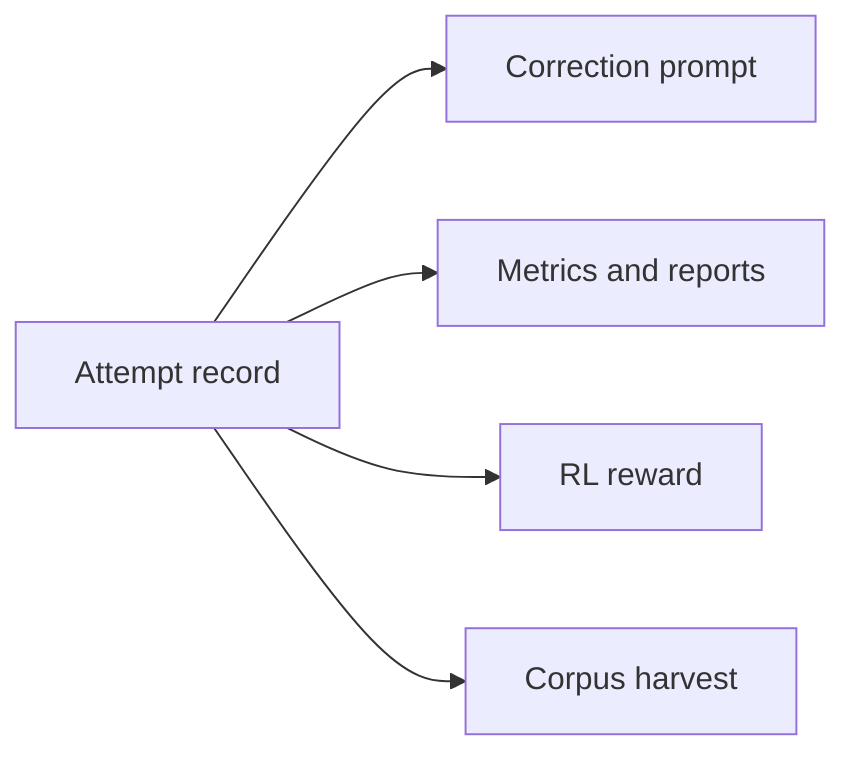
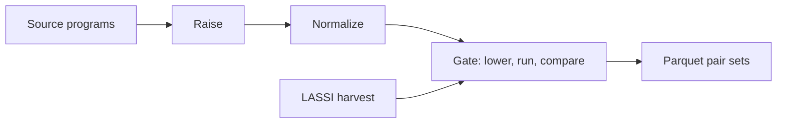

# LASSI Project Bible

Repository mirror of the project bible, master revision 231 (2026-09-26). The owner keeps the master copy; AGENTS.md describes how edits are mirrored. The Local Tooling section is kept outside the repository.

## Purpose And Scope

This document is the authoritative reference for one codebase that reproduces LASSI, reproduces LASSI-EE, and builds LASSI-DF. When code, prompts, or agent behavior conflict with it, this document wins; change the document first, then the code.

| Project | Goal | Source and target | Execution |
| --- | --- | --- | --- |
| LASSI reproduction | Rerun the Dearing et al. 2024 protocol with LLM inference on Furiosa RNGD | OpenMP offload <-> CUDA, 10 HeCBench apps | Compile-only on the RNGD host; NVIDIA A100 for the full reproduction |
| LASSI-EE reproduction | Rerun the energy-aware refactoring pipeline (Dearing et al., arXiv:2505.02184 v3) | CUDA -> CUDA and HIP -> HIP, 22 apps | GPU with power telemetry; MI300X once access is granted |
| LASSI-DF | Transpile between major languages and dataflow accelerators through an MLIR hub, with agents, judges, and optional RL training on the feedback loop | C, C++, C#, Rust, Python, and more <-> Tenstorrent, Cerebras, Furiosa, and more; the project's own dataflow dialect later | Native CPU, ttsim, and the Cerebras simulator; silicon where available |

Non-goals:

- Replacing compilers. Deterministic lowering stays in MLIR passes; the model handles what compilers do not.
- Performance claims from ttsim. The simulator is for correctness only.
- Training on evaluation splits, under any method.

How to use this document:

1. Agents read Agent Rules before any action, then the section that owns their task.
2. The repository mirrors this document, minus Local Tooling, as `docs/BIBLE.md`; `AGENTS.md` at the repo root points to it and restates Agent Rules.
3. Every change to a rule, interface, or default gets a dated Decision Log entry.

## Agent Rules

These rules bind every coding agent and every human contributor; `AGENTS.md` restates them verbatim.

Status tags used throughout this document and the repo:

| Tag | Meaning |
| --- | --- |
| [MEASURED] | From a logged run, with provenance |
| [JUDGED] | From an LLM judge; never presented as a measurement |
| [DESIGN] | Decided here; change only by editing this document and logging why |
| [OPEN] | Unresolved; never pick an answer silently; resolve with a spike and record the result |
| PLACEHOLDER, PROJECTED | Required inside any artifact that shows a value not yet measured |

Hard rules:

1. Never fabricate, relabel, or extrapolate a measurement. Every number carries commit, toolchain pins, device, SDK or driver version, and date.
2. Simulator results name the simulator as the device (ttsim, Cerebras fabric simulator). Never report a simulator result as silicon, and never report simulator timing as performance.
3. Projects are recipes. No project-specific code enters the `lassi/` package; new behavior is a component behind an existing interface.
4. Faithful mode reproduces upstream behavior, quirks included. Fixes are separate named toggles, off in faithful recipes.
5. Evaluation splits are untouchable: no training, prompt tuning, or corpus harvest on eval items, under any method.
6. Model-generated code runs only through the sandbox executor, never directly in a shell.
7. Nothing on the alpha01 root filesystem. Builds, venvs, HF caches, JIT caches, SDK containers, and results live under `/mnt/nvme10/joseph_ufl`; check free space before large runs.
8. Before claiming NPUs, run `furiosa-smi ps` and `furiosa-smi status`, and claim only a card whose memory reads 0.00 GiB in `furiosa-smi status` (`furiosa-smi ps` lists only the caller's own processes). Never claim npu0 (another tenant). Serve on port 8123 and confirm `/v1/models` returns the expected id. Wait for full process exit before relaunching (EBUSY).
9. Tenstorrent silicon: one placement at a time, never looped device opens (they have taken alpha01's network down twice). RL rewards never execute on silicon; silicon runs are evaluation runs a human starts.
10. Every run records its resolved recipe and toolchain pins. Never upgrade a pinned toolchain mid-run; changing a pin is a Decision Log entry.
11. IR is committed in custom assembly format only, never generic form. Corpus IR is never truncated to fit a limit; split it by function or drop it.
12. No credentials in the repo. API keys come from environment variables.
13. RNGD cards that execute Furiosa target candidates are never the cards serving a model arm.
14. Measured beats judged. A judge never overrides an oracle outcome or a profiler measurement, and judged values carry [JUDGED].
15. Every repository surface follows the Attribution Policy: no reference to any AI vendor, assistant, or coding tool, or to AI assistance in design or implementation, in commits, branch names, docs, comments, PRs, issues, or releases.
16. The repository keeps a vendor-neutral `AGENTS.md` at the root, with nested ones where useful. Vendor-named agent files and tool config directories stay local and uncommitted.

Agent workflow:

- Agents are coding-agent sessions on J's local machines. They reach alpha01 only through `tools/rx.py` and the project gate, since no further SSH keys can be added; J's SSH alias for alpha01 is `ionx`. Tool-specific setup lives in Local Tooling.
- `main` holds `docs/BIBLE.md`, `AGENTS.md`, and the vendor-neutral agent kit. Agent work happens on one feature branch per roadmap phase (for example `p0-core`); a phase branch starts from the previous phase branch while that one awaits merge.
- Agents commit under J's identity, with messages that describe the change and nothing else. They work unattended through the roadmap work order: [OPEN] items and owner reviews go to `plans/OWNER-QUEUE.md` with evidence while work continues on unblocked tasks, and only J merges into `main`.
- Done means: the phase gate passes, the text-policy check passes, results are logged with provenance under `results/`, this document reflects any design change, and every touched [OPEN] item is resolved in writing or carried forward.
- Repository: the local clone is `C:\dev\lassi` on J's Windows machine, and `origin` is `https://github.com/JoeMad21/lassi`, public while development needs it (J's decision) and private once possible. Agents push their branches to `origin` regularly to keep it aligned.

## Source Papers

Both papers come from Dearing, Tao, Wu, Lan, and Taylor (UIC and Argonne). LASSI established the self-correcting translation loop; LASSI-EE added energy feedback, an LLM judge, and multi-trial statistics.

### LASSI

[arXiv:2407.01638](https://arxiv.org/abs/2407.01638), CLUSTER 2024 LLMxHPC workshop. Bidirectional OpenMP target offload <-> CUDA on 10 HeCBench apps across 9 categories, run on an A100.

Pipeline:

1. Compile and run the original source and target-language versions to validate the toolchain and capture reference stdout. Halt on failure. The pinned notebook builds and runs only the target-language version, before its first model call; faithful mode follows it, and the fix baseline_both builds and runs both (task P1.5). The baseline stage declares builds_references; the runner refuses a recipe that lists it after any stage that asks the model.
2. Load language context: the OpenMP 4.0 C/C++ quick reference card (7,290 tokens) or Chapter 5 of the CUDA C++ Programming Guide 12.5 (4,053 tokens).
3. Self-prompt: the LLM summarizes the context, then describes the source code. Both go into the translation prompt.
4. Generate, extract the first fenced block, compile. Compile errors return with the code, compiler command, and stderr. Then execute; runtime errors return the same way. Loop until clean.
5. Store stdout for manual comparison.

Setup: GPT-4 via a private API; Codestral 22B (8-bit), WizardCoder 33B (8-bit), and DeepSeek-Coder-V2 16B (F16) on Ollama; two A100 40 GB. Temperature 0.2, top_p 0.9.

| Direction | Correct output | Within 10% or faster | First try | Sim-T >= 0.6 |
| --- | --- | --- | --- | --- |
| OMP -> CUDA | 80% | 78.1% | 65.6% | 40.6% |
| CUDA -> OMP | 85% | 61.8% | 55.9% | 47.1% |

Per-model successes: WizardCoder 9/10 OMP->CUDA and 10/10 CUDA->OMP; DeepSeek-Coder-V2 7/10 each way.

Fidelity findings that bind the reproduction:

- One generation per scenario (80 total); no variance estimate.
- Correctness was judged by manual stdout inspection.
- DeepSeek's 66x CUDA->OMP atomicCost speedup came from removing atomics, the quantity the benchmark times. Matching stdout missed it.
- Table VI error: the GPT-4 atomicCost row repeats layout's Ratio, Sim-T, and Sim-L. From the listed runtimes the ratio is 43.9190 / 45.8775 = 0.957. Recompute every ratio from raw runtimes.
- The arXiv HTML v2 garbles Table VII Panel A; transcribe from the PDF.
- Five of the eight results percentages do not follow from the paper's Tables VI and VII; the recounts and the paper's definitions are in Evaluation Protocol, LASSI Paper Metrics.

Upstream repo ([SPEAR-UIC/LASSI](https://github.com/SPEAR-UIC/LASSI) at 74b4681, GPL-3.0): `LASSI_pipeline_v0.ipynb`, `prompt_dictionary.py`, and the 20 `*_main` sources. Generated codes are not published.

| Quirk | Effect | Handling |
| --- | --- | --- |
| Uncapped loop; `self_correction_counter <= 7` gates only execution | After 8 corrections a compiling candidate exits unexecuted; metadata can hold stale stdout | Faithful toggle (fixes.execution_gate, reproduced by run_loop); a compiling attempt past the gate ends the trial unexecuted: after an earlier run, the last attempt carries a run-stage stale-output warning naming the last attempt that ran, whose stdout stands as the trial's output; with no earlier run, the trial ends upstream-crash, where the notebook raises; default cap 10 elsewhere |
| Fence stripping removes a leading `c` after `cpp`/`c++` | A ```cuda block becomes `uda...`, a guaranteed compile error | Faithful toggle; offline replay counts hits |
| Generation prompt cuts every run of spaces to one before the first generation call | Source indentation, the context pack, and the model's summary and description reach the model with each run of spaces cut to one; tabs and newlines stay, and correction prompts are not cut | Faithful toggle (`fixes.prompt_spaces`) |
| Baseline builds and runs only the target-language reference | A source program that fails to build or run goes unnoticed; a target failure still ends the trial before any model call | Faithful toggle (`fixes.baseline_both`) |
| Correction prompt loses every line feed: the previous code, the compiler command and flags, the whole raw compiler stderr (read in text mode), and the outro are joined, then each LF is removed | Code and compiler output reach the model as one line; a CR in the model's code stays; the raw stderr, -Minfo report included, is never capped | Faithful toggles (`fixes.prompt_newlines`, `fixes.parsed_diagnostics`) |
| `argo_llm` undefined in the public notebook | GPT-4 path cannot run | OpenAI-compatible backend |
| Sim-T tokenizes C/C++ with Python `tokenize` | Odd but reproducible | Keep (sim_t); add a C-aware Sim-T (sim_t_c; Evaluation Protocol, LASSI Score Profile) |
| Ollama unload before each execution | Frees the shared A100 | Only for Ollama arms: a backend declaring the capability unload_before_run (ollama) is asked to unload at trial start (the notebook's setup unload) and right before each attempt run; the reference run follows only the trial-start unload |
| PASS/FAIL in both languages for 7 of 10 apps; randomAccess CUDA only; none for bsearch, pathfinder | Oracle gaps | Masked stdout diff for gaps |
| entropy includes `reference.h`, absent from the repo | Build fails | Pull from pinned HeCBench |

Compile flags: `nvcc -std=c++14 -Xcompiler -Wall -arch=sm_80 -O3`; `nvc++ -Wall -O3 -Minfo -mp=gpu -gpu=cc80` (NVHPC 2024).

### LASSI-EE

[arXiv:2505.02184 v3](https://arxiv.org/abs/2505.02184). Same-language refactoring for energy on 22 apps (20 HeCBench plus XSBench and miniMDock): CUDA on A100 80 GB, HIP on MI100, Chameleon testbeds.

- Stage 0: power profiling. Stage 1: zero-shot vanilla refactor. Stage 2: context and refactoring plan. Stage 3: iterative refactor with self-correction and energy feedback. Stage 4: select best and write an LLM diff report.
- LLM-as-a-Judge (GPT-4.1) returns VALID or INVALID from source, candidate, and both stdouts on identical inputs, reading PASS/FAIL where present.
- Stopping counter starts at 0.2, adds 0.2 per non-improving iteration, resets on improvement, and doubles as temperature.
- Power sampled every 10 ms via pynvml or `rocm-smi --showpower`; idle subtracted from pre-run and 15 s post-run windows; negative samples clamped.
- n = 30 per app per device, 1,320 trials, about 30 minutes per trial. Generators o4-mini (GPT-5 for miniApps).
- Results: 36.2% (MI100) and 33.9% (A100) mean energy reduction, conditional on passing energy-reducing trials. energy-reduction@k = 29.1%, 48.2%, 54.6% at k = 1, 3, 5, versus 10.5%, 26.3%, 34.6% for the vanilla LLM.
- Caveats: headline averages condition on success; v1 reported 47% across 85% of 20 apps, so cite the version; code and prompts are not released.

## Design Principles

The codebase is built so that no project ever starts anew: LASSI, LASSI-EE, and LASSI-DF differ only in recipes. [DESIGN]

1. Projects are recipes, not code. A recipe picks stages, components, prompts, benchmarks, agents, judges, and a score profile. All code lives in the shared `lassi/` package.
2. One result record. Each attempt produces one structured record that feeds the self-correction prompt, the metrics, the RL reward, and the corpus harvest. The feedback loop and the training signal cannot drift apart.
3. Data is versioned files. Prompts, rubrics, context packs, and benchmark manifests live under `assets/`, are diffable, and never appear as string literals in code.
4. Faithful toggles. Upstream behavior, quirks included, is reproducible by setting `faithful: true`; every fix is a named toggle.
5. Reproducible runs. Every run writes its fully resolved recipe and all toolchain pins into its result directory and can be rerun from that file alone.
6. Deterministic work stays deterministic. Anything a compiler pass or generator can produce exactly (host programs, lowering, emission) is never delegated to the model.
7. Human-readable artifacts first. Machine formats (Parquet) mirror human formats (Markdown, custom-format IR), never replace them.
8. Languages and devices are plugins. A new language is a frontend plus a harness binding; a new device is a target. Neither changes core code.
9. Vendor code stays behind interfaces. Only `frontends/`, `targets/`, `toolchains/`, `executors/`, `profilers/`, and `ir/` adapters may import a vendor SDK.

## Repository Layout

One monorepo holds the shared Python package, the data assets, per-project recipes, and the future dialect. [DESIGN]

```
lassi/                            # monorepo root
  AGENTS.md                       # agent entry point; restates Agent Rules; vendor-neutral
  docs/BIBLE.md                   # mirror of this document minus Local Tooling
  .githooks/                      # commit-msg, pre-commit: run tools/check_text_policy.py
  .github/workflows/text-policy.yml   # required check on every push and pull request
  tools/check_text_policy.py      # reads its pattern list from outside git
  pyproject.toml
  lassi/                          # Python package, shared code only; nested AGENTS.md allowed
    core/        # stage-graph runner, trial state machine, Result record, cache
    llm/         # backends: openai_compat (furiosa-llm, vLLM), ollama, hf_local
    prompts/     # loader and renderer; templates live in assets/
    frontends/   # c, cpp (cgeist, clangir), cuda, fortran (flang), python_tensor
                 # (torch-mlir, stablehlo), python_subset, rust_mir, csharp_roslyn, llvm_import
    targets/     # cpu, tenstorrent (tt-mlir), cerebras (xDSL csl), furiosa (TCL emitter), gpu
    toolchains/  # nvcc, nvcpp, gcc, clang, hipcc, rustc, dotnet, python, cgeist, flang,
                 # mlir_opt, ttmlir, ttmetal_build, xdsl, cslc, furiosa_tcc
    ir/          # level registry; normalize, verify, hub utilities
    executors/   # local, ssh, ttsim, tt_silicon, cerebras_sim, furiosa_silicon, gpu; sandbox
    oracles/     # passfail, stdout_mask, binary_io, pcc
    harness/     # lassi_io: the harness file format's reader and writer, and the seeded held-out input generator
    agents/      # summarizer, planner, generator, fixer, reviewer, adversary
    judges/      # equivalence, efficiency, readability, plan_quality; calibration
    profilers/   # timing, nvml, rocm_smi, furiosa_smi, tt_smi
    scoring/     # score terms and profiles; shared by metrics and rewards
    bench/       # item registry with splits, held-out inputs, references
    corpus/      # build, gate, Parquet schema (absorbs mlir-corpus-pipeline)
    train/       # sft, rft, dpo, grpo, gspo, ppo, adversarial; weights: full, lora, qlora, dora
    analysis/    # Wilson intervals and pass@k, paper reference values, metric tables per arm and direction; later energy-reduction@k, judge calibration, reports
    cli.py       # lassi run | score | settings | train | corpus | export | report
    present/     # terminal presentation: graphics preset, LASSI-DF banner, live inference and training tables
  assets/
    prompts/     # lassi-2024/ (generated locally from pinned upstream; only MANIFEST.yaml tracked), lassi-ee-2026/, lassi-df-v0/
    rubrics/     # one file per judge rubric, with output schema
    context/     # openmp-4.0-card/, cuda-12.5-ch5/ (generated locally; only MANIFEST.yaml tracked), ttkernel-ods@PIN/, csl@PIN/, tcl@PIN/
    bench/       # suite manifests; sources pinned by commit
    upstream/    # upstream LASSI pin manifest (lassi.yaml), read by tools/fetch_upstream.py
    harness/     # lassi_io bindings: c/ (lassi_io.h, C99 and C++17), rust/, csharp/, python/; host generators; masking rules
    scoring/     # score profile files: df-v0.yaml (weights), lassi.yaml (component order and notes), lassi-paper.yaml (the LASSI paper's reference values)
  projects/
    lassi-repro/recipe.yaml
    lassi-ee/recipe.yaml
    lassi-df/recipe.yaml  train.yaml
  dialects/df/                    # future dataflow dialect: ODS, passes, lowerings
  toolchains/                     # pin files, install scripts, and tracked install lists (tt-metal-cpm-sources.txt)
  third_party/                    # upstream LASSI @ 74b4681, fetched by tools/fetch_upstream.py, untracked and untouched
  results/                        # run summaries and provenance manifests only
  tests/
```

Placement rules:

- Raw run trees go to `/mnt/nvme10/joseph_ufl/lassi-runs/`, never into git. `results/` holds summaries and provenance manifests.
- A new language is a frontend plus a harness binding; a new device is a target plus its executor; a new judge is a judge class plus a rubric file. Each adds files and a registry entry, nothing else.
- `third_party/` is read-only. Faithful behavior is re-implemented in `lassi/` and checked against upstream outputs.
- Python 3.10 for the control plane, matching the Furiosa SDK environment. Training uses its own environment (ROCm PyTorch). The dialect is C++17 with CMake against the pinned MLIR. SDK containers (Cerebras) run under Apptainer.
- `lassi/` never imports from `projects/`.

## Component Interfaces

Twelve interfaces carry all project differences; each is a Python Protocol in `lassi/core/interfaces.py`. [DESIGN]

| Interface | Contract | LASSI | LASSI-EE | LASSI-DF |
| --- | --- | --- | --- | --- |
| LLMBackend | messages + sampling -> text + token counts | Ollama, furiosa-llm | API, furiosa-llm | furiosa-llm |
| Frontend | source + flags -> hub-level module tagged `structured` or `low` | None (source level) | None (source level) | cgeist, Flang, torch-mlir, Python subset, Rust MIR, C# Roslyn, LLVM import |
| Target | hub module -> lowered, emitted, built artifact + capabilities | None | None | CPU, Tenstorrent, Cerebras, Furiosa, GPU |
| IRLevel | parse, verify, normalize at one level | Source only | Source only | Hub, ttkernel, csl, df, LLVM IR |
| Toolchain | files -> artifact + parsed diagnostics | nvcc, nvc++ | nvcc, hipcc | tt-mlir, EmitC, tt-metal build, xDSL, cslc, furiosa-tcc, g++ |
| Executor | artifact + inputs + limits -> RunResult; names its device | GPU | GPU | ttsim, Cerebras simulator, RNGD, native |
| Oracle | reference vs output -> alignment in [0, 1] | Masked stdout, PASS token | Masked stdout, PASS token | Binary I/O, PCC |
| Profiler | trace during a run | Timing | Power (NVML, rocm-smi) | Timing; power where telemetry exists |
| Agent | role + backend + tools + budget -> attempt or annotation | Summarizer, generator, fixer | Plus planner, reviewer | Plus adversary |
| Judge | candidate + evidence + rubric -> verdict, score, rationale | None | Equivalence | Equivalence, efficiency, readability |
| ScoreProfile | Trial -> components + scalar + notes | Eval metrics (lassi) | Plus energy term | Plus dataflow and calibrated judge terms |
| Stage | Trial -> Trial | Baseline, summarize, describe, generate, compile loop, run loop | Profile, vanilla, judge, plan, refine loop, select, report | Raise, normalize, generate, verify loop, lower, emit, build loop, run loop |

Contract rules:

- Toolchains return diagnostics parsed into records of (severity, code, file, line, column, message, stage). Raw stderr is kept as an attachment, never consumed downstream, with one faithful exception: with fixes.parsed_diagnostics off, the correction prompt carries the whole raw stderr attachment, read in text mode, as upstream does. With the fix on, a correction prompt carries the parsed diagnostics, at most 50 of them and 16384 bytes of whole lines [DESIGN], and says how many it left out. When a failed build left an empty stderr, which upstream reads as a success and so has no counterpart, the prompt carries the parsed diagnostics.
- Executors enforce limits (wall time, memory, CPU) and return exit status, stdout, stderr, output files, and a hang flag. Each executor also names the device its programs run on with device() [DESIGN] (task P4.5): one non-empty line of printable ASCII with no leading or trailing blank, computed without starting a process or using the sandbox. none names `none (compile only)`; native names `host CPU (native): <model>`, where the model is the value of the first `model name` line of /proc/cpuinfo with its whitespace collapsed (surrounding whitespace dropped and each inner run written as one space) and any other character that is not printable ASCII written as a backslash escape, and `host CPU (native)` alone when that file cannot be read, has no such line, or gives an empty value. The runner asks each bound executor once, before the run directory exists, and refuses a result that is neither such a line nor None, which records no device; an executor without device() is read as `none (compile only)` when it declares compile_only and as no device otherwise (Result Record, Storage). A RunResult also carries a simulator's findings [DESIGN] (task P4.6): sim_ub, true when the simulator reported undefined behavior, false when the executor checked and found none, and null when it did not check; sim_gap, the class of a simulator gap (a program the simulator cannot run, such as UnimplementedFunctionality or UnsupportedFunctionality), else null; and diagnostics, what the executor parsed from the run, kernel JIT messages among them at stage jit (Harness Contract). The defaults read as no finding, so an executor that reports none builds its RunResult as before. An executor that runs programs on a simulator declares the capability `simulator`: its run wall times are labeled (Result Record, Simulator wall times), and an attempt run of it that hangs gets the ttsim hang hint (Harness Contract). The stages read the findings and that capability, never an executor's name (Agent Rule 3; Result Record, Simulator runs).
- Oracles never trust a program's self-reported PASS as the only signal; the harness owns inputs and comparison.
- Stages are pure over the trial record: read fields, append an attempt, a model request, or an annotation, return. Side effects go through components. One handoff sits outside the record: compile_loop passes each built program to run_loop through the per-trial RunContext, in memory, so no resume or rerun can run an attempt from the record alone (an Attempt artifact field is a later record decision).
- A ScoreProfile returns a Score (lassi.core.interfaces): components by name, each a number or null (not measured or not computed), a scalar that may be null, and notes, a map from a component name to a plain ASCII note (why the value is null, or which interpreter computed it), empty unless the profile writes one. The lassi profile notes every null component. Two ScoreProfile capabilities: scores_attempts, a profile that also gives score_attempts(trial), one Score per attempt in order (df-v0); and reads_bench_sources, a profile that reads the suite's fetched sources and is built as factory(bench_root=<root>), while every other profile is built as factory() (lassi.scoring.profiles.build_profile, shared by lassi score and the runner). Which profiles get a bench root follows the declared capability, never a profile's name (the lassi profile declares it). A built profile declares trial_components, the names of its trial Score's components in order (df-v0: single_turn, multi_turn; lassi: the order assets/scoring/lassi.yaml lists); lassi run offers them as the metrics a recipe may name, and a profile that declares none offers none.
- An Oracle declares how the oracle stage aligns with it (task P4.4): `masks_stdout` (stdout_mask), bound to the item's masks, or `aligns_output_files` (binary_io), which compares the runs' output files and gives statistics per output (Oracles; Result Record). The oracle stage accepts either, and the runner refuses, before any directory is created, an Oracle that declares neither. baseline and run_loop keep run output files in the binary store only when the recipe's Oracle declares aligns_output_files, so a stdout_mask run keeps none.
- A component declares its capabilities (for example `emits_warnings`, `supports_power`). Recipes are validated against them at load time.

## Result Record

Every trial is one record; the same record drives correction prompts, metrics, rewards, and corpus harvest. [DESIGN]



The correction prompt renders diagnostics, metrics aggregate trials, the reward reads score components, and harvest takes gated train-split attempts only.

```yaml
Trial:
  trial_id: <project>/<arm>/<bench>/<direction>/<item>/run<NN>
  recipe_hash: sha256 of the resolved recipe
  toolchain_pins: {llvm, polygeist, tt_mlir, tt_metal, ttsim, furiosa_sdk, cuda, nvhpc, rocm, gcc}
  provenance: {commit, dirty, device, sdk, date}   # copy of the run manifest, filled by the runner
  bench_item: {suite, item, split, direction}
  model: {backend, id, sampling: {temperature, top_p, max_tokens}}
  reference_run: {exit_code, hang, sim_ub, wall_s, stdout_ref, outputs_ref, stdout_truncated, stderr_truncated, workdir_incomplete, outputs}   # the target reference's baseline run
  reference_agreement: [OutputStats]    # the source reference's agreement with the target reference; null when not measured
  baseline_diagnostics: [Diagnostic]    # what the baseline noted that no attempt carries
  context: {knowledge_summary, source_description}
  requests: [Request]                   # every model call in the order sent; null when not recorded (older records)
  attempts: [Attempt]
  final: {stage_reached, alignment, score, corrections, wall_s, end_reason: {code, message}}

Request:
  index: position in Trial.requests
  stage: the registered name of the stage that sent it
  attempt_index: the attempt its reply became; null for a context request
  messages: [RequestMessage]            # every message sent, in order, system messages included
  reply_ref: {sha256, path}             # the reply as kept, each lone surrogate replaced by U+FFFD
  diagnostics: [Diagnostic]             # notes on the reply that no attempt carries (a context reply's invalid-text)

RequestMessage:
  role: the chat role, such as system or user
  ref: {sha256, path}                   # the message text in the text store

Attempt:
  index: 0 for the initial generation, then one per correction
  prompt_ref: {sha256, path}
  response_text: raw model output
  files: {relative_path: text}          # parsed from FILE-tagged blocks
  diff_from_previous: unified diff
  stage_reached: S0 | S1 | S2 | S3 | S4 | S5
  diagnostics: [Diagnostic]
  run: {exit_code, hang, sim_ub, wall_s, stdout_ref, outputs_ref, stdout_truncated, stderr_truncated, workdir_incomplete, outputs}
  alignment: {per_input: [0..1], mean: 0..1, outputs: [OutputStats]}
  profile: {runtime_s, avg_power_w, energy_j}
  guards: {host_compute, harness_tamper, oracle_access}
  score: {components: {...}, scalar}

Diagnostic:
  stage: parse | verify | lower | compile | jit | run
  severity: error | warning | note
  code, file, line, column, message

OutputStats:
  name: the array's name in its lassi_io header; an unreadable file's path
  pcc: Pearson correlation in double; null when not computed
  max_abs: largest absolute difference in double; null when not computed
  max_ulp: largest ULP distance in the dtype's own units; null when not computed or for an integer output
  passed: true when nothing failed the output and it met its threshold
  note: why it failed, or null
```

Trial.reference_run is the target reference's run from the baseline stage: exit status, hang flag, wall time, stdout by hash, the run flags, and, under an Oracle that compares output files, the output files by hash. The oracle stage aligns every run's stdout or output files against it, and run_loop derives each attempt run's wall limit from its wall time (Sandbox); it stays unset (all null) under a compile-only executor. The reference run's own limits are 600 s of wall time, 16 CPUs, and the recipe's sandbox.mem_gb [DESIGN]. final.end_reason is null when a trial ends normally, and otherwise a fixed code with a message: `baseline-compile` (a reference program did not build), `baseline-run` (a reference run that did not stop at a simulator gap, which is read first and ends the trial at sim-gap, exited nonzero, ended with no exit status, hung, or reported undefined behavior, even after exit status 0, or, under an Oracle that compares output files, came back with a complete workdir whose files it cannot compare against: an unreadable file, which the message names, two files holding one array name, or no file), and `baseline-disagree` (the references' agreement missed the item's declared tolerance on an output; the message names the tolerance and the outputs) end the trial before any model call, and `correction-cap` means an error, from a build or a run, remained when loop.max_corrections stopped the loop, and upstream-crash means that, with fixes.execution_gate off, a compiling attempt came past the execution gate when no earlier attempt had run, where the notebook raises (no stdout, no alignment). `sim-gap` [DESIGN] (task P4.6) means a run stopped at a simulator gap (RunResult.sim_gap), a program the simulator cannot run, which is not a model error (ttsim Facts); the message names the gap's class. A reference run's gap ends the trial before any model call, whatever else the run reported. An attempt run's gap ends it right after that attempt, with no correction, unless the same run reported a kernel JIT error, which is read first and corrected as a compile error (Simulator runs, below, gives the order). Every code is spelled with hyphens, so the tag is sim-gap in the record and in this document. A stage that sets it ends the trial: no later stage runs. final.alignment is the alignment mean of the attempt whose output stands [DESIGN] (task P2.3): the last attempt whose run holds stdout (run.stdout_ref set), stale output past the execution gate included. lassi.core.record standing_attempt names it for the runner and for the stale-output warning, and the P1.9 replay reads the output that stands the same way. It is null when no attempt ran (a compile-only trial, upstream-crash) or when that attempt was not aligned. Because a stage that sets final.end_reason ends the trial, the oracle stage never aligns a trial that ended at correction-cap, and its final.alignment stays null. trial.md's summary Alignment row and the Parquet trials table's final_alignment column show it. trial.md shows the end reason and the reference run, and the Parquet trials table carries them as final_end_reason_code, final_end_reason_message, and reference_run_<field> columns. run_loop fills Attempt.run for each attempt it runs (stdout by hash): a clean run (exit status 0, no hang, no undefined behavior, no simulator gap) is S5, and a failed run stays S4 with a run-stage error Diagnostic, code run-error, apart from the simulator readings below. Its run-stage warning codes are stale-output and stdout-truncated, stderr-truncated, and workdir-incomplete, one for each RunResult flag that is set. Trial.reference_run and Attempt.run record the executor's RunResult flags stdout_truncated, stderr_truncated, and workdir_incomplete as booleans, false when the output was kept whole; null means not recorded, as for a run that did not happen, and a trial.json written before the flags existed loads with them null. Only the target reference's flags reach Trial.reference_run, a cut reference output does not end the trial, and run_loop records them for every run, a failed one included. trial.md shows them in the Reference run and Run tables (true, false, or PLACEHOLDER), and the Parquet mirror carries them as bool columns reference_run_<flag> and run_<flag>, after the matching outputs_ref columns.

Simulator runs [DESIGN] (task P4.6; ttsim Facts, Harness Contract; the P4 plan's planning decision "Simulator readings (P4.6)"). An executor reports a simulator's findings in RunResult (Component Interfaces), and the stages read them, never the executor's name. Trial.reference_run.sim_ub and Attempt.run.sim_ub copy RunResult.sim_ub: true when the simulator reported undefined behavior, false when the executor checked and found none, and null when not recorded (an executor that reports no finding, a run that did not happen, or a trial.json written before this task, which loads unchanged). The baseline reads each reference run it makes, the source reference's under baseline_both included, in this order: a gap ends the trial at sim-gap, whatever the exit status and even with undefined behavior; then a hang, undefined behavior (even after exit status 0, the message naming it), and an exit status other than 0, or none, each end it at baseline-run. It does not read a reference run's diagnostics: a kernel JIT error there counts only through the exit status, so a reference that exits 0 passes the baseline and one that exits otherwise ends at baseline-run with no JIT detail, and its jit diagnostics are kept nowhere. A reference run that hangs, on a simulator executor too, ends at baseline-run with the message it had before this task, without the hang diagnostic. run_loop adds every run's RunResult.diagnostics to the attempt, then reads the run in this order: a jit-stage error among them is a kernel JIT failure, whatever else the run reported, which leaves the attempt at S1 with its run recorded and no run-error, and compile_loop asks for the correction as for a compile error (Request stage compile_loop, the attempt's parsed diagnostics in the prompt, one correction count and cap for both); otherwise a gap leaves the attempt at S4 with no run-error and ends the trial at sim-gap, with no correction and no later run, whatever the exit status and even when the run also reported undefined behavior, which stays recorded in sim_ub; otherwise undefined behavior is a failed run, so the attempt stays S4 even after exit status 0, with a run-error that names the undefined behavior. jit-stage warnings of a clean run stay on the S5 attempt. An attempt run that hung on an executor that declares simulator gets the Harness Contract's hang diagnostic, the ttsim hint of a likely circular-buffer or semaphore deadlock, after the wall-limit status in its run-error. A failed attempt run's correction prompt carries the same findings: in this project's wording under a template set, and after upstream's run report and one line feed under a fragment set, a line feed that fixes.prompt_newlines off removes as it removes every other; a run with no finding gets the text it got before.

Simulator wall times [DESIGN] (task P4.6; Agent Rule 2): when a trial's target language runs on an executor that declares simulator, trial.md names the wall_s row of its Reference run table and of each attempt's Run table `wall_s (simulator wall time, not performance)`, still showing the value. run.md's Trials section opens, when the run has trials, with a note naming each language whose programs ran on such an executor (a direction's target language, and its source language when the baseline runs the source reference too): their run wall times are simulator wall time, not performance, and the wall_s column is each trial's pipeline wall time (final.wall_s), which includes those runs, so it is not performance either. Three places show a wall time with no label. trial.md's summary Wall time (s) row and the line lassi run prints per trial show the pipeline wall time, the elapsed time of all the trial's stages, model calls and builds included, which is never a program's run time and never performance under any executor. The Parquet mirror's reference_run_wall_s (trials table) and run_wall_s (attempts table) columns carry run wall times as numbers; each row's trial_id joins it to the trials table's provenance_device, which Agent Rule 2 requires to name the simulator for a simulator run. The labels change no record or Parquet value, and without the capability both pages are as before.

Trial.requests records every model call of a trial in the order sent, one Request each: the registered name of the stage that sent it (summarize_context, describe_source, generate, compile_loop for a compile-error correction, a kernel JIT failure's included, run_loop for a run-error correction), the attempt its reply became (null for a context request, whose reply fills Trial.context), every message sent with its role and text-store hash, system messages included, and the reply as kept (each lone surrogate becomes U+FFFD). The stage stores each message before sending it, so trial.json keeps no message text inline. An attempt's request ends with the user message the attempt keeps as prompt_ref, and its reply is the attempt's response_text; a context request's reply is the Trial.context field it fills. A faithful trial with context holds 3 + final.corrections requests, whose system messages are the general and the direction's system prompts. Request.diagnostics holds what no attempt carries: a context reply that held a lone surrogate gives its request one parse-stage invalid-text warning, while an attempt's own invalid-text warning stays on the attempt. The runner starts every trial with an empty list, so a trial that ends before any model call records []; null means not recorded, and a trial.json written before the field existed loads with it null. A request's index is its position, and its attempt_index names an attempt of the trial. trial.md shows a Requests section after the context, with each message's sha256, then the reply's sha256, for every request in order, and each distinct message text fenced once; the Parquet mirror's requests table holds one row per request (index, stage, attempt_index, message_roles, message_sha256, reply_ref_sha256, reply_ref_path, diagnostic_count).

Output files and statistics [DESIGN] (task P4.4): when the recipe's Oracle declares aligns_output_files (binary_io), baseline and run_loop keep every output file of each run they record in the binary store, `<run>/blobs/<sha[:2]>/<sha>` beside the text store's `texts/`, and RunInfo.outputs maps each file (its relative POSIX path, as the executor names it) to the sha256 of its bytes; {} means the run wrote no file, and null means not recorded (any other Oracle, a run that did not happen, or a trial.json written before the field existed). The baseline keeps the target reference's files; the source reference's files are compared but not stored. Alignment.outputs holds one OutputStats per output of an attempt the Oracle aligned, and is null from an Oracle that gives none (stdout_mask). Trial.reference_agreement holds the source reference's outputs judged against the target reference's, one OutputStats per output, under the tolerance the suite manifest declares for the item (Benchmark Suites), whose metric may differ from the recipe's; the baseline measures it when the Oracle declares aligns_output_files, fixes.baseline_both is on, both references ran with complete workdirs, and the item declares a tolerance, and it is null otherwise. An output that fails there ends the trial at baseline-disagree, with the agreement kept. Trial.baseline_diagnostics holds what the baseline noted that no attempt carries: one run-stage warning, code reference-workdir-incomplete, when the baseline would have measured the agreement (the conditions above, the workdirs aside) but a reference run's workdir came back incomplete; it is [] when the baseline noted nothing, as with baseline_both off or no tolerance declared, or in a trial.json written before the field existed. OutputStats records name (the array's name in its lassi_io header, or an unreadable file's path), pcc, max_abs, and max_ulp (each null when not computed, max_ulp also for an integer output), passed, and note (why it failed, or null); every field is required, pcc lies in [-1, 1], and max_abs and max_ulp are at least 0. A trial.json written before these fields existed loads with RunInfo.outputs, Alignment.outputs, and Trial.reference_agreement null. trial.md shows a run's outputs row as its file count (PLACEHOLDER when not recorded) with a table of each file and its sha256 after the run's table, a Reference agreement section after the reference run when one was measured, a Baseline diagnostics section after it when the baseline noted anything, and an attempt's statistics under Per output after its Alignment table, one row per output with - for a statistic that was not computed or does not apply. The Parquet mirror carries RunInfo.outputs as JSON text with sorted keys in the string columns reference_run_outputs and run_outputs, after the run flag columns; the diagnostics table carries Trial.baseline_diagnostics with attempt_index null; and a fifth table, output_stats, holds one row per OutputStats: the key columns, attempt_index (null for the agreement), ordinal (the position in its list), name, pcc, max_abs, max_ulp (unsigned 64-bit, since an f64 ULP distance can pass the signed range), passed, and note, sorted by trial_id, then attempt_index with null first, then ordinal.

Storage: one JSON file and one `trial.md` per trial under the run tree, aggregated into Hive-partitioned Parquet per run. Large texts (responses, stdout) are stored once by hash and referenced, and run output files are stored once by sha256 in the binary store beside them (`blobs/`). The run manifest (`provenance.json` and `run.md`) is authoritative for provenance; each Trial's `provenance` is a copy of it, shown in `trial.md` and the trials table, so a trial read outside its run tree still carries its provenance (Agent Rule 1). The manifest names the executor and the device its programs ran on [DESIGN] (task P4.5): with the single executor form, provenance.json's `executor` is the executor's registry name and `device` its device() (Component Interfaces); with executors per language (Project Recipes, Notes), `executor` and `devices` map each bound language to its executor's name and its device(), there is no `device` key, and a Trial's provenance.device is the device of its target language. run.md shows an Executor row and a Device row, or, per language, one Executor row listing each language's executor and one `Device (<language>)` row for each language.

Scores (task P2.9): `lassi score <run dir> --profile <name> [--profile <name> ...] [--score-id ID] [--bench-root P] [--runs-root P]` (lassi.scoring.score_run) scores a finished run tree and writes a new tree, `<runs root>/scores/<score id>/`. Scoring never changes the run tree it reads: the records, the text store, and the run's Parquet stay byte for byte as the run left them, and scoring one run twice gives identical component tables and review.md. It loads every trial.json at trial depth with the strict loader, records from earlier commits included, and scores each trial with every named profile in order. The score tree holds `provenance.json` (the score id, the scoring commit and dirty flag, the UTC date, the interpreter version, each profile's file `assets/scoring/<name>.yaml` with its sha256, the bench root, the paper values file the metrics read with its sha256, the trial count, and the source run's path, a copy of its `provenance.json`, and its recipe hash; written last, so a score tree without it is incomplete), `parquet/trial_components/` (trial_id, profile, component, value, note: one row per trial, profile, and component, plus a `scalar` row), `parquet/attempt_components/` (trial_id, attempt_index, profile, component, value, for each profile that declares scores_attempts), `metrics.md` with the Run Metrics tables and their Parquet under `parquet/` when the lassi profile is among the profiles (otherwise one line saying no metrics were computed and why), and `review.md` (Readability Standards). The runs root is --runs-root, else $LASSI_RUNS_ROOT, else the run dir's grandparent when its parent is named `runs`; it resolves outside the repository, and inside $LASSI_SCRATCH when that is set. The score id defaults to the UTC time as YYYYMMDD-HHMMSS, and an existing score tree is never overwritten. A profile that reads bench sources gets --bench-root, else the runner's default for the trials' suite. Every refusal comes before any directory is created. A score is a value computed over a logged run, so a scoring pass from a dirty tree is exploratory (Agent Rule 1). [DESIGN]

## Project Recipes

Five recipe files define every project; the reference versions below are the starting defaults. [DESIGN]

```yaml
# projects/base.yaml
llm:      {sampling: {temperature: 0.2, top_p: 0.9}}
loop:     {max_corrections: 10}
trials:   {n: 5}
runs_root: /mnt/nvme10/joseph_ufl/lassi-runs
sandbox:  {network: false, wall_s: baseline_x10, mem_gb: 16}
report:   {trial_md: true, parquet: true}
```

```yaml
# projects/lassi-repro/recipe.yaml
extends:  base
faithful: true                  # uncapped loop and fence quirk, as upstream
bench:    {suite: lassi-hecbench-10, split: eval}
directions: [{source: omp, target: cuda}, {source: cuda, target: omp}]
prompts:  lassi-2024
context:  [openmp-4.0-card, cuda-12.5-ch5]
toolchain: {cuda: nvcc-sm80, omp: nvcpp-cc80}
stages:   [baseline, summarize_context, describe_source, generate,
           compile_loop, run_loop, oracle]
executor: {kind: gpu, host: a100}   # tier 1: {kind: none}, compile-only
oracle:   {kind: stdout_mask, passfail: true}
arms:     [gpt-oss-120b, qwen3-coder-30b-a3b-fp8, wizardcoder-33b-fxb,
           llama-3.3-70b, wizardcoder-33b-ollama]
metrics:  [correct, within_10pct, first_try, sim_t, sim_l, self_corr]
```

```yaml
# projects/lassi-ee/recipe.yaml
extends:  base
bench:    {suite: lassi-ee-22, split: eval}
directions: [{source: hip, target: hip}]   # CUDA arm needs an NVIDIA host
prompts:  lassi-ee-2026
context:  [hip-guide-excerpt]
stages:   [profile, vanilla, judge, summarize_context, plan,
           refine_loop, select, compare_report]
executor: {kind: gpu, host: mi300x}
profiler: {kind: rocm_smi, interval_ms: 10, idle_window_s: 15}
oracle:   {kind: llm_judge, passfail: true}
refine:   {counter_start: 0.2, counter_step: 0.2, max_iters: 10}
trials:   {n: 30}
score:    ee
metrics:  [energy_reduction, power_change, runtime_change, energy_reduction_at_k]
```

```yaml
# projects/lassi-df/recipe.yaml
extends:  base
bench:    {suite: tt-pairs-v0, split: eval}
directions: [{source: cpu-mlir, target: ttkernel}, {source: ttkernel, target: cpu-mlir}]
model:    {backend: furiosa, id: registry:qwen3-coder-30b-gspo-lora-r8}   # or a base model
prompts:  lassi-df-v0
context:  [ttkernel-ods@PIN, affine-ods@PIN]
stages:   [raise, normalize, summarize_context, describe_source, generate,
           verify_loop, lower, emit, build_loop, run_loop, oracle, harvest]
executor: {kind: ttsim, arch: wormhole_b0, dispatch: slow}
oracle:   {kind: binary_io, metric: pcc, threshold: from_baseline}
score:    df-v0
```

```yaml
# projects/lassi-df/train.yaml
base_model: Qwen/Qwen3-Coder-30B-A3B-Instruct
method:   gspo            # sft | rft | dpo | grpo | gspo | ppo | adversarial
episode:  single_turn     # single_turn | multi_turn
weights:  lora            # full | lora | qlora | dora
lora:     {r: 8, targets: all-linear}
bench:    {suite: tt-pairs-v0, split: train}
reward:   {profile: df-v0, executor: ttsim, cache: true}
rollout:  {engine: vllm, group_size: 8}
adversary: {kind: llm, model: gpt-oss-120b, trained: false}   # used when method: adversarial
export:   {merge: true, fxb: check_then_build, register_as: qwen3-coder-30b-gspo-lora-r8}
```

```yaml
# agent and judge bindings, valid in any recipe
agents:
  generator: {model: registry:qwen3-coder-30b-gspo-lora-r8}
  fixer:     {model: same_as_generator}
  reviewer:  {model: gpt-oss-120b, enabled: false}
judges:
  equivalence: {model: llama-3.3-70b, rubric: equivalence-v1, use: screen}
  efficiency:  {model: gpt-oss-120b, rubric: efficiency-v1, mode: predict, use: metric}
adversary:   {kind: fuzzer, budget: {inputs: 64}}   # or {kind: llm, model: ...}
```

Notes:

- `faithful: true` overrides `loop.max_corrections` and turns every named fix off, which enables the upstream quirks the stages reproduce (fence tag, prompt spaces); the runner refuses a fix turned off only when no listed stage reproduces its quirk.
- A run recipe may set `project`, a string naming the first trial id segment (`<project>/<arm>/<bench>/<direction>/<item>/run<NN>`). It is inherited through extends like any scalar (the nearest file that sets it wins); without it the project is the loaded file's recipe name. The resolved recipe always writes project, so it enters the recipe hash and a rerun from recipe.resolved.yaml keeps the trial ids. A project that is not one trial id segment, or that names an entry of the run tree, is refused before anything is written. The lassi-repro recipe sets project: lassi-repro.
- A recipe with faithful: true may not bind a toolchain that declares openmp_multicore (the -mp=multicore proxy, Harness Contract); it is refused at load, before anything is written. Recipes that are not faithful may bind the proxy.
- `executor` takes one of two forms [DESIGN] (task P4.5; the P4 plan's planning decision "Executors per language (P4.5)"). The single form, a kind section such as `{kind: native}`, binds one executor for every language, and the recipes that use it keep their resolved recipes and hashes. The per-language form maps each language, as `toolchain` does, to an Executor name or to a kind section with that executor's config (for example `executor: {cuda: none, omp: native}`), and binds one executor per language, at executor.<language> (its config keys checked at executor.<language>.<key>); an entry that is neither a name nor a kind section is refused at load, naming executor.<language>. A mapping with `kind` is always the single form, so a child that sets only config keys of an inherited single form restates its kind. A child that switches forms replaces the inherited section, and two per-language sections merge entry by entry: two mappings for one language merge unless the child names another kind, which replaces the inherited entry, and any other child entry replaces it. Every attempt runs on its direction's target-language executor, and the baseline runs each reference program on its own language's executor, so a pair's C++ reference can run natively while its other reference runs elsewhere; with a compile-only executor for a language, that language's reference is built and not run. Before any directory exists the runner refuses a direction's target language with no executor, and its source language with none while a listed stage builds the source reference under its fix (baseline under fixes.baseline_both), each message naming executor.<language>; it checks the sandbox limits when any bound executor runs programs, and refuses each bound executor that runs programs without declaring sandboxed when a listed stage runs model-generated code (Sandbox).
- The LASSI-EE recipe runs HIP on MI300X, not MI100. That makes it a port of the paper's HIP arm; results are labeled as such.
- Recipes are validated against component capabilities at load time; a mismatch fails before any model call.
- `score` and `metrics` in lassi run (task P2.10). `score: <name>` binds a registered ScoreProfile, built by lassi.scoring.profiles.build_profile; after a trial's stages it sets final.score to the scalar of the trial's Score and, for a profile that declares scores_attempts, each Attempt.score to that attempt's Score, before trial.json is written, so trial.md and the Parquet mirror show them. Each `metrics` name is either a trial component that exactly one registered ScoreProfile declares (trial_components, Component Interfaces) or a row of the Run Metrics tables (Evaluation Protocol), which are offered when the lassi profile they read is registered. Before the run directory exists, the runner builds every registered ScoreProfile, with the run's bench root for one that reads bench sources, and refuses a name no provider offers, a name two providers offer, or a name listed twice. After the trials, each profile that gives a named metric scores every trial for the metrics alone; those Scores never enter Attempt.score or final.score. run.md then ends in a Metrics section (Readability Standards, Run row) that names each metric's source. When a trial component is named, the section shows the named components per trial and every note on them (why a value is null, which interpreter computed it), and parquet/ gains metric_values (trial_id, profile, component, value, and note); when a metric the lassi profile gives is named, the section shows the Run Metrics tables and parquet/ gains them. Without metrics there is none of these. projects/lassi-repro/recipe.yaml carries the block's metrics line and binds no score; tests/fixtures/recipes/p1-dry-run.yaml adds score: df-v0. The metrics line changes the recipe hash of lassi-repro and of every recipe that extends it: a child that names only the mock model mock-reference goes from 3a0411d2461b to 0871552c4846, and p1-dry-run (with its score line) from ad12fb6dd08e, the P1.G run's hash, to 43dab1d14715.

## IR Strategy

In LASSI-DF the model reads and writes MLIR at the level where program semantics live: the hub dialects on the CPU side, ttkernel on Tenstorrent, csl on Cerebras, linalg contractions for Furiosa, and the project's own dataflow dialect later. LLVM IR is a supported level. [DESIGN]

| Level | Dialects | In (raise) | Out (lower) |
| --- | --- | --- | --- |
| source | C, C++, CUDA, HIP, OpenMP | none | Toolchains directly |
| cpu-mlir | affine, scf, memref, arith, math, omp; linalg where recognized | [cgeist (Polygeist)](https://polygeist.llvm.org/), including its CUDA kernel path | lower-affine -> LLVM dialect -> mlir-translate -> clang |
| ttkernel | ttkernel with scf, arith, memref | LASSI TT raiser (new; Clang LibTooling maps Metalium kernel API calls to ttkernel ops) | ttkernel -> emitc -> `ttmlir-translate --mlir-to-cpp` -> tt-metal JIT -> ttsim or silicon |
| llvm-ir | LLVM IR | `clang -emit-llvm`, `mlir-translate --mlir-to-llvmir` | clang or llc -> native |
| df | Project dataflow dialect | Lowered from cpu-mlir, or model output | df -> ttkernel now; df -> CSL and other targets later |

Precedents for the ttkernel output path: tt-mlir's [PyKernel](https://docs.tenstorrent.com/tt-mlir/pykernel.html) builds ttkernel, arith, memref, and scf modules and lowers them through D2M and EmitC to C++; [loom2ttkernel](https://github.com/Victor-Jung/loom2ttkernel) lowers a third-party dataflow IR the same way. No upstream tool raises Metalium C++ into MLIR; the raiser is new work.

The table covers the first LASSI-DF levels. Language Frontends and Device Targets below give the full language and device matrices and define the hub level they share.

### Level Rules

- ClangIR and LLVM-dialect snapshots are not translation material. They represent C++ in IR form, turn Metalium calls into opaque calls, and inflate tokens without adding semantics.
- TT host programs are never model output. The model emits kernel MLIR plus a declarative program spec (core ranges, circular buffers, kernel bindings, compile-time and runtime args, buffers); a generator in `assets/harness/` produces the host program.
- What MLIR buys: parse, verifier, and pass-failure feedback before any compiler runs; canonical form without stylistic noise; deterministic generation of boilerplate; one representation across CPU, Tenstorrent, CSL, and Furiosa.
- What MLIR costs: thin model priors on MLIR and near zero on ttkernel, so fine-tuning is required; higher token counts (measure per kernel); new raiser tooling; two LLVM pins.
- Control arm: every LASSI-DF evaluation includes source-level LASSI on identical pairs. If MLIR does not beat source level after fine-tuning, the MLIR stage shrinks to verification only (the model writes source; the pipeline raises it to check it).

### Dataflow Dialect

The df dialect sits between affine or linalg and the target dialects; switching the model's target from ttkernel to df is a one-line recipe change. [DESIGN]

- Production definition in ODS (TableGen, C++17) against the pinned MLIR, so its passes link with tt-mlir lowerings. IRDL or xDSL prototypes are allowed but are not the source of truth. The ODS definition is exported to IRDL with upstream tblgen-to-irdl so that xDSL can parse df for the Cerebras lowering.
- Every op has a custom assembly format and implements `getAsmResultNames`, so SSA values print as `%cb_in`, `%tile`.
- Verifier messages are written as instructions, because they become model feedback and reward diagnostics.
- Dialect docs are generated from ODS; the same file is human documentation and LLM context.
- Design precedent: MLIR-AIE models tile-to-tile streams as first-class objects (objectFifo).
- [OPEN] Op set, type system, and the first lowering target beyond ttkernel (CSL via the Sandia collaboration is the leading candidate).

### Toolchain Pins

- Polygeist and tt-mlir each pin their own LLVM, and core-dialect textual syntax changes across LLVM versions.
- Either build Polygeist against tt-mlir's LLVM pin, or keep CPU and TT modules separate, each verified by its own toolchain. Never mix pins inside one module.
- tt-mlir, tt-metal, and ttsim are pinned together; emitted kernel C++ must match the tt-metal API version.
- Joint pin [DESIGN] (P4.1, plans/spikes/p4-tt-pins.md; the owner confirmed the rule's result, OQ-026, option (a)), by the P4 plan's rule, the newest tt-mlir release (or main commit, if it has no releases) whose tt-metal pin a published ttsim release supports on Wormhole: tt-mlir 0.9.0.dev20260221, the newest of its GitHub releases, which are all nightly prereleases and stop on 2026-02-21 (tag commit 5f396fd6ef85780bf1b6b85bef9c7d2f84a85f3c; LLVM 4efe170d858eb54432f520abb4e7f0086236748b; its release notes mark that nightly's own test run failed, run 22211454385); tt-metal 5280a9cfb00998fd49667a29523d03aee905c129 (2026-02-17), the TT_METAL_VERSION of that release's third_party/CMakeLists.txt, with its sfpi 7.25.0 (sfpi_7.25.0_x86_64_debian.txz, sha256 6a8883c448df537d9661e239e67721b1ba2a4d0e8ea7a573070d2f6c6d015093), which its CMake fetches; and ttsim v1.3.4, the release tt-metal's own ttsim CI ran on Wormhole at that commit (libttsim_wh.so, 162016 bytes, sha256 7b10aa05a5297c4a28f274e39526bfe6c69373661d1b4d4e47c4257e44b79507). The TurboQuant checkout at /mnt/nvme10/joseph_ufl/tt-metal (91f5a51, 557 commits past the pin, with local edits) is not the pin and is never built in or written to; the pinned tree installs under $LASSI_TOOLCHAINS (P4.2). A pin change is a Decision Log entry.
- Install [DESIGN] (P4.2; toolchains/tt-metal.pin, toolchains/ttsim.pin; results/p4-tt-install): tt-metal's source tree with its four submodules is built in place at $LASSI_TOOLCHAINS/tt-metal@5280a9cf, the runtime root that TT_METAL_RUNTIME_ROOT names (build directory build_Release), and is an install only once it holds lassi-install.txt. It builds only tt_metal, hw_toolchain (the linker scripts and objects the kernel JIT links with), and ten programming examples (the gate's add_2_integers_in_riscv, the five Tier A examples, and the four others the pin's ttsim CI job lists; it skipped matmul_multicore_reuse, as it did matmul_multi_core, ttsim Facts), with the configuration of the pin's own ttsim CI build (Release, the clang-20 libstdc++ toolchain file, Tracy and distributed off, unity builds and light-metal trace on). The toolchain file links with ld.mold when it finds it, else ld.lld-20; alpha01 has no mold, so lld-20 links here, and which linker CI used is not recorded. Python bindings, tests, and ccache are off, and at the pin none of them changes a compile flag of those targets, so libtt_metal comes from the same sources and compile flags as that build's tt-metalium (CI built its examples apart, with gcc-12 against the installed packages); TT-NN is configured but not built. The build runs with compiler, search-path, and CPM variables cleared, reads no CMake package registry, and refuses a host for which tt-metal's sfpi lookup does not name the pinned txz, since the configure would then build sfpi from source. ttsim installs at $LASSI_TOOLCHAINS/ttsim@v1.3.4: libttsim_wh.so with soc_descriptor.yaml (the pinned tree's wormhole_b0_80_arch.yaml) beside it. Every tt-metal program run sets TT_METAL_CACHE to a LASSI-owned directory and TT_METAL_RUNTIME_ROOT to the pinned tree, since at the pin the JIT clears every other entry of its cache root at program start (tt_metal/jit_build/build.cpp:70-74, 116-124) and the default root sits under HOME, which another project on alpha01 shares.
- Pin files live in `toolchains/<name>.pin` and record commit, build flags, and install path.
- A host compiler the project does not install is pinned by version and path [DESIGN] (task P4.5): toolchains/gcc.pin holds NAME gcc, VERSION 12.3.0 (the g++-12 package on alpha01, plans/spikes/p4-tt-pins.md), EXECUTABLE /usr/bin/g++-12, FLAGS `-O3 -fopenmp` (the native row's), and EXPECT_VERSION `(Ubuntu 12.3.0-1ubuntu1~22.04.3) 12.3.0` (the banner /usr/bin/g++-12 --version printed on alpha01 in rx 20260925-192127-exec-fcd6, after the program name, which GCC prints as invoked), with no PREFIX_NAME and no install script. A toolchain class that declares PIN and no PIN_BIN (gcc-native, and ttmetal-host below) uses the pin's EXECUTABLE as given, and the runner refuses, before any process starts, a pin without it, a path that is not absolute on the host, and one that is not an existing file. It still needs the toolchains root, which the compile sandbox exposes read-only as for every compile, and the --version check below applies to it as to every pinned compiler. Trial.toolchain_pins records it as gcc.
- The TT host build [DESIGN] (task P4.10; toolchains/tt-metal.pin, lassi.toolchains.ttmetal_build): the Toolchain ttmetal-host compiles and links a TT host program in one command of the build host's clang++-20, the compiler the install built with, pinned by path and version in tt-metal.pin: EXECUTABLE /usr/bin/clang++-20 and EXPECT_VERSION `Ubuntu clang version 20.1.8 (++20250708082409+6fb913d3e2ec-1~exp1~20250708202428.132)`, the first line /usr/bin/clang++-20 --version printed on alpha01 in the install's log (rx job 20260925-173117-p4-tt-metal-9c48). Five keys, HOST_DEFINES, HOST_INCLUDES, HOST_FLAGS, HOST_LINK_FLAGS, and HOST_LINK_LIBRARIES, record the pinned build's line for the gate's example (the tree's build_Release/build.ninja, read in rx 20260925-223402-exec-32ce, its rules in rx 20260925-223734-exec-4611) as argv words separated by spaces, `{TREE}` standing for the installed tree, and the command is `<EXECUTABLE> HOST_DEFINES HOST_INCLUDES -idirafter . HOST_FLAGS HOST_LINK_FLAGS -o main <host sources> HOST_LINK_LIBRARIES`. It differs from the pinned example's recorded values in four ways: the define OVERRIDE_KERNEL_PREFIX and CMake's linker dependency file are left out; `-idirafter .` is added, so an angle-bracket include finds a header beside the program only after every pinned include directory (a quoted include searches the including file's directory first); and -Werror is left out (OQ-027, option (b)), so the -Wall and -Wunused-parameter warnings of a host program stay warnings. The link names the tree's libraries by path with an rpath naming their four directories, so a program needs no loader variable, and the compile environment holds no TT_METAL_* variable. The class declares PIN, no PIN_BIN, and check_tree, so the runner builds it against the pin's installed tree, <resolved toolchains root>/tt-metal@5280a9cf, which it passes to the class as tree. Before any process starts, the runner refuses a tree that is not a directory inside the toolchains root, and check_tree refuses a tree whose lassi-install.txt cannot be read or does not name tt-metal and COMMIT on its first line, a tree whose lassi-cpm-sources.txt cannot be read or differs from toolchains/tt-metal-cpm-sources.txt, a tracked list that cannot be read or lists nothing, and a pin without NAME, COMMIT, or one of the five HOST_* keys; the --version check follows. toolchains/tt-metal-cpm-sources.txt is the tracked copy of the 25 packages the install's CMake fetched (results/p4-tt-install, as rx exec 20260925-173747-exec-fd38 read them). The two lists are compared line for line, with trailing whitespace and blank lines left out of both and the tracked copy's `#` comment lines left out, so a package at another commit or with other files, an added package, or a missing one is refused; a change to the tracked copy is a pin change. A trial whose target language ttmetal-host builds records the pin as toolchain_pins.tt_metal.
- Before the first build, the runner checks each pinned compiler's `--version` output against its pin's EXPECT_VERSION, inside the compile sandbox, and refuses a mismatch (P0.20; Agent Rule 10).
- CUDA installs from NVIDIA's per-component redistributable archives, each checked against its published sha256, with nothing written outside the scratch disk. The runfile installer is retired because it writes its log to /tmp on the root filesystem (Agent Rule 7); cuda@12.6.3 keeps its version and is reinstalled from the archives; no runfile install runs again (OQ-010). Since P0.19, cuda@12.6.3 holds four archives from redistrib_12.6.3.json (sha256 9c598598457a6463eb92889080c16b2b9dc04150e501b8bfc1536d403ba70aaf): cuda_nvcc 12.6.85, cuda_cudart 12.6.77, cuda_cccl 12.6.77, and cuda_cuobjdump 12.6.77, each with its sha256 in toolchains/cuda.pin [MEASURED 2026-09-23: nvcc V12.6.85, 63 remote tests, and a fixture recapture byte-identical for the 12 byte-stable scenarios from commit 7d8d3d5, rx 20260923-220925-desktop-8r113ei-p0-core-6db9, results/p0-cuda-redist/]. An app that needs another CUDA library or tool adds its archive through a pin change.

## Language Frontends

Every source language enters through a frontend plugin that raises it into the hub level, the shared set of core MLIR dialects every target departs from; C, C++, C#, Rust, and Python are required, and the list stays open. [DESIGN]

Hub level: builtin, func, arith, math, scf, affine, memref, tensor, linalg, plus omp and gpu for explicit parallelism. Both MLIR C++ tools and xDSL parse these dialects, which makes the hub the interchange format between toolchains.

| Language | Path to the hub | Level reached | Status |
| --- | --- | --- | --- |
| C | cgeist (Polygeist) | affine, scf, memref | Available |
| C++ | cgeist for the C-like subset; ClangIR (CIR) otherwise | scf and memref, or CIR | Available, partial |
| CUDA, HIP | cgeist CUDA path (kernels to gpu and scf.parallel) | gpu, scf | Research-grade |
| OpenMP | cgeist | omp, scf | Available |
| Fortran | Flang (FIR, HLFIR), lowered to core dialects | fir, hlfir, then core | Available upstream |
| Python, tensor code | torch-mlir (PyTorch), StableHLO (JAX), Triton | linalg, tensor, tosa, stablehlo | Available |
| Python, scalar and NumPy kernels | LASSI Python-subset frontend (AST to scf and memref, the approach of PyKernel and [PyDSL](https://mlir.llvm.org/users/)); Numba to LLVM IR as a fallback | scf, memref | New work |
| Rust | LASSI MIR frontend on `rustc_public` (stable MIR) for the numeric subset; `rustc --emit=llvm-ir` then `mlir-translate --import-llvm` otherwise | scf and memref, or llvm | New work |
| C# | LASSI Roslyn frontend (semantic model to scf and memref) for the numeric subset; NativeAOT-LLVM (dotnet/runtimelab, WebAssembly-focused) for LLVM IR | scf and memref, or llvm | New work |
| Any LLVM language (Swift, Zig, Julia) | LLVM IR import, then `lift-cf-to-scf` | llvm, cf, some scf | Available, low level |

The Rust project has a 2026 goal to prototype an MLIR backend for rustc ([project goal](https://rust-lang.github.io/rust-project-goals/2026/high-level-ml.html)); the LASSI MIR frontend is replaced if that lands.

### Frontend Rules

- A frontend implements the Frontend interface: source files plus build flags in, a hub-level module out, tagged `structured` (scf, affine, linalg) or `low` (llvm, cf).
- `low` modules are syntax pretraining data and LLVM-level pairs. They become translation pairs for dataflow targets only after raising to `structured`.
- Subset frontends publish their subset: loops over arrays, arithmetic and math intrinsics, and parallel-for constructs (C# `Parallel.For`, Rust rayon `par_iter`, Python `prange` and NumPy vectorized ops). Anything else fails with a readable diagnostic that is counted in corpus statistics.
- Every language needs a native execution path for the oracle, so the harness I/O contract ships bindings per language under `assets/harness/`: a C and C++ header, a Rust crate, a C# class, and a Python module.
- Multi-language suites draw on programs with identical outputs across languages, starting with the Computer Language Benchmarks Game (C, C++, C#, Rust, Python, and more).

## Device Targets

Every device is a target plugin that departs from the hub level and ends in an executable; Tenstorrent, Cerebras, and Furiosa are required, and the list stays open. [DESIGN]

| Target | Kernel-level representation | Dialect host | Emits | Executes on | Status |
| --- | --- | --- | --- | --- | --- |
| CPU | llvm | Upstream MLIR | Native binary | Host | Available |
| Tenstorrent (Wormhole, Blackhole) | ttkernel, with ttmetal, ttnn, ttir, d2m above it | tt-mlir (C++) | Metalium C++ through EmitC | ttsim; silicon | ttsim available; silicon removed |
| Cerebras WSE | csl, csl_wrapper, csl_stencil | xDSL (Python) | CSL source for `cslc` | Cerebras fabric simulator; CS systems | [OPEN] SDK access |
| Furiosa RNGD | TCL kernels (`@tcl.kernel` Python eDSL, `furiosa-tcc`); PyTorch modules inside supported architectures | None public | TCL Python emitted from linalg contraction ops | RNGD silicon only | [OPEN] Public TCL authoring |
| NVIDIA and AMD GPUs | gpu with nvvm or rocdl | Upstream MLIR | PTX or HSACO, or CUDA and HIP source | GPU | Needs hardware |
| Candidates: AMD AIE, NextSilicon, Groq, SambaNova | Vendor-specific (MLIR-AIE for AIE) | Vendor | Vendor | Vendor | Not started |

Target sources:

- Cerebras: xDSL carries the csl, csl_wrapper, and csl_stencil dialects, and [a stencil lowering pipeline to the WSE](https://arxiv.org/pdf/2601.17754) runs on them. The [Cerebras SDK](https://sdk.cerebras.ai/installation-guide) (2.10.0) ships `cslc`, `cs_python`, and the fabric simulator in an Apptainer or Singularity container on x86_64, available on request.
- Furiosa: SDK 2026.3 introduced TCL, a declarative Python eDSL whose kernels treat tensor contractions as first-class primitives and compile to EDF executables ([release notes](https://developer.furiosa.ai/latest/en/whatsnew/release-2026.3.0.html)). Contraction-first kernels map directly onto linalg named and generic contraction ops, which makes linalg the departure level for Furiosa.

### Target Rules

- A target implements the Target interface: accepted input levels, lowering pipeline, emitter, build toolchain, executors, and capability flags (`simulator`, `power_telemetry`, `multi_chip`).
- Target dialects stay where their owners maintain them: tt-mlir for Tenstorrent, xDSL for Cerebras. Toolchains exchange hub-level textual IR, never private objects.
- The df dialect lowers to each target's kernel-level representation. Until df exists, the model targets the kernel-level representation directly.
- A target without a public dialect (Furiosa) gets an emitter from the hub, not a reverse-engineered dialect. If TCL authoring is not public, the fallback is PyTorch modules inside supported architectures, the path J used for the earlier attention patch.
- Targets without a simulator (Furiosa) run candidates on silicon only through the sandbox, on cards never shared with the serving arm.

## Corpus Pipeline

The corpus holds pairs at the levels defined in IR Strategy, and nothing enters a pair set without an execution round trip. [DESIGN]



Every entry, whether raised from source or harvested from a LASSI run, passes the same gate before it becomes training data.

1. Raise: the frontend plugin for the source language (see Language Frontends); the TT raiser for Metalium kernels plus program-spec extraction.
2. Normalize: `canonicalize`, `cse`, `symbol-dce` from user roots; move locations to a sidecar; print in custom assembly format; deduplicate by structural hash.
3. Gate: lower the normalized IR through the target plugin, execute it, and compare outputs with the original program's outputs through the harness I/O contract. Only gated entries become pairs.
4. Record: write Parquet with pair_id, direction, source language, target, source IR, target IR, source text, program spec, oracle I/O hashes, gate status, toolchain pins, and provenance hashes.

### Benchmark Suites

| Suite | Contents | Pairing | Split |
| --- | --- | --- | --- |
| lassi-hecbench-10 | LASSI's 10 apps, OpenMP and CUDA | Natural pairs | Eval only |
| lassi-ee-22 | 20 HeCBench apps, XSBench, miniMDock | Single language | Eval only |
| tt-pairs-v0 Tier A | tt-metal programming examples (loopback, eltwise_binary, eltwise_sfpu, matmul_single_core, matmul_multi_core) with written C++ counterparts; goldens stripped from TT sources | Hand-written | Split by item |
| tt-pairs-v0 Tier B | TurboQuant stages (WHT, PolarQuant, QJL, dequant): baseline Brisc and multi_tile variants, C++ counterparts, NumPy oracle | Hand-written | Eval only |
| hecbench-cpu2tt Tier C | HeCBench OpenMP codes with elementwise or reduction structure | CPU source only; CPU output is the oracle | Split by item |
| csl-pairs-v0 | [Cerebras csl-examples](https://github.com/Cerebras/csl-examples); each `run.py` already computes the expected result on the host | Hand-written | Split by item |
| tcl-pairs-v0 | furiosa-kernels TCL kernels (attention, MoE, RMSNorm, Linear, MLP) paired with PyTorch references | Hand-written | [OPEN] Source availability |
| xlang-v0 | Computer Language Benchmarks Game programs in C, C++, C#, Rust, and Python with identical outputs | Natural cross-language pairs | Split by program |
| d2m-pairs | ttkernel generated by tt-mlir D2M, paired with the upstream CPU lowering of the same op | Compiler-taught | Train |
| ttnn-kernels | tt-metal ttnn operation kernels, raised to ttkernel | Unpaired | Continued pretraining |
| cir-snapshots | mlir-corpus-pipeline v0 output | Unpaired | Syntax pretraining |

Split rules:

- Tier C excludes every app in lassi-hecbench-10 and lassi-ee-22.
- Splits are assigned per item before any training and never change; the bench registry refuses eval items to `lassi train`.
- Tier B stays eval-only because porting the TurboQuant codec is the target application.

Item tolerance [DESIGN] (task P4.4): a suite manifest item may declare `tolerance: {metric: <pcc | max_abs | ulp>, threshold: <number>}`, the tolerance its two references must meet under an Oracle that compares output files (Oracles, binary_io rules); exact match is `{metric: max_abs, threshold: 0}`. The threshold follows binary_io's ranges and is never from_baseline. load_suite refuses another metric, a missing or unknown key, or a threshold outside its range, with an error naming the item's tolerance.

### Review Of v0

Reviewed at [JoeMad21/mlir-corpus-pipeline](https://github.com/JoeMad21/mlir-corpus-pipeline) commit 3ccd280. [OPEN] The alpha01 copy may be ahead and gets the same review once agents have access.

| Area | Finding | Action |
| --- | --- | --- |
| Pinned LLVM, manifest with parent-child hashes, exit-code taxonomy, Policy B, Hive Parquet with provenance | Sound | Keep; move into `lassi/corpus/` |
| `--cuda-host-only` | Kernels are dropped; the corpus is host C++ only | Replace the frontend with cgeist for kernels |
| Captured chain (CIR canonicalize, C++ ABI lowering, alloca hoisting, CFG flattening, CIR to LLVM) | Teaches imitation of deterministic passes | Reclassify as syntax pretraining data |
| Standard-library boilerplate dominates modules | Probe needs string heuristics to find user code | Filter in IR: `symbol-dce` from user roots, or keep ops whose `loc` is inside the benchmark tree |
| 2 MB whale truncation | Truncated IR does not parse and teaches broken syntax | Split by function or drop |
| Gate is a cir-opt parse round trip | Proves syntax, not semantics | Execution gate |
| `-Ddfloat=float -Ddlong=int` | Changes program semantics | Record per entry; exclude from pair sets unless built with Makefile values |

## Execution Backends

Tenstorrent code runs on ttsim until silicon returns, CPU code runs natively, and every executor runs generated code inside the sandbox. [DESIGN]

| Executor | Runs | Key settings | Status |
| --- | --- | --- | --- |
| none | Compile only | nvcc and nvc++ cross-compile for sm_80 without a GPU | Available: pinned nvcc 12.6 (cuda@12.6.3) and nvc++ 24.11 (nvhpc@24.11, with NVHPC_CUDA_HOME set to the pinned CUDA) build sm_80 without a GPU [MEASURED 2026-09-23] |
| native | C, C++, Rust, C#, Python; CPU MLIR lowered through LLVM | `g++ -O3 -fopenmp`, `rustc -O`, `dotnet`, `python3` | Available. C++ builds with the Toolchain gcc-native, the host g++ pinned by toolchains/gcc.pin (Toolchain Pins); runs name the host CPU, with its model, as the device |
| gpu (NVIDIA) | CUDA and nvc++ offload | One exclusive GPU per worker via `CUDA_VISIBLE_DEVICES` | Blocked: no NVIDIA host (OQ-003) |
| gpu (AMD) | HIP on MI300X | Source `rocm_env.sh`; `--offload-arch=gfx942` | Blocked: render group |
| ttsim | TT-Metalium on a virtual Wormhole | `TT_METAL_SIMULATOR=libttsim_wh.so`, `soc_descriptor.yaml` beside it, `TT_METAL_SLOW_DISPATCH_MODE=1`, `TT_METAL_DISABLE_SFPLOADMACRO=1`, single chip | Planned. Host programs build with the Toolchain ttmetal-host, the host clang++-20 against the pinned tt-metal tree (Toolchain Pins) |
| tt_silicon | Wormhole n300 | One placement at a time; human-started evaluation only | Units removed from alpha01 |
| cerebras_sim | CSL on the Cerebras fabric simulator | `cslc` then `cs_python run.py` inside the SDK container under Apptainer | [OPEN] SDK access |
| furiosa_silicon | TCL kernels compiled to EDF on RNGD | Dedicated cards, never the serving arm's; `furiosa-smi ps` first | RNGDs on alpha01 (OQ-001); [OPEN] TCL authoring |

### ttsim Facts

Source: [tenstorrent/ttsim](https://github.com/tenstorrent/ttsim). Pinned release v1.3.4 with tt-metal 5280a9cf (Toolchain Pins). tt-metal names the ttsim release its own CI runs: the ttsim-version input of .github/workflows/ttsim.yaml until 2026-07-01, and the file tt_metal/ttsim-version since. At the pinned commit that CI's Wormhole job passed (PR Gate run 22095847892); the job lists eight programming examples for a virtual Wormhole and skips any whose install directory is missing; at the pin, add_2_integers_in_riscv, eltwise_binary, and eltwise_sfpu are among those it ran, while the two matmul entries install under examples/matmul/, so the job skipped them. Its log has expired. This is an upstream CI result, not a LASSI measurement. libttsim_wh.so v1.3.4 needs only the C library, at GLIBC_2.14 at most (alpha01 has 2.35).

- Aims for bit-exact results against silicon and is Tenstorrent's golden ISA reference.
- Stricter than silicon: it reports `UndefinedBehavior` for conditions silicon may tolerate. These are real feedback for the model.
- `UnimplementedFunctionality` and `UnsupportedFunctionality` are simulator gaps, not model errors. The trial stops with the end reason `sim-gap` (Result Record), unless the same run reported a kernel JIT error, which is corrected first. df-v0 leaves the gap attempt's R uncomputed unless a guard violation is recorded on it, and the lassi profile leaves correct null (Reward Function; LASSI Score Profile).
- On Wormhole, Float32 LLK paths with `unpack_to_dest=true` (dest_acc) stop with `UndefinedBehavior: tensix_unpacr: unpack_to_dst=0` on ttsim Wormhole 1.10.3, 1.10.6, and 1.10.7 (the reporter's runs), while Blackhole 1.10.3 passes ([issue #18](https://github.com/tenstorrent/ttsim/issues/18), reported against tt-metal 70f840f). The issue was closed on 2026-09-14 with no simulator change: ttsim's maintainer ruled that FP32 or INT32 unpack without UnpackToDst is UndefinedBehavior under the Wormhole ISA documentation, so ttsim keeps reporting it; the reporter holds that the LLK sets UnpackToDst in its other config context and that the same kernels pass on Wormhole silicon, which the closing comment did not answer. Whether it occurs at the pinned ttsim v1.3.4 with tt-metal 5280a9cf is not verified. Check every reference kernel before it enters a suite (P4.9).
- Timing and cycle counters are not meaningful. No performance numbers come from ttsim.
- The Brisc watchdog is not documented as modeled. A ttsim pass is provisional until confirmed on silicon.

### Harness Contract

- Programs read inputs and write outputs as binary files through `assets/harness/c/lassi_io.h`, one named array per file; the control plane writes and reads the same files with `lassi.harness.lassi_io` (write_array, read_array). The harness owns inputs and comparison.
- lassi_io format, version 1 [DESIGN] (task P4.3): little-endian throughout; the magic, the ASCII text LASSIIO and one zero byte (8 bytes); u32 version, 1; u32 dtype code; u32 rank; rank u64 dims in C order; u32 name length; the name; zero bytes up to the next multiple of 8, so the data is 8-byte aligned; then the data, product(dims) x itemsize bytes in C order, with nothing after it. Codes and item sizes: f32 1 (4 bytes), f16 2 (2), bf16 3 (2), i32 4 (4), u32 5 (4), i8 6 (1), u8 7 (1), i64 8 (8), f64 9 (8); code 0 is never a dtype. A rank-0 array is a scalar of one element, and a dim of 0 gives an empty array with no data bytes. A name is 1 to 255 bytes, each an ASCII letter, digit, `_`, `.`, or `-`. Elements are raw little-endian bit patterns and neither side converts a value; a bf16 element is the upper 16 bits of the f32 of the same value.
- lassi_io refusals [DESIGN] (task P4.3): the Python reader raises LassiIOError, a ValueError whose message starts with the file's path, for a bad magic, a version other than 1, an unknown dtype code, a file that ends inside its header, a name length outside 1 to 255 or a bad name, nonzero padding, and data longer or shorter than the dims say. It checks each header field against the file's size before using it, so no field makes it read or allocate more than the file holds, and it multiplies the dims only until the product passes the bytes that follow the header, a zero dim giving an empty array at once, so its cost is linear in the rank. The Python writer refuses an unknown dtype, a negative or non-int dim or one past 2^64 - 1, a bad name, and data whose length is not product(shape) x itemsize, checked the same way against the data's length, before it opens the file. No refusal message formats a huge int given as a dim, a bound, or a seed, so such a refusal, however large the number, is a LassiIOError naming the path. A file that cannot be opened is an OSError, not a refusal.
- lassi_io.h (task P4.3): one self-contained header for C99 and C++17, include-guarded, with static inline functions and standard C I/O only. It declares the type lassi_io_array (name, NUL-terminated; dtype; rank; dims; data, 8-byte aligned; count; nbytes), lassi_io_read, lassi_io_write, lassi_io_free, lassi_io_itemsize (0 for an unknown code), and LASSI_IO_<DTYPE> constants with the codes above. lassi_io_read and lassi_io_write return 0 on success; on a refusal they return 1 and print one line, `lassi_io: <path>: <reason>`, to stderr. lassi_io_read refuses the files the Python reader refuses, holds the whole file in one allocation that data points into, and zeroes the array first whenever its pointer is not NULL, so the array stays zeroed after any refusal, a NULL path included. lassi_io_write refuses a bad name, an unknown dtype code, missing dims or data, and dims whose byte size the host cannot address, before it creates the file, and removes the file when a write fails. Both refuse on a big-endian host. The header is compiled into candidate programs, so the remote test (tests/harness/test_lassi_io_remote.py) builds it as C99 and C++17 with -O2 -Wall -Wextra -pedantic -Werror.
- Reward and evaluation use held-out inputs that never appear in a prompt.
- Held-out input files [DESIGN] (task P4.3): `generate_inputs(spec, seed, out_dir)` writes one file per spec entry, `<name>.lassiio`, into an existing directory and writes nothing else. An entry has exactly the keys name, dtype, shape, dist, lo, and hi; the seed is an int in [0, 2^64). Each input draws from its own PCG-XSH-RR 64/32 stream (the PCG reference implementation's pcg32 and its seeding), with initstate the seed and initseq the first 8 bytes of sha256(name), little-endian, so its bytes depend on the seed and its own entry alone. Elements are drawn in C order. `uniform` (f32, f16, bf16, f64) gives lo + (hi - lo) x u computed in double, with u = (r >> 8) x 2^-24 from one 32-bit draw r for f32, f16, and bf16, and u = (d >> 11) x 2^-53 from one u64 d of two draws, the first in the high half, for f64; the value is rounded to the dtype to nearest, ties to even, and a value that rounds outside [lo, hi) becomes the nearest dtype value inside it. Its bounds are finite numbers inside the dtype's finite range, hi - lo is finite in double, and at least one dtype value lies in [lo, hi). `integers` (i8, u8, i32, u32, i64) gives lo plus an unbiased draw in [0, hi - lo) by rejection, as the reference's pcg32_boundedrand_r does: for n = hi - lo up to 2^32, draw r until r >= 2^32 mod n and take r mod n; above 2^32, the same with u64 draws and 2^64. Its bounds are ints, and [lo, hi) lies in the dtype's range. An input's name is at most 247 bytes, so that `<name>.lassiio` fits a 255-byte file name; write_array keeps the 255-byte name rule, since its path is the caller's. Every refusal (a seed outside [0, 2^64) or a bool, a bad entry, a name over 247 bytes, a dist that does not draw the dtype, a repeated name, an existing target file, a missing directory) is a LassiIOError whose message starts with the output directory, a huge int in the spec included, and comes before any file is written. The rounding is integer arithmetic on the double's significand, so a seed gives the same bytes on every host; a test pins the sha256 of one generated f32 file.
- Output files [DESIGN] (task P4.4): under an Oracle that compares output files (binary_io), every file in a run's RunResult.output_files is an output; the native executor returns there each regular file the run created (all of them unless its workdir came back incomplete) under its workdir, not one it rewrote, a link, or a directory. Each must be a lassi_io file, one array per file, and no two may hold one array name. A reference run that breaks this, or writes no output file, ends the trial at baseline-run unless its workdir came back incomplete; a candidate file that breaks it is an unreadable or a repeated output, which fails (Oracles, binary_io rules).
- Multi-file output uses fenced blocks tagged `// FILE: <relative path>`. A missing file is a build error fed back to the model.
- Device kernels compile at first launch, so kernel JIT errors surface during execution; the executor reclassifies them as stage `jit` and returns them in RunResult.diagnostics. A jit-stage error in an attempt run leaves the attempt at S1, whatever else the run reported, corrected as a compile error; a reference run's jit-stage errors are not read [DESIGN] (task P4.6; Result Record, Simulator runs). A TT host build never compiles a kernel source [DESIGN] (task P4.10): ttmetal-host reads a C++ file (.cpp, .cc, .cxx) with a directory named kernels in its path as a kernel source and writes it at its path in the build directory, beside the program; every other C++ file is a host source, and a build with none has the no-sources error. At the pin the kernel JIT takes an absolute kernel path as given and looks a relative one up in the process's working directory first (tt_metal/impl/kernels/kernel.cpp:57-63 at 5280a9cf, read in rx 20260925-183618-exec-1845), so an executor that runs the program in its artifact's directory, as native does, has the JIT find the kernel at the path the program names.
- Timeout per run = reference runtime x 10, never less than 30 s, and 30 s when no reference ran (Sandbox; sandbox.wall_s baseline_x10, RUN_WALL_FLOOR_S in lassi/core/stages.py [DESIGN]). A timeout returns a hang diagnostic naming a likely circular-buffer or semaphore deadlock, plus the Watcher dump if Watcher works under ttsim ([OPEN]). run_loop writes that diagnostic into the run-error and the correction prompt of an attempt run that hung on an executor that declares simulator [DESIGN] (task P4.6). Its text is the ttsim hint, since circular buffers and semaphores are tt-metal constructs, and any executor that declares simulator gets it. A reference run that hangs keeps its baseline-run message without it, and no Watcher dump is added yet.
- CPU -> TT guard: the program must create at least one compute kernel, and host loops that write output elements are flagged. Data-movement-only solutions are tagged, not failed.
- CUDA -> OMP proxy without a GPU: build a second binary with `nvc++ -mp=multicore` so target regions run on the host. It checks outputs, never runtime.

### Oracles

| Oracle | Use | Rule |
| --- | --- | --- |
| passfail | HeCBench apps with built-in validators | Read PASS/FAIL, confirmed by stdout_mask |
| stdout_mask | LASSI reproduction | Diff stdout with timing lines masked |
| binary_io | LASSI-DF | PCC, max-abs, and ULP statistics per output file; a threshold per kernel, a number or from_baseline (the references' agreement); an item declares its references' tolerance, exact match (max_abs 0) where the CPU side emulates bf16 rounding |
| llm_judge | LASSI-EE | Screening only, never proof of equivalence |

Rules for stdout_mask and passfail [DESIGN] (task P1.7):

- stdout_mask: both stdouts are split into lines on LF only. A line that one of the item's masks matches (a regular expression searched in the line) is a timing line and is replaced by one fixed marker line, never deleted, so a missing or extra timing line is still a difference. per_input is 1.0 when the masked candidate equals the masked reference exactly (no whitespace or case normalization), else 0.0; mean is the arithmetic mean of per_input.
- Masks live in `assets/harness/masks/<suite>.yaml`, one list per item, derived from the stdout print statements of the item's pinned sources in both languages. A mask matches the fixed text that starts a timing print, never the printed number, so any number format is masked. A test renders every stdout print of the pinned sources and checks both directions: every timing line is masked and no other line is.
- passfail: the recipe states it as `oracle: {kind: stdout_mask, passfail: <true or false>}`, with no default. PASS and FAIL are read as whole-word tokens anywhere in stdout, and only when the suite manifest lists the target language under the item's `passfail`. There a candidate scores 1.0 when its stdout holds PASS, holds no FAIL, and stdout_mask scores 1.0; a missing PASS is a fail. Elsewhere, or with `passfail: false`, the value is stdout_mask's alone.
- The oracle stage aligns every attempt whose run holds stdout, the faithful loop's stale output included, and leaves the alignment of attempts that never ran unset.
- The oracle stage never aligns against a reference stdout marked truncated (Trial.reference_run.stdout_truncated true) [DESIGN] (task P2.2): every alignment stays unset, and each attempt whose run holds stdout, the stale output included, gets one run-stage warning, code reference-stdout-truncated, saying the reference stdout was cut. A flag that is false or not recorded aligns as before; a cut reference stderr or an incomplete reference workdir does not stop a stdout oracle.
- Reference stability under the CPU proxy [MEASURED 2026-09-24: rx job 20260924-133017-p2-proxy-3a3a from commit 207e4dd, results/p2-proxy-stability; three reference runs and three mock candidate runs per item, CUDA to OpenMP, host CPU]: every item's masked reference stdout agreed across its runs, so no item needs a stability mark. dense-embedding's OpenMP reference prints FAIL under the proxy (one OpenMP team), so passfail cannot pass there; every table and packet that reports it under the proxy marks it not scorable. jacobi's CUDA reference cannot run without a GPU (OQ-003) and stays unchecked until P10.

Rules for binary_io [DESIGN] (task P4.4; lassi.oracles.binary_io):

- The recipe states `oracle: {kind: binary_io, metric: <pcc | max_abs | ulp>, threshold: <number | from_baseline>}`; both keys are required choices with no default. An unknown metric is refused, and so is a threshold that is not an int or a float (a bool never is), not finite, outside [-1, 1] for pcc, or below 0 for max_abs and ulp (lassi.core.tolerance); exact match is max_abs 0, and there is no other form. The runner refuses a bad or missing key before any directory is created.
- Outputs are a run's output files, one lassi_io array per file (Harness Contract), matched by the array name in each file's header, never by file name. A name the candidate lacks is a missing output, one the reference lacks an extra output, a name two candidate files hold a repeated output, and a candidate file that is not a readable lassi_io file an unreadable output named by its path; each fails with a note. A dtype or shape mismatch fails the output with a note, and its statistics are null.
- Float dtypes (f16, bf16, f32, f64): a NaN equals a NaN in the same position, whatever its bits, and an infinity equals an infinity of the same sign in the same position; any other pairing with a NaN or an infinity fails the output, with a note naming the first such element and, when there are more, how many. Matched pairs never enter the statistics. Over the pairs of finite elements, max_abs is the largest absolute difference in double (a difference that overflows double, possible only for f64, leaves it null and fails the output); max_ulp is the largest distance in steps between adjacent values of the dtype's own format, -0 and +0 counting as one point, so the smallest positive and negative subnormals are 2 apart; pcc is 1 whenever the two sides are equal element for element (-0 equals +0), otherwise 0 when either side is constant, and else the Pearson correlation in double, clamped to [-1, 1]. With no finite pair (an empty array, or only matched NaNs and infinities), pcc is 1, max_abs 0, and max_ulp 0.
- Integer dtypes (i8, u8, i32, u32, i64) match exactly: the output passes only when every element is equal, whatever the metric and threshold; max_abs is the exact largest difference as a float, pcc is computed in double as for floats, and max_ulp is null.
- A float output passes when nothing failed it and its metric meets the threshold: pcc at least it, max_abs and max_ulp at most it. per_input is 1 when every output passes, else 0, and Alignment.outputs holds the statistics.
- from_baseline: each output's threshold is its value of the recipe's metric in Trial.reference_agreement. A float output the agreement gives no value for fails with a note; an integer output passes only on exact equality, whatever the agreement holds. The runner refuses from_baseline, before any directory is created, while fixes.baseline_both is off, when no listed stage builds the reference programs, and when an item of the run declares no tolerance; a trial that reaches the oracle stage with output files to align and no recorded agreement raises.
- The references: every output file of a reference run that exited 0 without hanging, and whose workdir came back complete, must be a readable lassi_io file, no two may hold one array name, and there must be at least one; otherwise the trial ends at baseline-run, the message naming the file, or both files, or saying the run wrote none. With fixes.baseline_both on and a tolerance declared, the baseline judges the source reference's outputs against the target reference's under the tolerance's own metric and threshold, records Trial.reference_agreement, and ends the trial at baseline-disagree when an output fails, before any model call.
- A reference run whose workdir came back incomplete (RunResult.workdir_incomplete), as for a truncated reference stdout under stdout_mask: its output files are not checked, so the cut alone ends nothing. The oracle stage never aligns output files against a target reference run whose workdir_incomplete is true, whether the threshold is a number or from_baseline, and nothing raises: every alignment stays unset, and each attempt whose run recorded output files gets one run-stage warning, code reference-workdir-incomplete, saying the reference's output files may have been cut. When the baseline would measure the agreement (an Oracle that compares output files, fixes.baseline_both on, both references ran, and the item declares a tolerance) and either run's workdir came back incomplete, it records no agreement and adds one run-stage warning, code reference-workdir-incomplete, naming the run, to Trial.baseline_diagnostics; otherwise it notes nothing. When only the source's run is incomplete, the target is aligned against as usual, so under from_baseline the oracle stage then raises for a trial whose attempts recorded output files, as whenever no agreement was recorded, with that note in its message, and the run ends with provenance status failed. A flag that is false or not recorded changes nothing.
- The oracle stage aligns every attempt whose run recorded output files (RunInfo.outputs), failed runs and stale output included, reading both sides from the binary store with each file checked against its hash; an attempt that never ran keeps its alignment unset, and a trial whose attempts recorded output files while its reference recorded none raises.

### Sandbox

- A user-namespace container whose processes keep the host uid, no network, limits on memory (cgroup) and wall time, and CPU capped as CPU time through RLIMIT_CPU (`prlimit --cpu`). Sandboxed runs start with `systemd-run --user` through the gate, the mechanism P0.10 measured (plans/spikes/p0-sandbox-verify.md). Root access will not be granted, so a cgroup CPU quota (a root drop-in delegating the cpu controller) and a separate host uid (a newuidmap helper) are out of scope (OQ-011).
- Mechanism on alpha01 (P0.10, lassi/executors/sandbox.py): systemd-run --user --scope with MemoryMax and MemorySwapMax=0, wrapping unshare --mount-proc with user, network, mount, and pid namespaces; a setup script keeps the per-trial directory writable, remounts the listed roots, the harness, the root filesystem, and the cgroup tree read-only, puts private tmpfs mounts on /tmp, /var/tmp, /dev/shm, and /run, and forbids nested user namespaces; the program runs under env -i, nice 19, setpriv with no capabilities, prlimit --cpu for CPU time, and an innermost timeout --kill-after for wall time [MEASURED 2026-09-23: 23 remote tests from commit f57c90a, plans/spikes/p0-sandbox-verify.md]. An outer timeout with RuntimeMaxSec did not enforce wall time (plans/spikes/p0-sandbox.md addenda). Set but not exercised by the tests: TasksMax, a RuntimeMaxSec backstop with TimeoutStopSec=1, and IPC and UTS namespaces. bubblewrap and Apptainer are not installed. The CPU-time cap and the unchanged host uid meet the rule above (OQ-011). P0.16 hardening, all unprivileged [MEASURED 2026-09-23: 46 remote tests from commit 59b5799, rx 20260923-173420-desktop-8r113ei-p0-core-192f, results/p0-sandbox-hardening/provenance.json; probes A to K in plans/spikes/p0-sandbox-hardening.md]: the whole command runs under prlimit --core=1 (the kernel aborts a piped core dump at that limit, and systemd-coredump ignores a limit of 0) and env -i with a constant PATH, and unshare gets --kill-child, so a runner kill ends every sandbox process, outside the window noted below. Setup makes every mount read-only with one recursive mount_setattr call and fails closed unless every writable mount in /proc/self/mountinfo is its own; builds a private /dev (null, zero, full, random, urandom, tty, a new devpts instance, a private shm); hides $HOME, $LASSI_SCRATCH, and the runs root under tmpfs, re-exposing the workdir and, read-only, the harness and $LASSI_TOOLCHAINS; and hides /sys device attributes and every /var entry but tmp. The workdir is an overlay on a size-capped tmpfs (256 MiB by default, at most half the memory limit, also the program's file size limit); setup copies new regular files back to the host after the program's own pid and IPC namespaces end, none when they total more than the cap, and none deeper than 32 levels or with paths over 1024 bytes. The program runs in a new session with a new session keyring, under a seccomp filter that keeps its core limit and refuses changes to other processes' limits, keyring calls, AF_VSOCK sockets, and io_uring. A hang is judged by the program's own run time, not by setup or copy-back time. The sandbox's runner keeps at most 1 MiB of a program's stdout and of its stderr, with truncation flags. Compiles of generated sources run in the same sandbox (P0.20) [MEASURED 2026-09-23: 63 remote tests from commit 1de7db6, rx 20260923-195751-desktop-8r113ei-p0-core-7f98; a fixture recapture from that commit, rx 20260923-200343-desktop-8r113ei-p0-core-bcf2, byte-identical for the 12 byte-stable scenarios; results/p0-compile-hardening/]: the build directory and the pinned toolchains stay visible while $HOME, the scratch root, and the runs root are hidden; the compiler gets only PATH, LANG=C, LC_ALL=C, a private TMPDIR under its build directory, and the variables its pin names; compiles run under prlimit --core=1; and each stream of compiler output is kept whole up to 64 MiB [DESIGN], with a note in stderr when cut. Limits: workdir writes count toward MemoryMax (probe E). Inferred from the code and the kernel source, not measured: paths outside the hidden roots and /var keep host read permissions, a pathname socket there stays reachable when its permissions allow, /proc/keys still lists key metadata, and a kill in the short window before unshare's child arms its parent-death signal can leave that child running. The 256 MiB, 1 MiB, 32-level, and 1024-byte values are design choices [DESIGN].
- Harness mounted read-only; oracle and expected outputs outside the sandbox.
- Native program runs get exactly PATH (the sandbox's), LANG=C.UTF-8, TMPDIR=/tmp, and OMP_NUM_THREADS set to the run's Limits.cpus, so an OpenMP runtime starts as many threads as the run's CPU budget allows rather than one per host CPU; HOME is not set. OMP_NUM_THREADS is on the sandbox's environment allowlist [DESIGN]. Exploratory, from dirty-tree runs on alpha01 (plans/spikes/demo-multicore-proxy.md): with one thread per CPU (256), a run passed the sandbox's TasksMax of 256 and 9 of 10 OpenMP references aborted.
- Attempt run limits (run_loop): with sandbox.wall_s baseline_x10, the wall limit is ten times Trial.reference_run.wall_s, never less than 30 s (RUN_WALL_FLOOR_S), which is also the limit when no reference ran; a number there is the limit in seconds; memory is sandbox.mem_gb and the CPU count 16 (RUN_CPUS, the reference run's) [DESIGN]. When any bound executor runs programs, the runner refuses a wall_s that is neither, and a mem_gb not above 0, before any directory is created. A stage that runs model-generated code runs only on an executor that declares sandboxed; the runner refuses any other, checking with executors per language each bound executor that runs programs, before any directory is created.
- Per-trial build directory and JIT kernel cache under `/mnt/nvme10/joseph_ufl/lassi-runs/`.

## Model Serving

All pipeline inference runs on Furiosa RNGD through the furiosa-llm OpenAI-compatible server; training and online RL rollouts run on GPUs. [DESIGN]

furiosa-llm 2026.3 compiles EXAONE 4.0, K-EXAONE, GPT-OSS, Llama 3.1 and 3.3, Solar Open, Qwen 2.5, Qwen 3, and Qwen 3 MoE architectures ([supported models](https://developer.furiosa.ai/v2026.3.0/en/furiosa_llm/supported_models.html)). Mistral (Codestral) and DeepSeek-V2 are absent, and GPT-4 is not local, so three of LASSI's four models need substitutes.

| Arm | Model | Role | Source |
| --- | --- | --- | --- |
| A1 | gpt-oss-120b (MXFP4) | Stand-in for GPT-4 | Pre-compiled, SDK >= 2026.3 |
| A2 | Qwen3-Coder-30B-A3B-Instruct-FP8 | Code MoE, analog of DeepSeek-Coder-V2-Lite | Pre-compiled, SDK >= 2026.3 |
| A3 | WizardCoder-33B-V1.1 | Direct overlap with the LASSI paper | `fxb build` as LlamaForCausalLM; fallback Qwen3-32B-FP8 |
| A4 | Llama-3.3-70B-Instruct (BF16) | Dense general model | Pre-compiled |
| B0 | WizardCoder-33B q8_0 | Bridge to the paper's Ollama stack | Ollama on the A100 host |

Pre-compiled bundles: [huggingface.co/furiosa-ai](https://huggingface.co/furiosa-ai). A3 versus B0 separates platform and precision effects from model effects; B0 versus the paper validates the harness.

### Serving Rules

- Create a new venv with furiosa-llm 2026.3.x under `/mnt/nvme10/joseph_ufl`. Keep the 2026.2.1 venv for the stock demo.
- One arm served at a time. Run `furiosa-smi ps` first; skip npu0 and any occupied card.
- Port 8123. Confirm `/v1/models` returns the expected id before the first request.
- Record tp, pp, dp, and `max_model_len` from the serve log into every run's provenance.
- `max_model_len` >= 16384 for the LASSI reproduction (the paper's floor) and >= 32768 for LASSI-DF context packs. A prompt that exceeds it fails the trial; never truncate.
- gpt-oss: enable the reasoning parser so fenced code lands in `content`; fix reasoning effort per arm and record it.
- A3: if `fxb build` fails to accept linear RoPE scaling (factor 4) within one working day, switch to the fallback and log it.

### Model Registry

- `registry:<id>` resolves to an FXB path plus training provenance: base model, method, weight mode, data split hash, reward profile, commit.
- Export path for trained models: merge the adapter, run `fxb check` against the base model's published bundle, and serve with it when the architecture fingerprint matches; run `fxb build` only when it does not. SDK 2026.3 bundles are reusable across fine-tuned variants that share a fingerprint, a feature Furiosa labels experimental ([release notes](https://developer.furiosa.ai/latest/en/whatsnew/release-2026.3.0.html)).
- The base must be a supported architecture.
- [OPEN] FP8 path for fine-tuned BF16 weights, and whether fingerprint reuse holds for LoRA-merged checkpoints in practice.

## Agents And Judges

Agents act in the loop and judges score or screen candidates; both are registered, versioned components that recipes bind to roles, so adding a judge or an adversary never touches core code. [DESIGN]

| Role | Does | Existing instance |
| --- | --- | --- |
| Summarizer | Condenses context packs and source code | LASSI self-prompting |
| Planner | Writes a translation or refactoring plan | LASSI-EE Stage 2 |
| Generator | Produces candidate code or IR | LASSI generation |
| Fixer | Turns diagnostics into a corrected candidate | LASSI self-correction |
| Reviewer | Critiques a candidate before execution | LASSI-EE self-prompted review |
| Judge | Screens or scores a candidate | LASSI-EE equivalence judge |
| Adversary | Searches for inputs or perturbations that break a candidate | New |

Interfaces:

- Agent: role, LLM backend, tools it may call (read the trial record, run a toolchain or executor through the sandbox, append an attempt), versioned prompts, and a budget in tokens and steps.
- Judge: input (candidate, source, artifacts, measurements), rubric (versioned prompt plus output schema under `assets/rubrics/`), output (verdict, score in [0, 1], rationale), and a calibration record.
- Recipes bind roles to models. A judge uses a different model family from the generator in the same trial, and both are recorded.

### Judge Types

| Judge | Output | Checked against |
| --- | --- | --- |
| Equivalence | VALID or INVALID from code and both stdouts (LASSI-EE) | Oracle outcome |
| Efficiency | Predicted energy and power effect of a change, with rationale | Profiler measurements |
| Readability | Rubric score for IR or code | A human-rated sample |
| Plan quality | Whether a plan is likely to improve the candidate | Improvement achieved |

Efficiency judging runs in two modes. Explain mode writes the post-hoc diff report of LASSI-EE Stage 4. Predict mode scores candidates before execution, to prune expensive runs and to cover targets without power telemetry (ttsim, some silicon).

Judge rules:

- Measured beats judged. A judge never overrides an oracle outcome or a profiler measurement.
- A judged value carries the [JUDGED] tag and is never presented as a measurement.
- Calibration: every efficiency prediction is logged against the measurement when one exists. Report sign accuracy and Spearman rank correlation per target.
- A judge enters a reward only after its calibration passes a recorded threshold on held-out measured trials, and only with a bounded weight.
- Comments are stripped from candidates before judging, so a candidate cannot argue its own case.
- Changing a rubric invalidates its calibration.

### Adversarial Setups

1. Adversarial inputs: an adversary (LLM agent or fuzzer) proposes inputs within the program's documented input contract that maximize divergence between source and candidate outputs. Confirmed counterexamples join the held-out input set. Precedent: [Kaizen](https://arxiv.org/pdf/2607.04058) applies metamorphic fuzzing and differential testing to LLM-translated HPC applications.
2. Adversarial review: a critic agent argues that a candidate is not equivalent; a judge adjudicates; execution settles any disagreement it can reach.
3. Adversarial training: the generator and adversary are trained in alternating rounds. The adversary is rewarded only for divergences the oracle confirms, so it cannot win by hallucinating bugs.
4. Judge probing: candidates crafted to fool a judge measure its exploitability; the rate is logged with its calibration.

Adversary rule: inputs that violate the input contract (types, ranges, sizes) are rejected before execution, because a divergence on invalid input is not a bug.

## Training Module

Training is optional and decoupled from inference: `lassi train` produces a registered model, and any recipe can point at it or at a base model. The reward is the LASSI feedback loop, scored by the same ScoreProfile that produces evaluation metrics. [DESIGN]

### Reward Function

The default `df-v0` profile scores the stage reached, then subtracts warnings and adds output alignment; all weights live in YAML (assets/scoring/df-v0.yaml; lassi.scoring.df_v0 holds none and refuses a weights file missing one).

| Stage | Meaning | Base score |
| --- | --- | --- |
| S0 | No extractable output | -1.0 |
| S1 | Parses | -0.8 |
| S2 | Verifies (MLIR verifier) | -0.6 |
| S3 | Lowers (all passes) | -0.4 |
| S4 | Compiles (host and kernel JIT) | 0.0 |
| S5 | Runs clean: no crash, UB, or hang | +0.2 |

```latex
R = b(s) - 0.02\,\min(W, 10) + 0.8\,A\,\mathbb{1}[s = S5]
```

W is the count of unique warnings after a successful compile, deduplicated by (flag, location). A is the mean per-input alignment in [0, 1] over held-out inputs. A guard violation (host compute, harness tamper, oracle access) sets R = -1. Multi-turn episodes use R_final - 0.05 x corrections. The LASSI-EE profile adds w_e x clip(energy reduction, 0, 1), only when A = 1.

Scoring decisions:

- S0 and S1 under FILE blocks (fixes.fence_tag on) [DESIGN] (task P2.3): an attempt is S1 when its FILE blocks gave at least one file and every FILE-block error is missing-file, an expected file with no block. That error is the build error the Harness Contract feeds back to the model: the incomplete files are not built, the attempt stays S1, and the correction prompt carries the error. A reply whose blocks gave no file (no FILE block, or each one dropped), or with any other FILE-block error (bad-path, duplicate-file, unclosed-block), is S0, with or without a missing file beside it. The attempt keeps the parse diagnostics exactly as the FILE-block parser gives them. With fixes.fence_tag off, the reply's first fenced block is the target's one file, as before (Source Papers, quirk table).
- Error counts are logged, never rewarded. One missing include cascades into dozens of errors, and an `#error` line or truncated file yields exactly one error, outscoring an honest near-miss.
- Warnings count only after a successful compile.
- df-v0's readings of an attempt [DESIGN] (task P2.6). W counts the attempt's compile- and jit-stage Diagnostics of severity warning, unique by (code, file, line, column), the flag and location above, when the attempt reached S4 or S5. Parse- and run-stage warnings (fence-quirk, stale-output, and the truncation warnings among them) are pipeline notes, not code warnings, and an attempt below S4 has W = 0. Verify- and lower-stage warnings belong to the IR levels (S2 and S3); df-v0 leaves them out until a profile for those levels decides how they count. A is Attempt.alignment.mean, counted only at S5. An S5 attempt never aligned (mean null, as when the reference stdout was cut) holds no evidence of correct output: its alignment term is 0 and its component alignment_missing is 1 (0 on every other attempt). The guard component is 1 when any of the three guards is true, 0 when all three are false, and null otherwise, since a null guard was not checked; only a true guard sets R = -1. Each Attempt.score holds the components stage_base, warning_count (W before the cap), alignment_term, guard, and alignment_missing, with R as its scalar.
- df-v0's trial score [DESIGN] (task P2.6). R_final is the R of the trial's last attempt, scored by its own record (a sim-gap attempt's R is null, below): a guard violation there gives -1 - 0.05 x corrections, and a stale-output last attempt keeps its own stage and warnings, never the output that stands. The trial's Score holds single_turn, attempt 0's R (the single_turn episode, Algorithms), and multi_turn, R_final - 0.05 x final.corrections (the multi_turn episode); its scalar and final.score are the multi-turn value. A trial with no attempts has no score: both components, the scalar, and final.score are null.
- Simulator readings [DESIGN] (task P4.6; Result Record, Simulator runs). A kernel JIT failure leaves the attempt at S1, since S4 needs host and kernel JIT, and undefined behavior makes the run a failed one, S4 even after exit status 0; each scores by its stage, with no reading of its own, and jit-stage warnings from a run count in W as the reading above says. df-v0 reads a sim-gap attempt, the last attempt of a trial whose end reason is sim-gap, as holding no evidence either way: the simulator could not complete its run, and a gap is not a model error (ttsim Facts). Its R is null (not computed), neither a failed S4 run's nor a clean one's, even when its run also reported undefined behavior: the gap reading wins, as run_loop ends such a trial at sim-gap. Its components are its own record's, as for any attempt, and a guard violation recorded on it (Attempt.guards; df-v0 reads the recorded guards, not the run) still sets R = -1. Every earlier attempt is scored by its own record. single_turn is attempt 0's R, and multi_turn, the scalar, and final.score are null whenever R_final is; df-v0 notes each trial component it leaves null this way. score_attempt reads one attempt without its trial and so gives the record's R; score_attempts applies this reading. A trial that ended at sim-gap with no attempt has no score, as any trial with no attempts. This is the conservative reading: no reward comes from a run the simulator did not complete, so a gap adds no false negative to the reward (Risks And Questions), and a guard violation recorded on the gap attempt is still penalized. Whether a guard can be checked on a run that stopped at a gap is for the task that computes the guards to state.
- Alignment with the source means output agreement on held-out inputs, never textual similarity. Similarity rewards copying; most correct LASSI translations were dissimilar to the reference.
- Judge terms (for example predicted efficiency on targets without power telemetry) enter only after passing calibration, with a bounded weight that never exceeds any measured term.
- The profile runs as an evaluation metric on real LASSI trajectories before it is ever used as a reward.

### Algorithms

| Method | Type | Candidates sampled on | Notes |
| --- | --- | --- | --- |
| sft | Offline | None | Gated pairs |
| rft | Offline | RNGD | Rejection-sampling fine-tuning: sample k, keep passing, train, repeat |
| dpo | Offline | RNGD | Same-prompt pairs with a score gap above a margin |
| grpo | Online | GPU (vLLM) | Group-relative advantages, no value model |
| gspo | Online | GPU (vLLM) | Sequence-level importance sampling; default for MoE bases; TRL `importance_sampling_level="sequence"` ([paper index](https://huggingface.co/docs/trl/paper_index)) |
| ppo | Online | GPU | Value model; parity with J's earlier TRL pipeline |
| adversarial | Online, two policies | GPU (vLLM) | Generator and adversary in alternating rounds; the adversary is rewarded only for oracle-confirmed divergences (see Agents And Judges) |

Episodes: `single_turn` rewards the first attempt and is the default. `multi_turn` makes the LASSI correction loop the episode; it is experimental because TRL 1.9.2 has an open report of divergence with multi-turn GRPO, vLLM, and LoRA together ([issue #6688](https://github.com/huggingface/trl/issues/6688)). Multi-turn runs carry an HF-generation control arm.

### Weight Modes

| Mode | Mechanism | Use |
| --- | --- | --- |
| full | FSDP or DeepSpeed ZeRO-3 | Continued pretraining on the MLIR corpus |
| lora | PEFT, all linear layers including MLP and MoE experts | RL (low rank); SFT (compare with full) |
| qlora | 4-bit base plus LoRA | Memory-constrained runs |
| dora and others | PEFT config passthrough | Experiments |

Basis: [LoRA Without Regret](https://thinkingmachines.ai/blog/lora/) finds LoRA matches full fine-tuning for RL even at small ranks, underperforms in pretraining-like large-data regimes, and works best applied to all weight matrices. LoRA needs a much higher learning rate than full fine-tuning.

### Compute

- Online RL updates the policy every step. Even with fingerprint-compatible FXB reuse, RNGD would reload the full weights every step, so online rollouts run on the training GPUs through vLLM (server or colocate mode; TRL applies truncated importance sampling by default).
- Offline methods sample on RNGD between rounds.
- Target: the 8 MI300X on alpha01 once the render-group grant lands. Estimate: full fine-tuning of a 30B model needs about 480 GB for weights, gradients, and Adam state, against 1,536 GB across 8 GPUs.
- TRL with Accelerate and DeepSpeed sits behind the `lassi/train` interface, so verl or OpenRLHF can replace it.
- [OPEN] ROCm builds of TRL and vLLM on gfx942; fallback compute site if the grant stalls.

### Safeguards

- Eval splits are refused by the trainer (Agent Rules 5).
- Reward inputs are held out from every prompt.
- Rewards execute on ttsim or native only, inside the sandbox; never on Tenstorrent silicon.
- The reward cache is keyed on a hash of normalized code, inputs, and toolchain pins; identical candidates are common within GRPO groups.
- Measure reward latency on ttsim first, then size group size and batch to the reward workers.
- Every checkpoint logs per-step reward components, the resolved train recipe, and data split hashes.

## Evaluation Protocol

Every result is reported per arm and direction, with the paper's values alongside, n trials per scenario, and pass@k with Wilson 95% intervals. [DESIGN]

| Project | Metrics | Trials |
| --- | --- | --- |
| LASSI reproduction | Correct output (paper criterion and automated oracle), within 10% or faster, first try, Sim-T >= 0.6, Sim-L, correction distribution, cap hits, fence-quirk replay count, pass@1, pass@3 | n = 5 |
| LASSI-EE | Energy, power, and runtime change (conditional as in the paper, and unconditional), energy-reduction@k at k = 1, 3, 5, judge agreement with PASS/FAIL | n = 30 |
| LASSI-DF | Per source language and target: stage-reached distribution, build and JIT rates, run rate, correct rate, pass@1, pass@3, corrections by class, sim-gap rate, guard flags, MLIR-to-source token ratio, Sim-T and Sim-L where a reference exists | n = 5 |
| Judges and adversaries | Judge sign accuracy and Spearman correlation against measurements, judge exploitability rate, adversary confirmed-divergence rate, invalid-input rejection rate | Per calibration set |

### LASSI Paper Metrics

The LASSI paper's metrics, from arXiv:2407.01638 (v1 and v2 have the same tables and percentages; v2, the 2025 revision, is the authoritative copy, owner, OQ-021) and the pinned notebook at 74b4681 (task P2.4; evidence in plans/spikes/p2-lassi-metrics.md, recounted independently). A paper trial is one run of one app, direction, and model. The paper ran one trial per scenario: 10 apps x 4 models, or 40 trials per direction.

| Metric | Paper definition | Denominator |
| --- | --- | --- |
| Correct output | The final code compiled, ran with exit status 0, and a person judged its stdout to match the stdout of the HeCBench original in the target language, reported timings aside (paper pp. 4 to 7, Sec. III-D, V-A, V-B, V-D). The notebook records both stdouts and no verdict | All trials of the direction: 32/40 OMP -> CUDA, 34/40 CUDA -> OMP |
| Within 10% or faster | Ratio = the target-language original's runtime (Table IV, the mean of three A100 runs) / the generated code's runtime (a mean over an unstated number of runs); the share of trials where the generated code is at most 10% slower | Correct trials: 25/32, 21/34 |
| First try | Self-corr = 0. Self-corr is the notebook's final correction count, one counter for compile and run corrections; it equals final.corrections | Correct trials: 21/32, 19/34 |
| Sim-T >= 0.6 | Token similarity of the final code against the target-language original, 0.6 or higher | Correct trials: 13/32, 16/34 |

For correct output, the counts are the rows of Tables VI and VII that have values. For the other three metrics, every fraction with a denominator of at most 40 that gives a published percentage has the direction's correct-trial count as its denominator (47.1% is also 8/17, which matches no trial count), and the paper's text says the same. Every rate pools the four models; the paper reports no per-model rate. Correct counts per model (OMP -> CUDA, CUDA -> OMP): GPT-4 7 and 9, Codestral 9 and 8, WizardCoder 9 and 10, DeepSeek-Coder-V2 7 and 7.

Five of the eight published percentages do not follow from the paper's Tables VI and VII. The recounts below are counts read from those tables, not measurements; a second, independent recount from the v1 and v2 PDFs and HTML gave the same values:

| Direction | Metric | Published | Recount from Tables VI and VII |
| --- | --- | --- | --- |
| OMP -> CUDA | Within 10% or faster | 78.1% (25/32) | 24/32 with GPT-4's atomicCost Ratio recomputed, the reference (OQ-021); 23/32 from the printed Ratios |
| OMP -> CUDA | Sim-T >= 0.6 | 40.6% (13/32) | 8/32 |
| CUDA -> OMP | Within 10% or faster | 61.8% (21/34) | 20/34 |
| CUDA -> OMP | First try | 55.9% (19/34) | 18/34 |
| CUDA -> OMP | Sim-T >= 0.6 | 47.1% (16/34) | 15/34 |

Correct output (both directions) and OMP -> CUDA first try recount to their published values. Neither 0.9 nor 1/1.1 gives either published within-10% value, and no single Ratio threshold gives both. GPT-4's OMP -> CUDA atomicCost row repeats the layout row above it (Ratio, Sim-T, Sim-L, and Self-corr), so that trial's Sim-T and Self-corr are as doubtful as its Ratio.

Rules for the reproduction:

- The paper criterion for correct output is a manual judgment, so it is never computed: it is None and labeled. The automated oracle gives correct.
- A rate shown next to a paper value uses the paper's denominator. [DESIGN]
- The reference value for each paper metric is the recount from Tables VI and VII, not the printed percentage (OQ-021, owner: option (c)): a headline metric is marked reproduced, or its gap reported, against the recount, and the printed percentage is shown beside it for reference only. For OMP -> CUDA within 10% or faster the recount is 24/32, GPT-4's atomicCost Ratio recomputed from Table IV and its Runtime, as the Reporting Rules recompute every ratio from raw runtimes; 23/32 from the printed Ratios is shown beside it. [DESIGN]
- The notebook keeps, per trial, the last attempt's code, the last successful build, and one metadata file. The file holds the configuration, the direction's system and translation prompts, the generation loop's wall time, both token similarities and Sim-L at two decimals, the correction count, the reference stdout, and the stdout of the last attempt that ran. The notebook records no program runtime, no verdict on correctness, and no per-attempt history, so the paper's runtimes and verdicts were taken outside it.

[OPEN], because the sources do not say:

- What else counted as a stdout match (tolerance, which lines), and why each N/A trial failed.
- The exact within-10% inequality (Ratio >= 0.9 and Ratio >= 1/1.1 count the same on the printed Ratios), how many runs the generated code's mean used, and how runtimes were timed. Settle these before within_10pct is computed (P10).
- Which of the notebook's two token similarities the Sim-T column is: Python tokenize, or tiktoken cl100k_base. The owner's answer to OQ-022 (2026-09-24): keep both. The faithful sim_t (Python tokenize; quirk table, Sim-T row) stays the Sim-T compared with the paper, labeled with the open tokenizer, and a tiktoken cl100k_base similarity joins under its own name, sim_t_tiktoken, in a later phase, once tiktoken and its cl100k_base file are cached under the scratch root for offline use. The owner reviews the question again later.
- What the percentages that do not recount were computed from. The reproduction compares against the recounts (OQ-021, answered).
- Which pipeline version produced the paper's results. Both committed notebooks postdate the paper's v1. Codestral's CUDA -> OMP pathfinder (Self-corr 34, correct, with a runtime) cannot come from the pinned notebook's stored output, because its execution gate leaves attempt 34 unrun.
- How a trial that never reached a clean run was stopped. The pinned loop has no cap, and the paper names no stopping rule.

### LASSI Score Profile

The ScoreProfile `lassi` (lassi.scoring.lassi_profile, task P2.7) scores one trial of the reproduction. assets/scoring/lassi.yaml names its components in order, its scalar (correct), and every note text; the code holds the definitions below. The profile is built over the root of the suite's fetched sources and reads the item's one target-language reference file there, found through the suite manifest, in text mode (each CRLF and each lone CR becomes LF), as the notebook reads it. A missing reference file is an error naming its path, never an empty text. Every component is a number or null, and every null carries a note saying why. [DESIGN]

| Component | Definition |
| --- | --- |
| correct | 1 when the output that stands (Result Record, standing_attempt) came from a clean run, exit status 0, no hang, and no undefined behavior (RunInfo.sim_ub not true; task P4.6), of an attempt that reached S4 or S5 (a kernel JIT failure leaves its attempt at S1, which is not a clean run), that the oracle aligned at 1; 0 when that run was not clean, when the oracle gave less than 1, or when no output stands. Null, with a note, for a trial with no attempt that ended at baseline-compile, baseline-run, baseline-disagree, or sim-gap, for a trial with attempts that ended at sim-gap (the gap note: the output that stands came from the run that stopped at the gap, which is not a model error, whatever its exit status or undefined behavior, as df-v0 reads it), for a compile-only trial (the target reference was not run and no attempt ran; noted as a compile-stage reproduction), and for a clean standing run the oracle never aligned (no reference stdout, a truncated one, or, under binary_io, a target reference run whose workdir came back incomplete). The scalar |
| correct_paper | The paper criterion, a manual inspection of stdout; never computed, always null |
| within_10pct | Null while no timing profiler exists, even when an attempt carries a runtime; the CPU proxy checks outputs, never runtime |
| first_try | 1 when correct is 1 and final.corrections is 0; null when correct is null; else 0 |
| sim_t, sim_l | The faithful Sim-T and Sim-L of the last attempt's target file (empty when that attempt has none) against the text-mode reference target, reference first; null when the trial holds no attempt. Each note names the interpreter version that computed it |
| sim_t_c | The C-aware Sim-T of the same pair; a separate measure, never reported as Sim-T |
| self_corr | final.corrections |
| cap_hit | 1 when final.end_reason is correction-cap, else 0 |
| fence_quirk | The number of fence-quirk diagnostics over all attempts |
| compiled | 1 when the last attempt reached S4 or S5; null for a trial that ended at the baseline; 0 for any other trial with no attempt |
| compiled_first_try | 1 when compiled is 1 and final.corrections is 0; null when compiled is null; else 0 |

correct reads the output that stands, stale output included, while the similarity values read the last attempt's file, as the notebook stores them; past the execution gate the two can come from different attempts. The stdout_mask rule itself is unchanged: an oracle match from a run that crashed, exited nonzero, or hung aligns at 1 and scores correct 0.

C-aware Sim-T (sim_t_c), design choices of task P1.8; the tests pin the lexer rules: [DESIGN]

- The C lexer drops layout (whitespace, form feeds, backslash-newline splices) and both comment styles; an unclosed block comment runs to the end of the text. A string or char literal is one token, quotes and escapes included; an unclosed one ends at the end of its line, and an encoding prefix such as `L` or `u8` is a separate name token. Numbers follow the C preprocessing-number rule, so suffixes and exponent signs stay in the token (`1.5e-3f`, `0x1Fu`, and `42UL` are one token each). Multi-character operators are one token each by longest match, with the CUDA launch brackets `<<<` and `>>>` among them; `#` is its own token; any other character is a one-character token. The lexer never raises and never yields an empty or whitespace token.
- The value is the matched-token ratio 2M/T of difflib's SequenceMatcher over the token strings, reference first, with autojunk off. With autojunk on, difflib ignores as match seeds every token that occurs more than len/100 + 1 times (integer division) in a candidate of 200 or more tokens; in C that is the common punctuation and keywords, so matched runs of them would go uncounted. The faithful Sim-T's positional tokens are nearly all distinct, which is why autojunk hardly acts there.
- Two texts with no C tokens score 1.0, difflib's value for two empty sequences.

### Run Metrics

lassi.analysis (task P2.8) gives one metric table per arm and direction, in Markdown and Parquet, from the lassi profile's scores and the trial records; it never rescores. Each table gives the trial count, n trials per scenario, and the devices of its trials, and shows the paper's values from assets/scoring/lassi-paper.yaml next to each row the paper reports. Every interval is the Wilson 95% score interval without continuity correction, over the population below. The stage-reached and correction distributions are counts over all trials. [DESIGN]

| Row | Population and interval |
| --- | --- |
| compile_rate, run_rate, correct_rate, cap_hit_rate, fence_quirk_rate | All trials of the arm and direction. run_rate reads the last attempt's stage (S5); the others read the lassi components (compiled, correct, and cap_hit equal to 1; fence_quirk above 0, with the total hit count in the note) |
| first_try_rate, sim_t_ge_0.6_rate | The correct trials (correct = 1), the paper's denominator. sim_t_ge_0.6_rate compares the faithful sim_t, unrounded, with 0.6; the paper prints Sim-T to two decimals and states no tokenizer ([OPEN], OQ-022), and the row's note says so |
| within_10pct_rate | Not computed: PLACEHOLDER until a timing profiler exists (P10) |
| pass@1, pass@3 | Per scenario (bench item), the unbiased pass@k (Chen et al. 2021, arXiv:2107.03374) over its trials whose correct is not null, averaged over the scenarios. The interval is Wilson on the sum of the per-scenario values over the scenario count, so the scenario is the unit. Null, with n and k in the note, when any scenario has fewer than k such trials |
| Paper values | The published value and the recount (and the alternate recount where LASSI Paper Metrics gives one), each with its Wilson interval on the paper's own count and denominator, citing LASSI Paper Metrics. The recount is the reference value and the published value is shown for reference only (OQ-021, option (c)); task P4.15 labels the table columns so. For OMP -> CUDA within 10% or faster the reference recount is the recomputed 24/32, which P2.8 recorded as the alternate, and 23/32 from the printed Ratios is shown beside it; P4.15 swaps the two in assets/scoring/lassi-paper.yaml. The B0 criterion's interval is Wilson on the paper's WizardCoder correct count |

Rules:

- A trial whose component a row reads is null is excluded from that row's numerator and denominator, and the row's note gives the number excluded. A value that cannot be computed, such as a rate over an empty population, is null with a note and has no counts and no interval.
- A run in which every trial's correct is null with the compile-stage note is labeled a compile-stage reproduction. Its correctness rows (correct, first try, Sim-T >= 0.6, pass@1, pass@3) are null with that label, and the table shows no paper value.
- The tables hold names, counts, rates, and notes only: no prompt, source, context, or model text (OQ-018).

### Acceptance Criteria

LASSI reproduction:

- All 20 baseline programs PASS, and a mock LLM that returns the reference target passes 20/20.
- B0 per-direction pass@1 falls inside the Wilson interval around the paper's WizardCoder counts (9/10 OMP -> CUDA, 10/10 CUDA -> OMP).
- Each headline metric is marked reproduced or reported with its gap, attributed through the B0 versus A3 and A3 versus A1, A2, A4 comparisons.
- The compile-only tier is labeled a compile-stage reproduction and never compared to the paper's correctness numbers.

LASSI-EE:

- Idle-power drift between pre-run and post-run windows is reported for every trial.
- Energy results are reported both conditional (paper-comparable) and unconditional.
- MI300X results are labeled a port of the HIP arm, not a reproduction of MI100 numbers.

LASSI-DF:

- Every reference pair passes the round-trip gate on ttsim before any model runs, and the mock-LLM dry run passes every pair.
- The MLIR arm is compared with the source-level control arm on identical pairs.
- A trained model must beat its base model at pass@1 on the eval split, with a split-hash check proving no eval item was in training data.

### Reporting Rules

- Recompute every ratio from raw runtimes; never copy a paper's table value.
- Manually audit every passing candidate with a runtime ratio above 2 or below 0.5 for semantic drift.
- Label the device on every number; ttsim results never carry performance.
- Unmeasured values in slides or reports carry PLACEHOLDER or PROJECTED inside the artifact.

## Readability Standards

A person must be able to follow any trial, IR file, or config without tooling; machine formats mirror human formats. [DESIGN]

| Artifact | Standard |
| --- | --- |
| MLIR | Custom assembly format only; locations in a sidecar file; `lassi report --view` interleaves each source line with the IR it produced |
| df dialect | Named SSA results via `getAsmResultNames`; verifier messages phrased as instructions |
| Trial | `trial.md` with the trial's provenance, each prompt, each attempt's code, the unified diff from the previous attempt, parsed diagnostics, and the score breakdown |
| Run | `run.md` with the resolved recipe, toolchain pins, per-arm tables, a Metrics section when the recipe names metrics (each metric's source; the named components per trial with their notes, when a trial component is named; and the Run Metrics table of every arm and direction, when a metric the lassi profile gives is named), and links to every `trial.md` |
| Score | `review.md` per scoring pass: the source run's manifest fields and each profile's file hash, then one section per trial in trial_id order with its final block and reference run, one part per attempt (stage, exit status, hang flag, run flags, alignment, diagnostics by stage, severity, code, and place, never the message, and the attempt scores of profiles that score attempts), every component of every profile with its note, and the fields the record lacks (reference-run flags, with the reference stdout size in UTF-8 bytes, attempt run flags, and requests); plain ASCII, no score id or date, and no prompt, context, source, stdout, or model text (OQ-018) |
| Config | YAML with a comment on every non-default value; the resolved recipe saved per run |
| Prompts | One template file per prompt under `assets/prompts/<set>/`, readable as plain text |
| Dialect docs | Generated from ODS; the same file serves people and model context |
| Code | Docstrings on every public interface; type hints throughout; no function over about 60 lines without a reason in a comment |

Naming:

- Runs and trials: `<project>/<arm>/<bench>/<direction>/<item>/run<NN>`.
- Arms: model family, size, precision, and training tag, for example `qwen3-coder-30b-a3b-fp8` or `qwen3-coder-30b-gspo-lora-r8`.
- Until the model registry names arms, the arm segment is the served model id with each '/' written '--' (the Hugging Face cache spelling); the record keeps the model id unchanged.
- Branches: `p<phase>-<topic>`, for example `p2-ttsim`.
- Text in repo artifacts is plain ASCII.

### Terminal Presentation

The `lassi` command line can decorate what it prints to an interactive terminal with a LASSI-DF banner and live tables. The decoration is optional and display only, and presentation itself writes no file (owner request, 2026-09-24). [DESIGN]

- Graphics setting: on or off, decided once per command by the first of these that applies: the global option `--graphics on|off`; the environment variable LASSI_GRAPHICS (`on` or `off`); off when stdin or stdout is not an interactive terminal (a pipe or a file, an rx job, CI, an unattended session), where nothing is asked and the preset is not read; the saved preset; the prompt; off. The prompt comes whenever a `lassi` command runs in an interactive terminal with no saved preset: it asks whether to show graphics, then whether to save the answer as the user's preset; once a preset is saved it never asks again. The preset is `settings.yaml` in $LASSI_CONFIG_DIR, else in $LASSI_SCRATCH/config/lassi when $LASSI_SCRATCH is set, else in ~/.config/lassi beside the text-policy pattern list; LASSI_CONFIG_DIR must point outside the repository and every run tree. The file is a YAML mapping with the one key graphics, as in `graphics: on` or `graphics: off`; any other key, a repeated key, or any other value is refused. On a POSIX host no preset is read or saved on the filesystem that holds `/` (Agent Rule 7), judged by the preset directory or, before it exists, its nearest existing parent: a prompted answer then applies to that command only and the prompt names LASSI_CONFIG_DIR, so on a Linux machine whose home is on `/` the preset saves only with LASSI_CONFIG_DIR or LASSI_SCRATCH set. `lassi settings graphics on|off` saves the preset and prints where; `lassi settings graphics` with no value prints the setting that applies on a terminal and its source (the option, the variable, the preset and its path, or the default); the settings command never asks. A bad `--graphics` value is the argument parser's usage error (exit 2, the value named); a bad LASSI_GRAPHICS value, or a preset that cannot be read, checked, or saved, is a usage refusal, never a default: the command exits 2 with `lassi <command>: <message>`, naming the value or the file, before it starts. The one exception is `lassi settings graphics on|off`, which takes an unreadable preset as graphics off and replaces it, so a corrupt preset never blocks its own repair.
- Banner: with graphics on, every `lassi` command starts by printing LASSI-DF in ASCII art, once. The repository tools under tools/ keep plain output, since hooks and agents read it.
- Inference table: with graphics on, `lassi run` shows the trial in progress as a boxed table in the style of `furiosa-smi status` (`+---+` rules and `|` cells), redrawn in place about once a second under a header that names the run, the arm, the device, the elapsed time, and the trial's place in the run. The columns are Step, Status, and Code. The rows are the source program (the starter code); each attempt in order (the translation, then each correction) with its compile or run status and its first errors; the latest code while the model works; and the final product with its end reason and correction count. A code cell shows a bounded excerpt, about 12 lines from the first kernel, launch, or pragma line, cut to the terminal width; without an interactive terminal the Code column is left out.
- Training table: with graphics on, training commands show the same boxed style, one row per logging step (step, loss, reward mean and components, KL, throughput, rollout counts, and the last checkpoint), redrawn in place.
- Rules: presentation reads the record and the run tree and changes nothing. No stage, score, record, trial.md, run.md, results/ file, exit status, or tested output depends on it, apart from the graphics setting's usage refusal (exit 2 before a command starts), and with graphics off a command prints what it prints today. It writes nothing to a file or to a log that provenance or results/ keep. Its glyphs are plain ASCII, and ANSI escape sequences are used only on a terminal, to redraw or color. Source, prompt, and model text appear only as bounded excerpts on the local terminal and are never saved by it (OQ-018).
- The lassi-demo script written for the 2026-09-24 demo (/mnt/nvme10/joseph_ufl/bin/lassi-demo on alpha01, outside the repository; not the projects/lassi-demo recipes) is the prototype of the inference table; the implementation replaces it.
- Delivery (owner, OQ-023, option (a)): P4 builds the graphics prompt and preset, the banner, and the inference table; P7 builds the training table, since training first exists there. [OPEN] for P4's plan: how the runner hands live progress to the table, since trial.json is written only when a trial ends; a progress hook in the runner is an interface addition with its own Decision Log entry.

## Attribution Policy

Repository artifacts carry no reference to any AI vendor, assistant, or coding tool, or to AI assistance in the project's design or implementation. Agent instruction files are the one sanctioned exception, and they stay vendor-neutral. [DESIGN]

| Surface | Rule |
| --- | --- |
| Commit messages | No tool co-author trailers, no "generated with" footers, no session links or session trailers |
| Commit author and committer | The human contributor's identity only; never a bot or tool identity |
| Branch names | `p<phase>-<topic>`; no tool-prefixed branch names |
| READMEs, `docs/`, CHANGELOG, CITATION.cff | No vendor names and no statements about AI assistance |
| Source comments, docstrings, notebook metadata, generated-file headers | Same rule |
| PR titles and bodies, issues, release notes, wiki | Same rule; agents strip tool footers before posting |
| `AGENTS.md` at the root, plus nested `AGENTS.md` per package where useful | Required; operational instructions only; no vendor names; no statements about who or what wrote the code |
| Vendor-named agent files and tool config directories | Never committed; local only (see Local Tooling) |
| `docs/BIBLE.md` | This document minus Local Tooling; no links to the hosted copy |

Subject-matter boundary: the project studies LLMs, so model names, "LLM", "agent", and "judge" as research subjects are allowed. The ban covers authorship and tooling attribution. Adding any vendor-named model as an experimental arm needs a Decision Log entry first.

### Enforcement

1. Local hooks: `.githooks/commit-msg` and `.githooks/pre-commit` run `tools/check_text_policy.py` on the message and on staged text files, and a violation blocks the commit. Every clone runs `git config core.hooksPath .githooks`.
2. CI: `.github/workflows/text-policy.yml` runs the same checker on every push and pull request, over all commit messages in range, changed files, the branch name, and the PR title and body. Branch protection on `main` makes it a required status check. J set it on 2026-09-23 (OQ-007): that day `gh api repos/JoeMad21/lassi/branches/main/protection` listed `text-policy` as the required status check (strict false), with enforce_admins false, no required reviews or push restrictions, and force pushes and deletions refused. Branch protection on a private repository needs a paid or education plan, so recheck it when the repository goes private (OQ-005).
3. Pattern list stays out of git. Hooks read it from `~/.config/lassi/text-policy.txt`; CI reads it from the repository Actions secret `TEXT_POLICY_PATTERNS`, which Actions masks in run logs (an Actions variable until 2026-09-23, when the public repository's run logs were found printing it, OQ-013). Committed scripts contain no vendor strings.
4. Tool-side attribution settings are configured per machine. They are a convenience, not a control; hooks and CI are the control.
5. Before each release tag, `tools/check_text_policy.py --history` scans the full history.

Remediation:

- Unpushed commit: amend or rebase before pushing.
- Pushed feature branch: rewrite the branch (interactive rebase or `git filter-repo`), force-push, and notify collaborators.
- `main`: log a Decision Log entry; rewrite only with J's approval, because it changes published hashes.

Scope: this policy governs the repository and its GitHub surfaces. Papers, theses, and reports follow the AI-use disclosure policy of their venue or institution.

## Environment State

As of the 2026-09-23 check (`rx devcheck`, the gate's read-only inventory, plus `rx doctor`, `df`, and `du`), the eight RNGDs enumerate on alpha01, report status through `furiosa-smi`, and are reachable through the gate; the Wormholes no longer enumerate, the MI300Xs are permission-blocked, and alpha01 has no NVIDIA GPU. Re-verify before relying on any line here. [MEASURED]

| Resource | State on 2026-09-23 | Evidence | Next step |
| --- | --- | --- | --- |
| Furiosa RNGD | 8 cards (npu0-npu7) on alpha01, reachable through the gate: J enabled its rngd class on 2026-09-23 (OQ-001); nothing has run on them yet | rx devcheck at 2026-09-23T11:55:29-07:00: `lspci -d 1ed2:` lists 8 RNGD devices and `furiosa-smi info` lists npu0-npu7 at firmware 2026.3.0; `furiosa-smi ps` listed no processes (rx 20260923-115543-exec-6dba); rx 20260923-123527-exec-4e1b logged all three again at 12:35:27-07:00; `rx doctor` shows devices_enabled rngd true from 12:06:12-07:00; plans/spikes/oq-001-rngd-host.md | Check `rx doctor` before RNGD work (J sets the class; agents never do); Agent Rules 8 and 13 apply |
| Tenstorrent Wormhole | Removed from the cluster | `lspci -d 1e52:` empty; no `/dev/tenstorrent` | Restore request pending; ttsim meanwhile |
| AMD MI300X (8) | Present, unusable | `/dev/kfd` (root:render, crw-rw----) refuses open, and `id -nG` lists only joseph_ufl [rx devcheck 2026-09-23]; `render` is GID 109 (2026-09-22 check) | Deferred by J (OQ-002, 2026-09-23): no developer access to the AMD GPUs yet and no agent action on AMD for now; deferred, not dropped |
| NVIDIA GPU | None on I/ONX; J has no NVIDIA host (OQ-003) | Cluster topology on file; no `nvidia-smi` on alpha01 [rx devcheck 2026-09-23] | Work without it: compile-only tier plus the `-mp=multicore` proxy; the full LASSI reproduction (P10) waits for a host |
| Storage | Root filesystem: 291G available of 1.7T (82% used); `/mnt/nvme10`: 483G available of 3.5T (87% used) [MEASURED 2026-09-23T12:00:27-07:00, rx 20260923-120027-exec-208c]. `/mnt/nvme10/joseph_ufl`: 108G used against J's 120G cap [MEASURED 2026-09-23T12:11:33-07:00, rx 20260923-121133-exec-e28f] | `df -h / /mnt/nvme10` on alpha01 as joseph_ufl (/dev/mapper/ubuntu--vg-ubuntu--lv on /, /dev/nvme23n1p1 on /mnt/nvme10); `du -sh` of `/mnt/nvme10/joseph_ufl` after J removed the CUDA runfile and NVHPC tarball from `$LASSI_SCRATCH/downloads` | `df -h /mnt/nvme10` and `du -sh /mnt/nvme10/joseph_ufl` before every large build; the scratch cap in Host Facts applies; Agent Rule 7 keeps everything off the root filesystem whatever its free space |

### Host Facts

- alpha01 is shared bare metal on I/ONX. SSH alias `ionx`; working root `/mnt/nvme10/joseph_ufl`.
- Scratch cap (J, 2026-09-23): `du -sh /mnt/nvme10/joseph_ufl` stays under 120G as far as agents can manage (J: "attempt to keep"); to save space they may back files up to the workstation, zipped. Agents never delete files there and recommend deletions to J instead; a large folder moves off the host only after J approves its backup to the workstation. The installer downloads under `$LASSI_SCRATCH/downloads` are gone, so a reinstall downloads again and the pin files keep the checksums. This is host policy beside Agent Rule 7, which is unchanged.
- RNGD configuration: 8 cards npu0-npu7, firmware 2026.3.0 [MEASURED 2026-09-23, rx 20260923-123527-exec-4e1b]. Last known SDK venv `/mnt/nvme10/joseph_ufl/furiosa-venv` (Python 3.10, furiosa-llm 2026.2.1), not re-checked. npu0 was held by another tenant; `furiosa-smi ps` listed no processes on 2026-09-23 (rx 20260923-115543-exec-6dba), and Agent Rule 8 still reserves npu0.
- Last known good serving config: Llama-3.1-8B-Instruct @ v2026.2, `-pp 1 -dp 4` on npu4-npu7, port 8123, prefix caching off.
- furiosa-llm pins Hugging Face artifact revisions to its own version tag (2026.2.1 requests v2026.2); models without that tag do not load.
- ROCm lives at `/opt/rocm/core-7.12` (HIP 7.12.60610). Source `/mnt/nvme10/john_ufl/rocm_env.sh` and unset `HIP_PATH` before any build; `/opt/rocm-7.2.0` is partial and unusable.
- Existing assets: a tt-metal checkout at `/mnt/nvme10/joseph_ufl/tt-metal` (used by TurboQuant-Tenstorrent); the v0 MLIR corpus, a ClangIR LLVM build, and CUDA 12.6.3 headers under the corpus pipeline's project root; and a complete CUDA 12.6 toolkit (directory `cuda-12.6.3`, nvcc V12.6.85, not on PATH) at `/mnt/nvme10/joseph_ufl/cuda-12.6.3` [MEASURED 2026-09-23]. Before P0.7 no nvc++ or NVHPC install was found on alpha01 (bounded search, plans/spikes/p0-nvcc.md); P0.7 pinned CUDA 12.6.3 and NVHPC 24.11 under $LASSI_TOOLCHAINS (toolchains/*.pin) [MEASURED 2026-09-23]. Host GCC 12.3.0 (gcc-11 also installed), glibc 2.35; the gate's locale is en_US.UTF-8, so GCC diagnostics carry UTF-8 quotes unless `LC_ALL=C` [MEASURED 2026-09-23].

## Build Roadmap

Seventeen phases, each closed by a gate; P0 through P2, P4, P5, and P12 need no accelerator and start immediately. [DESIGN]

| Phase | Scope | Gate | Blocked by |
| --- | --- | --- | --- |
| P0 Core | Monorepo, AGENTS.md, text-policy hooks and CI check, all twelve interfaces, Result record, recipe loader, openai_compat and ollama backends, sandbox, `trial.md` | Mock LLM runs one HeCBench app end to end, compile-only; the text-policy check blocks a seeded violating commit locally and in CI | None |
| P1 Faithful LASSI | LASSI stages, `lassi-2024` prompts, context packs, faithful toggles, pinned HeCBench, stdout_mask and passfail oracles, Sim-T and Sim-L | Replaying recorded responses reproduces upstream notebook decisions; mock dry run compiles 20/20 | None |
| P2 Scoring | `df-v0` and `lassi` score profiles run as metrics on P1 trajectories | Score components reviewed by J on one full run | None |
| P3 RNGD Serving | Locate RNGDs, furiosa-llm 2026.3 venv, arms A1 to A4, compile-only LASSI matrix | Smoke: 1 app x 2 directions x 1 run per arm | RNGD host (answered 2026-09-23, OQ-001: the cards are on alpha01; the phase Note in plans/STATUS.md records when the blocker is cleared) |
| P4 ttsim Execution | ttsim and native executors, `lassi_io.h`, binary_io oracle, CPU -> TT guard, terminal presentation (graphics prompt and preset, LASSI-DF banner, live inference table; Readability Standards) | `metal_example_add_2_integers_in_riscv` passes on ttsim; Tier A references pass | None |
| P5 IR Levels | C and C++ frontends (cgeist), Tenstorrent target, TT raiser, normalize, execution gate; v0 corpus migrated into `lassi/corpus/` | Every Tier A and B reference pair round-trips on ttsim; per-kernel gate rates reported | None |
| P6 DF Zero-Shot | MLIR arm and source control arm on RNGD, n = 5 | Report per Evaluation Protocol | P3 |
| P7 Offline Training | Live training table (Readability Standards, Terminal Presentation); sft, rft, dpo with RNGD sampling; merge, `fxb check`, export | Trained model beats base at pass@1 on the eval split, split hash clean | P3, training GPUs |
| P8 Online Training | grpo and gspo with vLLM rollouts | Same gate as P7 | MI300X access |
| P9 LASSI-EE | EE stages, rocm_smi profiler, equivalence judge on MI300X | LASSI-EE acceptance criteria | MI300X access |
| P10 Full LASSI | GPU execution of the full reproduction matrix | LASSI acceptance criteria | A100 host |
| P11 Dataflow Dialect | df dialect in ODS, IRDL export, lowering to ttkernel, recipe target switch | Tier A pairs round-trip through df | P5 |
| P12 Language Frontends | Python subset, Rust MIR, C# Roslyn, Fortran, LLVM import; harness bindings per language | xlang-v0 programs raise to the hub and round-trip natively in every language | None |
| P13 Cerebras Target | xDSL csl target, cerebras_sim executor, csl-pairs-v0 | csl-examples references pass on the fabric simulator | Cerebras SDK access |
| P14 Furiosa Target | TCL emitter from linalg, furiosa_silicon executor, tcl-pairs-v0 | Reference kernels pass on RNGD | RNGD host (answered 2026-09-23, OQ-001: the cards are on alpha01; the phase Note in plans/STATUS.md records when the blocker is cleared), TCL authoring |
| P15 Judges | Judge interface, equivalence and efficiency judges, rubrics, calibration reports | Efficiency judge calibration reported on MI300X measurements | P9 for measurements |
| P16 Adversarial | Adversary agent and fuzzer, input-contract checks, `adversarial` training method | Adversary finds oracle-confirmed divergences on seeded faulty candidates | P4, P8 for training |

Work order while hardware is blocked: P0, P1, P2, P4, P5 in that sequence, with P12 frontends and P11 design notes in parallel.

## Risks And Questions

Hardware access is the dominant risk; the largest research risk is MLIR failing to beat source-level translation. [OPEN]

| Risk | Impact | Mitigation |
| --- | --- | --- |
| RNGD cards shared on alpha01 (reachable through the gate since 2026-09-23, OQ-001; npu0 belongs to another tenant) | Blocks all RNGD inference (P3, P6, P7) and the Furiosa target (P14) whenever the gate's rngd class is disabled or the cards are occupied | Develop against the mock LLM and a small CPU model through `hf_local` |
| MI300X render group not granted; AMD work deferred by J (OQ-002, 2026-09-23) | Blocks LASSI-EE, online RL, and judge calibration | AMD Developer Cloud credit (about 50 hours on one MI300X) for single-GPU work |
| No NVIDIA host | Blocks the full LASSI reproduction | Compile-only tier plus the `-mp=multicore` proxy until a host is found |
| MLIR does not beat source level | Weakens the LASSI-DF thesis | Source control arm on identical pairs; fall back to MLIR as verification only |
| C#, Rust, and Python-subset frontends are new tooling | Slower multi-language coverage | Publish subsets early; LLVM import covers the rest at the low level |
| TT raiser coverage (templates, macros, constexpr compile-time args) | Smaller TT corpus | Start with Tier A; report per-kernel gate rates |
| Cerebras SDK is request-only | Blocks the Cerebras target | Access pending on J's side (2026-09-23, OQ-004); no agent action |
| TCL authoring may not be public | Furiosa target falls back to PyTorch modules | Ask Furiosa through the forum or support portal |
| Simulator gaps, including the Wormhole unpack_to_dest failure | False negatives in the loop and in rewards | Check references first; the `sim-gap` end reason stops the trial |
| Simulator-to-silicon gap (Brisc watchdog) | False positives | Silicon check of every ttsim pass once Wormhole returns |
| Reward hacking, including against judges | Inflated training results | Guards, sandbox, held-out inputs, comment stripping, calibration gates, drift audits |
| Adversary produces out-of-contract inputs | False counterexamples | Input-contract check before execution |
| Multi-turn RL numerics in TRL | Unstable training | Single-turn default; HF-generation control arm |
| Toolchain churn (tt-mlir ops, tt-metal API, xDSL csl, TCL) | Breakage mid-project | Joint pins; pin changes only through the Decision Log |
| Scratch cap of 120G on `/mnt/nvme10/joseph_ufl` (108G used on 2026-09-23) | LLVM-scale toolchain builds, the furiosa-llm 2026.3 venv, and model weights for arms A1 to A4 may not fit, and Agent Rule 7 forbids the root filesystem | Measure with `du` before large work; recommend deletions to J; ask J before backing up a large folder |
| Tool attribution settings ignored, or server-side commits that bypass local hooks | Attribution leaks into history | Required CI check under branch protection; history scan before each release tag |

Open questions:

1. Which host holds the RNGDs now, and will they return to alpha01? Answered 2026-09-23 (OQ-001): alpha01 reaches them directly; see Environment State and plans/spikes/oq-001-rngd-host.md.
2. Which A100 host runs the full LASSI reproduction? Answered 2026-09-23 (OQ-003): none; J has no NVIDIA host, so work runs on the compile-only tier plus the `-mp=multicore` proxy, and the full reproduction (P10) stays blocked until a host exists.
3. Local repo path and remote name for the monorepo. Answered 2026-09-23 (OQ-005): see Agent Rules, Agent workflow.
4. Does Watcher work under ttsim?
5. FP8 path for fine-tuned BF16 weights, and whether FXB fingerprint reuse holds for LoRA-merged checkpoints.
6. Do ROCm builds of TRL and vLLM run on gfx942 at the pinned versions?
7. Op set, type system, and first non-Tenstorrent target for the df dialect.
8. Is the alpha01 copy of the corpus pipeline ahead of GitHub commit 3ccd280?
9. Role of the existing xDSL dialect framework beyond hosting the Cerebras dialects.
10. Item-level split assignment for Tier A, Tier C, csl-pairs-v0, and xlang-v0. Tier A (tt-pairs-v0): every item stays unassigned, refused to training as eval items are, until training exists; the owner assigns its splits before any training run reads the suite, in P7 (OQ-025, owner: option (d)).
11. Is TCL kernel authoring documented for users, and is furiosa-kernels source readable for tcl-pairs-v0?
12. Cerebras SDK access: request directly, or through the Sandia collaboration? 2026-09-23 (OQ-004): J reports access incoming; it is pending on J's side and needs no agent action.
13. Does tblgen-to-irdl cover every df construct that xDSL needs?
14. Calibration threshold for admitting a judge term into a reward.

## Decision Log

Ninety-five decisions have been made: twenty-six on 2026-09-22, twenty on 2026-09-23, thirty-six on 2026-09-24, seven on 2026-09-25, and six on 2026-09-26; add new entries at the top, newest first.

| Date | Decision | Rationale |
| --- | --- | --- |
| 2026-09-26 | The tt-metal host toolchain ttmetal-host (task P4.10; Toolchain Pins, Execution Backends, Harness Contract, Repository Layout). lassi.toolchains.ttmetal_build registers ttmetal-host, which builds a TT host program with one command of the pinned host clang++-20, `<EXECUTABLE> HOST_DEFINES HOST_INCLUDES -idirafter . HOST_FLAGS HOST_LINK_FLAGS -o main <host sources> HOST_LINK_LIBRARIES`, the five HOST_* values being the pinned build's line for the gate's example, recorded in toolchains/tt-metal.pin with `{TREE}` for the installed tree, which the toolchain reads when it is built. Kernel sources, C++ files with a directory named kernels in their path, are written at their paths and never compiled; every other C++ file is a host source, compiled in sorted order. It declares diagnostics and emits_warnings and parses clang's and ld.lld's stderr: a `<file>:<line>:<column>: <severity>: <message>` line as gcc-native reads it, with a leading ./ dropped from the file and the column kept only for a built file; a clang, clang++, or ld.lld line, each with an optional version suffix, read with no place; and nothing from the include chain, the echo and caret lines, the errors-generated summary, or ld.lld's >>> lines. tt-metal.pin gains EXECUTABLE /usr/bin/clang++-20 and EXPECT_VERSION, the banner it printed on alpha01 | The pinned examples were built with this compiler and, but for the four changes the pin records, this line (rx 20260925-223402-exec-32ce), so a TT host program builds as upstream's examples did. Recording the line in the pin, rather than reading build.ninja at each build or configuring with CMake per build (which would also fetch through CPM), keeps it in the repository, testable, and changed only by a pin change. Without the define, each example falls back to its own prefix and names its kernels relative to its working directory (the remote tests check all six), where the kernel JIT looks first; placing kernel sources there, never compiled, follows the Harness Contract, since the JIT compiles them at first launch. The linker's dependency file is CMake's own bookkeeping. `-idirafter .` finds a header written beside the program, after every pinned include directory for an angle-bracket include. Compile and link are one call, so the link sees the compile flags, where CMake links with -O3 -DNDEBUG only. The rpath is the pinned example's, so a program needs no loader variable |
| 2026-09-26 | A host compiler against an installed tree, and the tracked CMake-fetched packages (task P4.10; Toolchain Pins, Repository Layout; plans/PHASE-NOTES.md, P4). A toolchain class with PIN and no PIN_BIN that defines check_tree builds against the pin's installed tree, <resolved toolchains root>/<PREFIX_NAME>: the runner refuses, before any process starts, a tree that is not a directory inside the root or that check_tree refuses, and passes the tree to the class as tree. ttmetal-host's check_tree refuses a tree whose lassi-install.txt cannot be read or does not name the pin's NAME and COMMIT on its first line, and one whose lassi-cpm-sources.txt differs from toolchains/tt-metal-cpm-sources.txt, the tracked copy of the 25 packages the install's CMake fetched (results/p4-tt-install), compared line for line with trailing whitespace, blank lines, and the tracked copy's comments left out; the --version check follows. A change to the tracked list is a pin change | The install recorded its CMake-fetched packages only after the fetch, and many are fetched by upstream tag, so a rebuild after a move-aside could take a moved tag unrefused (PHASE-NOTES P4). Comparing the tree's record with a tracked copy before the tree is used refuses such a tree at every build; pinning the packages in advance (CPM's source cache from a recorded download) remains the fuller fix. The copy lives beside the pin because results/ holds evidence and Toolchain Pins governs a pin file. A hook on the class keeps what an install of tt-metal looks like out of the runner, which only finds the tree, checks that it lies where a compile can see it, and turns a refusal into a RunError before anything runs |
| 2026-09-26 | TT host programs build without -Werror (OQ-027, option (b), applied as the owner's standing direction of 2026-09-26 to take the recommendation of every item the owner does not answer personally, marked for review later; task P4.10; Toolchain Pins, Reward Function). The pinned examples compile with -Wall -Werror -Wunused-parameter; ttmetal-host keeps -Wall, -Wunused-parameter, and the rest of the pinned line and leaves out -Werror, so a warning in a TT host program stays a warning, which df-v0's W counts at S4 or S5 as it does for gcc-native, and only an error fails the build and is corrected as a compile error. It is the fourth change from the pinned line, recorded in toolchains/tt-metal.pin | One reading of warnings across toolchains: gcc-native builds with -O3 -fopenmp and no -Werror, so its warnings count in W, while with -Werror a TT candidate's warning would fail its build at S1 and cost a correction instead. The pinned examples build clean with -Werror, so dropping it changes nothing for them. The owner has not answered OQ-027 personally, so the choice is open for review |
| 2026-09-26 | Simulator readings of the baseline and run_loop (task P4.6; Component Interfaces, Result Record, Harness Contract, Reward Function; the P4 plan's planning decision "Simulator readings (P4.6)"). RunResult gains sim_ub, sim_gap, and diagnostics, whose defaults read as no finding, and an executor that runs programs on a simulator declares the capability simulator; the stages read these, never an executor's name. RunInfo.sim_ub copies RunResult.sim_ub: true, false when the executor checked and found none, and null when not recorded. The baseline reads a reference run's gap first; after it, a reference run that reports undefined behavior ends the trial at baseline-run, even after exit status 0. It does not read a reference run's diagnostics, and a reference run that hangs keeps its earlier message. In run_loop every run's diagnostics join the attempt, and the run is read in this order: a jit-stage error leaves the attempt at S1 with no run-error, and compile_loop corrects it as a compile error under the same count and cap; then a gap ends the trial (sim-gap); then undefined behavior is a failed run, S4 even after exit status 0, fed back with a run-error that names it. An attempt run that hung on a simulator executor carries the Harness Contract's hang diagnostic, the ttsim hint of a likely circular-buffer or semaphore deadlock, in its run-error and its correction prompt | S4 needs host and kernel JIT (Reward Function), so a program whose kernels do not compile has not reached S4, and the model fixes it from its diagnostics as it fixes a compile error, whatever else its run reported. ttsim is stricter than silicon and its UndefinedBehavior reports are real feedback for the model (ttsim Facts), so a run with undefined behavior is not clean whatever its exit status. Findings travel in RunResult fields and a capability, so a simulator executor (P4.11) plugs in behind the existing interface and no project name enters the stages (Agent Rule 3); the hang text is ttsim's, the one simulator the project runs. Copying sim_ub as reported keeps a run on an executor that checks nothing from being recorded as free of undefined behavior. The planning decision names only undefined behavior and a gap for reference runs, so their diagnostics and hang message stay as they were, for the tasks that build the TT references and the ttsim executor (P4.11, P4.13) to settle |
| 2026-09-26 | The end reason sim-gap and how the profiles read it (task P4.6; Result Record, Reward Function, Evaluation Protocol > LASSI Score Profile, ttsim Facts, Risks And Questions). A run that stops at a simulator gap (RunResult.sim_gap, such as UnimplementedFunctionality or UnsupportedFunctionality) ends the trial with the new end reason sim-gap, its message naming the gap's class, whatever the exit status: a reference run's gap, the source reference's under baseline_both included, before any model call, and an attempt run's gap right after that attempt, which stays S4, with no correction, unless the same run reported a kernel JIT error, which is read first. sim-gap joins the lassi profile's baseline ends, so a trial that ended there with no attempt has correct, first_try, compiled, compiled_first_try, and the similarity values null, each with the baseline note. The lassi profile reads a standing run as clean only when its attempt reached S4 or S5 and it exited 0 with no hang and no undefined behavior, so a kernel JIT failure (S1) is never clean, and a standing run with undefined behavior scores correct 0 and the not_aligned note says so; and a trial with attempts that ended at sim-gap has correct and first_try null with a new note, gap (assets/scoring/lassi.yaml), whatever the gap run's exit status or undefined behavior. df-v0 computes no R for the gap attempt, the last attempt of a trial that ended at sim-gap, even when its run also reported undefined behavior: its R is null and its components are its own record's, a guard violation recorded on it still sets R = -1, earlier attempts are scored by their own records, single_turn is attempt 0's R, and multi_turn, the scalar, and final.score are null whenever R_final is, each such trial component with a note. This document spells the tag as the record does, sim-gap | A gap is a program the simulator cannot run, not a model error (ttsim Facts): feeding it back would ask the model to fix what is not wrong, and a reference that hits one leaves nothing to judge a translation against. Scoring the gap attempt as a failed S4 run would put the false negative the Risks table names into the reward, and scoring it as clean would reward a run nobody saw finish, so R is left uncomputed, the conservative reading, and the gap reading wins over undefined behavior in the same run, as run_loop ends that trial at sim-gap. The lassi profile reads a gap attempt as df-v0 does, so no profile counts a gap as a model failure, and it uses the Result Record's clean run, so no note calls a run with undefined behavior clean. df-v0 reads Attempt.guards, not the run, so a violation recorded on the gap attempt is not hidden; whether a guard can be checked on a run that stopped at a gap is for the task that computes the guards to state. Every end reason code is hyphenated, so one spelling serves the record and this document |
| 2026-09-26 | Simulator wall times are labeled (task P4.6; Result Record; Agent Rule 2). When a trial's target language runs on an executor that declares simulator, trial.md names the wall_s row of its Reference run table and of each attempt's Run table `wall_s (simulator wall time, not performance)`, still showing the value, and run.md's Trials section opens with a note naming each language whose programs ran on such an executor, a source language included when the baseline runs its reference, and saying that their run wall times are simulator wall time, not performance, and that the wall_s column is each trial's pipeline wall time, which includes them. trial.md's summary Wall time (s) row and the line lassi run prints per trial show that pipeline time and stay unlabeled, and the Parquet wall_s columns stay numbers that trial_id joins to provenance_device. Without the capability both pages print as before | Agent Rule 2 forbids reporting simulator timing as performance, and ttsim's timing is not meaningful (ttsim Facts), yet the pages show run wall times beside other numbers; labeling each where it appears keeps a reader from taking it for a runtime. The pipeline time is the elapsed time of a trial's stages, model calls and builds included, never a program's run time, and a Parquet reader finds the device of each value through its trial_id. The label follows the capability, so it covers any simulator executor (Agent Rule 3), and pages of other executors stay as they were |
| 2026-09-25 | Executors per language (task P4.5; Project Recipes, Sandbox; the P4 plan's planning decision "Executors per language (P4.5)"). `executor` also takes a per-language form, like `toolchain`: a mapping from language to an Executor name or a kind section, binding one executor per language at executor.<language>. The single form `{kind: ...}` is unchanged, and so are the resolved recipes and hashes of the recipes that use it. A mapping with kind is the single form; a child that switches forms replaces the inherited section, and two per-language sections merge entry by entry. Attempts run on the target language's executor and the baseline runs each reference on its own language's. Before any directory exists the runner refuses a target language with no executor, a source language with none while baseline_both has the baseline build the source reference, and any bound executor that runs programs without declaring sandboxed when a listed stage runs model-generated code | A Tier A pair's C++ reference runs natively and its TT reference on ttsim (the planning decision), so a single executor cannot run both references, and binary_io's from_baseline needs both with baseline_both on (P4.4). Binding per language, as toolchains are bound, keeps the choice in the recipe (Design Principle 1) and project names out of the runner (Agent Rule 3). Reading a mapping with kind as the single form keeps every existing recipe's meaning and hash; the cost is that a child restating only config of an inherited single form names the kind again. Checking every bound executor keeps generated code in the sandbox whichever language it targets (Agent Rule 6) |
| 2026-09-25 | Every executor names its device (task P4.5; Component Interfaces, Result Record; PHASE-NOTES P2, device in native runs). The Executor interface gains device(), one non-empty line of printable ASCII with no leading or trailing blank, computed without starting a process: none names `none (compile only)`, as runs recorded before, and native names `host CPU (native): <model>` from the first model name line of /proc/cpuinfo, its whitespace collapsed, or `host CPU (native)` alone. The runner asks each bound executor once before the run directory exists and refuses a result that is neither such a line nor None. provenance.json records `executor` and `device` for the single form and, with executors per language, `executor` and `devices` by language; each trial's provenance.device is its target language's device, and run.md shows one Device row per language | A native run recorded device null although its programs ran on the host CPU, so its numbers lacked the device Agent Rule 1 asks for. Asking the executor keeps device knowledge out of the runner, and the CPU model tells hosts apart without running anything. A trial's attempts run on its target language's executor, so its copy of the manifest names that device |
| 2026-09-25 | The native C++ toolchain gcc-native and its host pin (task P4.5; Toolchain Pins, Execution Backends, Result Record). gcc-native builds C++ sources (.cpp, .cc, .cxx) with `<g++> -O3 -fopenmp -o main <sources>` in the compile sandbox, declares diagnostics and emits_warnings, and parses GCC's stderr: `<file>:<line>:<column>: <severity>: <message>` lines, a fatal error read as an error and a trailing bracketed option that starts with - read as the code, the column kept only for a built file; no diagnostic from context, echo, caret, or fix-it lines; a driver line (g++, gcc, cc1plus, or cc1) read with no place; and the linker's undefined reference and the collect2 line read as errors by the shared linker patterns, a place kept only on a built file. toolchains/gcc.pin pins the host g++-12 by version, 12.3.0, and path, /usr/bin/g++-12, with FLAGS and EXPECT_VERSION and no install: a toolchain class with PIN and no PIN_BIN uses the pin's EXECUTABLE as given, which must be an absolute path to an existing file, and its --version check runs in the compile sandbox as for the installed pins. Trial.toolchain_pins gains gcc, which trial.md and the Parquet mirror (toolchain_pins_gcc) show | The P4 plan pins the host compiler rather than installing one: g++-12 12.3.0 is on alpha01 and is the compiler the pinned tt-metal's ttsim CI job builds its examples with (plans/spikes/p4-tt-pins.md), so an install would copy what the host already has. Pinning the path and checking the version banner before the first build still keeps a run from being labeled with a compiler it did not use (Agent Rule 10). The flags are the native row's, so a C++ reference and a translation build alike |
| 2026-09-25 | The binary_io oracle and item tolerances (task P4.4; Oracles, Harness Contract, Benchmark Suites, Component Interfaces; the P4 plan's planning decision "binary_io (P4.4)"). binary_io compares a run's lassi_io output files with the target reference's, output by output, matched by array name: PCC, max-abs, and ULP statistics with the NaN, infinity, and -0 rules the Oracles section states, for f16, bf16, f32, and f64 alike, the ULP distance in each dtype's own units; integer outputs match exactly. The recipe's metric (pcc, max_abs, or ulp) and threshold are required choices with no default; a threshold is a number in the metric's range (pcc in [-1, 1], max_abs and ulp finite and at least 0), exact match being max_abs 0, or from_baseline, which takes each output's threshold from the references' agreement. A suite manifest item may declare the tolerance its references must meet, in the same form. The runner refuses from_baseline, before any directory is created, while fixes.baseline_both is off, without a stage that builds the references, or for an item that declares no tolerance. An Oracle declares masks_stdout or the new capability aligns_output_files, and the oracle stage accepts either. As P2.2 rules for a truncated reference stdout, the oracle stage never aligns output files against a target reference run whose workdir came back incomplete (each attempt that recorded output files gets a reference-workdir-incomplete warning instead, and nothing raises); where the baseline would measure the agreement, a reference run cut that way leaves none, noted in Trial.baseline_diagnostics, so with only the source cut, from_baseline then raises at the oracle stage for a trial whose attempts recorded output files. Under binary_io every file a run returns as output must be a lassi_io file, one array per file (Harness Contract) | A program's own verdict is never the only signal, so the harness compares the arrays itself, and matching by the name in the file header leaves file names to the program. NaNs and infinities match only in the same position and sign, since a kernel that turns a number into a NaN is wrong, and keeping them out of the statistics keeps pcc and max_abs finite. Counting ULPs in the dtype's own format makes one bf16 step one unit, as a bf16 kernel sees it, and integer outputs have no rounding to tolerate. Two references in different languages rarely agree bit for bit, so from_baseline sets each output's threshold at what the references themselves achieve, while the item's declared tolerance says whether they agree enough to judge a translation at all. Refusing from_baseline where no agreement can be measured stops a run before it starts rather than at its first trial. Output files an executor cut would judge every candidate against a partial reference, so leaving the alignment unset with a warning is better than a wrong value, and a threshold is never taken from an agreement measured on cut files |
| 2026-09-25 | Output files and statistics in the Result Record (task P4.4; Result Record, Evaluation Protocol > LASSI Score Profile). RunInfo.outputs maps each output file of a run to the sha256 of its bytes in a binary store, <run>/blobs/<sha[:2]>/<sha> beside the text store; baseline and run_loop fill it only under an Oracle that declares aligns_output_files, the baseline for the target reference only, and outputs_ref is left as it is. Alignment.outputs and Trial.reference_agreement hold OutputStats records (name, pcc, max_abs, max_ulp, passed, note), the second the source reference's agreement with the target reference under the item's tolerance. A new end reason, baseline-disagree, ends a trial at the baseline when that agreement misses the tolerance and joins the lassi profile's baseline ends, so correct, compiled, and the similarity values stay null there; a reference output file that cannot be compared against ends the trial at baseline-run. Trial.baseline_diagnostics holds what the baseline noted that no attempt carries, a reference-workdir-incomplete warning when a cut reference run left no agreement where the baseline would have measured one. trial.md shows the file counts, the agreement, the baseline's notes, and each attempt's statistics; the Parquet mirror gains the JSON text columns reference_run_outputs and run_outputs and a fifth table, output_stats, and its diagnostics table carries the baseline's notes with attempt_index null. A trial.json written before the fields existed loads with them null, and with baseline_diagnostics [] | Output files are binary, so they are stored once by hash like texts but apart from them, since the text store holds UTF-8 text only, and a map from each file to its hash lets the oracle stage re-read exactly the bytes a run wrote, checked against the hash. Recording the agreement beside the reference run keeps the thresholds a trial was judged by in its own record. A pair whose references disagree past their declared tolerance has no answer a translation could be judged against, so it ends before any model call, like the other baseline ends. The baseline had no place for a note that no attempt carries, so it gets one, as Request.diagnostics is for model requests. One Parquet row per output lets statistics be filtered and aggregated without parsing JSON |
| 2026-09-25 | The pinned tt-metal and ttsim installs (task P4.2): tt-metal 5280a9cf is fetched by sha at depth 1 with its four submodules and built in place at $LASSI_TOOLCHAINS/tt-metal@5280a9cf, only the targets P4 needs (tt_metal, hw_toolchain, and ten programming examples: the gate's, Tier A's five, and the four others the pin's ttsim CI job lists), with the configuration of the pin's own ttsim CI build except Python bindings, tests, and ccache, which are off. The build runs with compiler, search-path, and CPM variables cleared, reads no CMake package registry, and refuses a host for which tt-metal's sfpi lookup does not name the pinned txz. The tree counts as installed only once lassi-install.txt is written after every check; a rerun at the same pin continues a stopped build, an interrupted checkout or CPM download is remedied by moving the tree aside, and anything else at the prefix is moved aside, never deleted. ttsim v1.3.4 installs as libttsim_wh.so with soc_descriptor.yaml beside it. Every tt-metal program run sets TT_METAL_CACHE and TT_METAL_RUNTIME_ROOT. The install ran once from clean f9bb560 (results/p4-tt-install); its 25 CMake-fetched packages are recorded after the fetch, not pinned in advance (plans/PHASE-NOTES.md, P4) | The owner asked on 2026-09-25 to minimize activity on alpha01. At the pin the ten examples link TT::Metalium and TT::STL (the matmul ones also the header-only Matmul::Common), so TT-NN, the tools, and the install tree need not be built, and the options turned off change no compile flag of the targets built, so libtt_metal comes from the same sources and compile flags as the tt-metalium of upstream's ttsim-tested build. Without the pinned sfpi hash for the host, tt-metal's CMake would build sfpi from source (about 10 CPU-hours by upstream's own estimate). A CMake build tree holds absolute paths, so it cannot be staged elsewhere and renamed as cuda@12.6.3 was; the marker file keeps a half-built tree from being taken for an install. UMD reads soc_descriptor.yaml from the library's directory and accepts any .so path, so the release name stays. The JIT's cache clearing at program start would otherwise reach another project's cached kernels |
| 2026-09-25 | The lassi_io harness format and bindings (task P4.3; Harness Contract, Frontend Rules, Repository Layout). One binary file per named array, version 1, little-endian: the magic LASSIIO and a zero byte, u32 version, u32 dtype code, u32 rank, rank u64 dims, u32 name length, the name, zero padding to a multiple of 8, then the data with nothing after it. Nine dtypes with codes f32 1, f16 2, bf16 3, i32 4, u32 5, i8 6, u8 7, i64 8, f64 9. The C and C++ header is assets/harness/c/lassi_io.h (the Harness Contract named assets/harness/lassi_io.h; bindings sit in per-language folders as Repository Layout lists them); the control plane's reader, writer, and seeded input generator are lassi.harness.lassi_io, in a new lassi/harness/ package. Held-out inputs come from PCG-XSH-RR 64/32, one stream per input keyed by the sha256 of its name, with the drawing rules the Harness Contract states. Readers refuse any file that is not exactly valid, and writers refuse a bad argument before they open the file | The harness owns inputs and comparison, so a file is read exactly or refused, never guessed at. A self-describing header (dtype, shape, name) lets binary_io (P4.4) compare output files without side tables, and 8-byte alignment lets a program use the data in place. bf16 is first-class because Tenstorrent kernels use it, and with no array library among the dependencies both sides move raw bit patterns and convert nothing. PCG32 and rounding in integer arithmetic give the same bytes for a seed on every host (Agent Rule 10), and a stream per input keeps an input's bytes independent of the other entries. A single static inline header needs no build step and compiles into every candidate program; the remote test makes its warnings errors, since they would reach the diagnostics fed back to the model |
| 2026-09-24 | The graphics setting, its preset, and the banner (task P4.7; Readability Standards, Terminal Presentation; the P4 plan's planning decision "Preset (P4.7)"). Graphics are decided once per command by the first source that applies: --graphics, LASSI_GRAPHICS (on or off), off without an interactive terminal (the preset is not read), the saved preset, the prompt, off. The preset file is a YAML mapping with the one key graphics, valued on or off; any other key, a repeated key, or another value is refused. On a POSIX host no preset is read or saved on the filesystem that holds / (Agent Rule 7), judged by the preset directory or, before it exists, its nearest existing parent: a prompted answer then applies to that command only and the prompt names LASSI_CONFIG_DIR, so on a Linux machine whose home is on / the preset saves only with LASSI_CONFIG_DIR or LASSI_SCRATCH set. A bad --graphics value is the argument parser's usage error, and a bad LASSI_GRAPHICS value, or a preset that cannot be read, checked, or saved, is a usage refusal: either way the command exits 2 with a message naming the value or the file before it starts, and the Rules bullet names this as the one exit status the setting can cause. lassi settings graphics on or off saves the preset, taking an unreadable one as graphics off and replacing it; lassi settings graphics with no value prints the setting that applies on a terminal and its source, never asking. With graphics on, the banner (LASSI-DF in plain ASCII art with a caption line) goes to stderr once, before anything else the command prints after the graphics prompt; lassi/present/ holds settings.py and banner.py | Agent Rule 7 keeps files off a host's root filesystem, where a login whose home is on / would otherwise receive the preset; alpha01's account home is the scratch root, so the rule guards other hosts and other logins. Comparing the device of the preset directory (its nearest existing parent before it exists) with the device of / keeps the rule generic (Agent Rule 3) on any POSIX host. Not reading the preset without a terminal keeps rx jobs, CI, and unattended sessions independent of a user's file. Strict on and off values, and a refusal for a corrupt preset, follow the rule that nothing is picked silently; the refusal is a usage error like a bad argument, raised before any stage runs, so no record, result, or run tree depends on it. Letting the settings command replace an unreadable preset keeps lassi settings graphics on or off the recovery the section names. Putting the banner on stderr leaves stdout, which scripts and tests read, unchanged, and with graphics off every command prints what it printed before |
| 2026-09-24 | The joint pin of tt-mlir, tt-metal, and ttsim (task P4.1; the owner confirmed option (a), OQ-026): tt-mlir 0.9.0.dev20260221 (tag commit 5f396fd6), tt-metal 5280a9cfb00998fd49667a29523d03aee905c129, which that release's third_party/CMakeLists.txt names, with its sfpi 7.25.0, and ttsim v1.3.4 (libttsim_wh.so sha256 7b10aa05a5297c4a28f274e39526bfe6c69373661d1b4d4e47c4257e44b79507), chosen by the P4 plan's rule: the newest tt-mlir release whose tt-metal pin a published ttsim release supports on Wormhole. The pinned tt-metal installs under $LASSI_TOOLCHAINS, never in the TurboQuant checkout (91f5a51, dirty, 557 commits past the pin). ttsim Facts records that issue #18 was closed as intended behavior, not fixed | tt-mlir's GitHub releases are nightly prereleases ending at 0.9.0.dev20260221, which pins tt-metal 5280a9cf. At that commit tt-metal's own CI ran its Wormhole ttsim job with v1.3.4, its workflow default and the newest ttsim release that day, and passed (PR Gate run 22095847892), so the rule stops at the newest release; the owner kept that result over tt-mlir main (tt-metal d04395ed, ttsim v1.10.3). No tt-mlir commit pins the checkout's commit, so the checkout cannot be the pin; building apart leaves TurboQuant's tree unchanged. The build is PROJECTED at about 5 GiB from the checkout's measured 5390248 KiB, so the scratch root stays near 99G of the 120G cap. plans/spikes/p4-tt-pins.md records the commands, outputs, and sources |
| 2026-09-24 | Tier A splits wait for training (OQ-025, owner: option (d)). Every tt-pairs-v0 item stays unassigned until training exists, and training refuses unassigned items as it refuses eval items (P4.13 builds the suite and that refusal); the owner assigns the splits before any training run reads the suite, in P7. Task P4.14 records this and changes no manifest | No phase before P7 trains a model, so no split is needed yet, and an eval label can never be undone (Agent Rule 5). Leaving the items unassigned decides nothing and still lets P4 evaluate them |
| 2026-09-24 | The paper's reference values are the recounts from Tables VI and VII (OQ-021, owner: option (c)). A headline metric is marked reproduced, or its gap reported, against the recount; the printed percentage is shown for reference only. For OMP -> CUDA within 10% or faster the recount is 24/32, GPT-4's atomicCost Ratio recomputed from raw runtimes as the Reporting Rules require, with 23/32 from the printed Ratios shown beside it. Task P4.15 relabels the metric tables' paper columns and swaps the recount and its alternate for OMP -> CUDA within 10% in assets/scoring/lassi-paper.yaml, replacing P2.8's designation of 24/32 as the alternate | Five of the eight printed percentages do not follow from the per-trial rows of the paper's own Tables VI and VII (v2, the authoritative copy). The recounts come from the rows the paper publishes and follow the Reporting Rules' recompute-from-raw rule; the owner chose them over the printed values after reviewing the sources |
| 2026-09-24 | The P2 gate review is accepted with changes (OQ-024, owner: option (b)). P2 is DONE. The eight review questions of results/p2-gate/summary.md move to P4 as task P4.15, which settles each by evidence, brings each choice back to the owner with a recommendation, or records why a reading stands, and adds sim_t_tiktoken under its own name (OQ-022's pending item). No reading, weight, or paper value changes without an owner answer | The owner accepted the scoring and asked that the open questions move to the next phase instead of holding P2. The questions name readings and a Sim-T finding, not specific changes, so the task that carries them decides nothing on the owner's behalf |
| 2026-09-24 | arXiv:2407.01638v2, the 2025 revision, is the authoritative copy of the LASSI paper (OQ-021, owner). The choice OQ-021 asks, which paper values mark a headline metric reproduced when the published percentages and the recounts differ, stays open | The owner named v2 authoritative. LASSI Paper Metrics already cites v2's pages, and v1 prints the same tables and percentages, so the five mismatches are inside v2 itself (Tables VI and VII against Sec. V-B and V-C), and naming the copy does not settle them |
| 2026-09-24 | Terminal presentation's phases (OQ-023, owner: option (a)). P4 builds the graphics prompt and preset, the LASSI-DF banner, and the live inference table, and its Build Roadmap scope names them; P7 builds the live training table, and its scope names it. P4's gate is unchanged. How the runner hands live progress to the table is [OPEN] for P4's plan. The Result Record Scores paragraph also names the score id among the provenance.json fields, as lassi score writes it | The work is small and needs no hardware, and P4 is the next phase plan to be written, so that plan picks it up; the training table needs training to exist. The runner writes trial.json only when a trial ends, so a live table needs a progress hook, an interface addition that P4's plan decides and logs. The score id line corrects the P2.9 field list to match the code |
| 2026-09-24 | Recipes bind score and metrics in lassi run (task P2.10). The runner no longer refuses score or metrics. score binds a registered ScoreProfile that sets final.score and, for a scores_attempts profile, each Attempt.score before a trial is written. Each metrics name must be a trial component that exactly one registered ScoreProfile declares (trial_components, which joins Component Interfaces) or a row of the Run Metrics tables; the runner checks every name before the run directory exists and refuses one that no provider offers, that two offer, or that the recipe repeats. With metrics, every profile that gives a named metric scores every trial for the metrics alone, run.md ends in a Metrics section (each metric's source, and, as the named metrics need them, the named components per trial with their notes and the Run Metrics tables), and parquet/ gains metric_values and the Run Metrics tables. projects/lassi-repro/recipe.yaml carries the bible block's metrics line and drops its P2 comment, so its recipe hash changes (a child naming only the mock model mock-reference: 3a0411d2461b to 0871552c4846); tests/fixtures/recipes/p1-dry-run.yaml binds score: df-v0, and its hash goes from ad12fb6dd08e, the P1.G run's, to 43dab1d14715 | A recipe picks its score profile (Design Principle 1), and the saved resolved recipe must not claim scoring the run did not do (Design Principle 5), so the runner either carries out score and metrics or refuses them. Checking names against what registered components declare, before anything is written, keeps profile names out of the runner (Agent Rule 3) and makes a mistyped metric fail at once instead of yielding a run without it; a name two providers offer is refused, since the runner never picks. Metric-only Scores stay out of the record, so Attempt.score and final.score always mean the bound profile, the score the review packet and training read; lassi score recomputes any profile from the records. The per-trial table shows every named component, including those the Run Metrics tables do not aggregate (sim_l, or any df-v0 component), and its Parquet mirrors it (Design Principle 7). The P1.G evidence keeps its old hash: it ran the earlier recipe, and a rerun under the new one is a new run |
| 2026-09-24 | Terminal presentation joins the project (owner request; Readability Standards, Terminal Presentation). The lassi command line gains optional graphics: asked once in an interactive terminal and saved as a per-user preset (settings.yaml under $LASSI_CONFIG_DIR, $LASSI_SCRATCH/config/lassi, or ~/.config/lassi; lassi settings graphics on\|off), overridden by --graphics or LASSI_GRAPHICS, and off without a terminal; a LASSI-DF banner in ASCII art at the start of every lassi command; and live boxed tables in the style of furiosa-smi status for inference (Step, Status, Code: the source program, each attempt, the final product) and for training (one row per logging step). Presentation is display only and terminal only, and lassi/present/ joins the Repository Layout. P4 builds it, and P7 the training table (OQ-023) | The owner asked that the demo's graphics (the lassi-demo table of 2026-09-24) become a project feature rather than a one-off: optional, with a saved preset so a user is not asked every time. Keeping it display only and out of every file leaves records, results, and tested outputs unchanged, keeps repository artifacts plain ASCII, and keeps upstream and model text off disk (OQ-018). Never asking without a terminal keeps rx jobs, CI, and unattended sessions from waiting on a prompt, and a preset under the scratch root keeps alpha01's root filesystem clean (Agent Rule 7) |
| 2026-09-24 | Both token similarities are kept (OQ-022, owner: option (b)). The faithful sim_t (Python tokenize) stays the Sim-T compared with the paper, and each comparison names the open tokenizer (Run Metrics). A tiktoken cl100k_base similarity joins under its own name, sim_t_tiktoken, in a later phase, and the owner reviews the question again later (plans/PHASE-NOTES.md, All Phases) | The paper names one Sim-T without its tokenizer, and its generated codes are unpublished, so no data can settle which of the notebook's two similarities it is; reporting both shows each candidate. P2's scope is fixed at planning, and the second measure needs the tiktoken dependency and its cl100k_base file cached for offline use on alpha01, so it comes in a later phase |
| 2026-09-24 | Scoring a finished run (task P2.9). lassi score <run dir> --profile <name> [...] (lassi.scoring.score_run) loads every trial.json of a run tree strictly, records from P1 commits included, and writes <runs root>/scores/<score id>/: provenance.json (scoring commit, dirty flag, date, interpreter, the sha256 of each profile file and of the paper values file, a copy of the source run's provenance.json and its recipe hash; written last), trial and attempt component tables in Parquet, metrics.md with the P2.8 tables when the lassi profile is requested, and review.md, which joins the Readability Standards. It never writes under the run tree it reads, never overwrites a score tree, and refuses before creating any directory. The runs root defaults to $LASSI_RUNS_ROOT, then the run dir's grandparent when its parent is runs, and the bench root to the runner's default for the trials' suite. Two ScoreProfile capabilities join Component Interfaces: scores_attempts (score_attempts gives one Score per attempt) and reads_bench_sources (built with the bench root by lassi.scoring.profiles.build_profile, which the runner reuses) | A score is a value computed over a logged run, so it carries both the scoring commit and the source run's provenance (Agent Rule 1). Rescoring must not disturb the evidence it reads: a separate tree keeps the run tree byte for byte, lets one run be scored under several profile versions side by side, and lets the P2.G review rescore P1 trees without rerunning them. Refusing before any directory exists, and writing provenance.json last, leaves no score that looks complete but is not. Deciding which profiles get the bench root by a declared capability keeps component names out of the scoring path (Agent Rule 3), so a new profile that reads sources needs no change to the pass or the runner. review.md is the human-readable form that the Parquet tables mirror (Design Principle 7). It shows diagnostics without their messages and no stored text, so the packet can leave the host (OQ-018). It names the fields a P1 record lacks, with the reference stdout size standing in for the missing truncation flag, so a missing flag never reads as false |
| 2026-09-24 | Run metrics per arm and direction (task P2.8). lassi.analysis gives one metric table per arm and direction, in Markdown and Parquet, from the lassi profile's scores and the trial records, never rescoring, with the populations of Evaluation Protocol, Run Metrics. Trial rates (compile, run, correct, cap hit, fence quirk) cover all trials of the arm and direction. First try and Sim-T >= 0.6 cover the correct trials, the paper's denominator. pass@k is the unbiased per-scenario estimate averaged over scenarios, with its Wilson 95% interval on the scenario count. Paper values carry Wilson 95% intervals on the paper's own count and denominator. A trial whose component is null is excluded and counted in the row's note. within_10pct is PLACEHOLDER until P10. A compile-only run is labeled a compile-stage reproduction and shows no paper value. The published values, the recounts (the OMP -> CUDA within-10% alternate 24/32 included), the per-model correct counts, and the B0 model live in assets/scoring/lassi-paper.yaml, which joins the Repository Layout | The Evaluation Protocol asked for Wilson 95% intervals without saying over which population. LASSI Paper Metrics requires a rate shown next to a paper value to use the paper's denominator, so first try and Sim-T >= 0.6 are shares of the correct trials. The trials of one scenario share its difficulty and are not independent draws, so pass@k counts the scenario as its unit; an interval over trials would overstate the precision. Excluding a null keeps a value that was not measured from counting as a failure (the P2.7 decision). The Wilson interval stays inside [0, 1] and stays informative at 0 and n successes; the tests check it against Newcombe 1998's worked values. Both the published values and the recounts are shown, as OQ-021 recommends, without choosing for the owner. Keeping paper values in YAML keeps numbers out of the code, as with the score profiles' weights |
| 2026-09-24 | The lassi score profile (task P2.7). The ScoreProfile lassi (lassi.scoring.lassi_profile) gives each trial the components of Evaluation Protocol, LASSI Score Profile, in the order assets/scoring/lassi.yaml lists them, with correct as the scalar and every note text in that file. correct is 1 only when the output that stands came from a clean run (exit status 0, no hang) that the oracle aligned at 1, so an oracle match from a crashed, failed, or hung run is 0. correct is null, with a note, for a compile-only trial (a compile-stage reproduction), for a trial with no attempt that ended at the baseline, and for a clean standing run the oracle never aligned; correct_paper is never computed, and within_10pct stays null until a timing profiler exists. The similarity values compare the last attempt's target file with the reference target read in text mode, and each notes the interpreter version. A missing reference file is an error naming its path. Score (Component Interfaces) gains notes, a map from component name to a plain ASCII note, empty by default, and its components and scalar may be null. assets/scoring/lassi.yaml joins the Repository Layout | stdout_mask ignores exit status and hang, so a program that crashes after printing the reference's stdout aligns at 1 (PHASE-NOTES P2, stdout_mask), while the paper's correct output also required exit status 0 (LASSI Paper Metrics); the profile therefore asks for a clean run (plans/p2-scoring.md, the planning decision on correct). A null with its reason keeps a value that was not measured (no run, no alignment, no baseline, no profiler, a manual criterion) apart from a measured 0, so no rate counts it as a failure. Reading the reference in text mode and comparing the last attempt's file is what the notebook does, so sim_t and sim_l equal its values on the P1.9 replay records (tests/scoring/test_lassi_profile_replay.py); Python's tokenize changes between interpreter versions, so each value names the one that computed it |
| 2026-09-24 | The C-aware Sim-T's design choices join the Evaluation Protocol, LASSI Score Profile (task P2.7, from P1.8): a C lexer that drops layout and comments and keeps literals, preprocessing numbers, and longest-match operators (the CUDA launch brackets included) as one token each; difflib's 2M/T over the token strings with autojunk off; 1.0 for two texts with no C tokens. sim_t_c is its own component, never reported as Sim-T | The quirk table keeps the faithful Python-tokenize Sim-T and asks for a C-aware one. The choices were documented only in lassi.scoring.similarity (PHASE-NOTES P2, C-aware Sim-T); with the lassi profile they reach metrics, so they belong in the bible. With autojunk on, difflib drops C's frequent punctuation and keywords as match seeds in any candidate of 200 or more tokens, so matched runs of them would go uncounted |
| 2026-09-24 | The df-v0 score profile and its readings of the Result Record (task P2.6). The ScoreProfile df-v0 (lassi.scoring.df_v0) reads every Reward Function weight from assets/scoring/df-v0.yaml (stage_base, warning_weight, warning_cap, alignment_weight, guard_violation, correction_penalty), holds none in code, and refuses a file missing a weight. W counts the compile- and jit-stage warnings of an attempt at S4 or S5, unique by (code, file, line, column); parse- and run-stage pipeline warnings are not code warnings. A counts only at S5, and an S5 attempt never aligned scores no alignment term and is marked alignment_missing. The guard component is 1, 0, or null (not every guard checked), and only a true guard sets R = -1. R_final is the last attempt's R, a guard violation or a stale-output attempt included. The trial's components are single_turn (attempt 0's R) and multi_turn (R_final - 0.05 x corrections), final.score is the multi-turn value, and a trial with no attempts has no score. assets/scoring/ joins the Repository Layout | The Reward Function names W, A, and the guards without saying which record fields they read. A parse- or run-stage warning (a fence quirk, a stale output, a cut stream) says nothing about the code the compiler saw, so charging it would penalize the pipeline, not the translation (plans/p2-scoring.md, the planning decision on W). A null alignment at S5 is no evidence of correct output, so it earns nothing, and the mark keeps it apart from an output that aligned at 0. A null guard was not checked, so it neither violates nor clears. Episodes default to single_turn (Algorithms), but a trial record holds the whole correction loop, so final.score takes the multi-turn value and attempt 0's R stays as the single-turn component (plans/p2-scoring.md, the planning decision on final.score). Weights in YAML let the P2.G review change one by a file edit and a Decision Log entry, with no code change |
| 2026-09-24 | The stage ladder's reading of FILE blocks and final.alignment (task P2.3). With fixes.fence_tag on, an attempt whose FILE blocks gave at least one file and whose only FILE-block errors are missing-file is S1: the missing file is the Harness Contract's build error, so the incomplete files are not built, the attempt stays S1, and the correction prompt carries the missing-file error. A reply whose blocks gave no file, or with any other FILE-block error, stays S0; replies read with fixes.fence_tag off are unchanged. One helper, lassi.core.record standing_attempt, names the attempt whose output stands: the last attempt whose run holds stdout, stale output past the execution gate included, or none when no attempt ran. The execution gate's stale-output warning names that attempt, and the runner sets final.alignment to its alignment mean, null when no attempt ran or it was not aligned. A trial that ends at correction-cap never reaches the oracle stage, so its final.alignment stays null | P1 read a reply that gave some files but left out an expected one as S0, the rung of a reply with no code, although the Harness Contract calls a missing file a build error fed back to the model, and S0 and S1 carry different rewards (PHASE-NOTES P2, stage ladder reading). The runner rebuilt Final after the stages, so final.alignment was never set, and the P2 profiles need one reading of the output that stands: the one the P1.9 replay and the stale-output warning already used (PHASE-NOTES P2, final alignment) |
| 2026-09-24 | The run flags join the Result Record (task P2.2). RunInfo, and so Trial.reference_run and Attempt.run, gains stdout_truncated, stderr_truncated, and workdir_incomplete after outputs_ref, copied as booleans from the executor's RunResult flags of the same names; null means not recorded, so a trial.json written before this change loads with them null. The baseline stage fills them for the target reference's run only, and a cut output does not end the trial; run_loop fills them for every attempt it runs, a failed run included, and keeps its stdout-truncated, stderr-truncated, and workdir-incomplete warnings. The oracle stage never aligns against a reference stdout marked truncated: the alignments stay unset and each attempt whose run holds stdout gets one run-stage warning, code reference-stdout-truncated. trial.md shows the flags in the Reference run and Run tables, and the Parquet trials and attempts tables gain reference_run_<flag> and run_<flag> bool columns | The baseline dropped the reference run's flags, so an attempt could be aligned against a cut reference stdout with no record of the cut, and a correct translation could score 0.0 against it (PHASE-NOTES P2, reference run flags). An attempt's flags were only warnings, which the P2 scores and the review packet cannot read as run fields. Aligning against a cut reference would make stdout_mask measure the cap, not the translation |
| 2026-09-24 | The LASSI paper's metrics join the Evaluation Protocol as LASSI Paper Metrics (task P2.4). Correct output was a manual judgment of stdout against the target-language original's, over all 40 trials of a direction. Within 10% or faster, first try (final.corrections = 0), and Sim-T >= 0.6 are shares of the correct trials (32 OMP -> CUDA, 34 CUDA -> OMP). A rate shown next to a paper value uses the paper's denominator. Five published percentages that differ from recounts of Tables VI and VII are recorded with both values. Six questions the sources leave open are [OPEN]; OQ-021 and OQ-022 ask the owner the two that need a choice | Spike plans/spikes/p2-lassi-metrics.md read arXiv:2407.01638 v1 and v2 (same tables and percentages) and the pinned notebook at 74b4681, and an independent recount from both versions' PDFs and HTML gave the same values. The paper's text and the arithmetic agree on the denominators. The notebook records no runtime or verdict, and it computes two token similarities without saying which the paper used, so those questions are named, not guessed. The recounts are read from published tables, not measured |
| 2026-09-24 | Under the CPU proxy every item's masked reference stdout is stable across three runs, so stdout_mask scores against one reference run per trial; dense-embedding is marked not scorable under the proxy, and jacobi's CUDA reference stays unchecked until a GPU host exists (task P2.5) | Spike plans/spikes/p2-proxy-stability.md, rx job 20260924-133017-p2-proxy-3a3a from a clean commit: all 30 trials reached S5, the six masked stdouts per item agreed, and 9 items aligned at 1.0; dense-embedding's reference prints FAIL under the proxy's single team. Three runs bound what this shows |
| 2026-09-24 | Third-party code is pinned with a manifest and a fetch tool, not a git submodule, and the text-policy checker keeps reading every staged path as a blob of this repository (OQ-020, owner answer: option a, to be reviewed again later) | The checker refuses a staged gitlink, and the manifest pin of upstream LASSI works and is tested (P1.1); whether the checker should skip gitlinks is left for the owner's later review |
| 2026-09-24 | Agent Rule 8 now requires furiosa-smi ps and furiosa-smi status before claiming NPUs, and a claim only of a card whose memory reads 0.00 GiB in furiosa-smi status (OQ-019, owner answer: option a, to be reviewed again later); AGENTS.md restates the amended rule | On alpha01 furiosa-smi ps lists only the caller's own processes: it showed no rows while another tenant held npu4 to npu7 (plans/spikes/p3-rngd-demo.md, exploratory). A gate check that refuses a furiosa-llm --devices naming a busy card (option c) is left for the review |
| 2026-09-24 | Upstream LASSI's prompts and context packs stay local (OQ-018, owner answer; task P1.12): tools/extract_lassi_assets.py generates them from the pinned upstream checkout into gitignored trees, and only their MANIFEST.yaml files (keys, source cells, sha256) are tracked. No upstream prompt or documentation text is committed, and none had been, so nothing was removed; the leak-guard test in tests/prompts keeps it that way | The owner did not want the LASSI prompts in the repository: the text is GPL-3.0 upstream text and third-party documentation, and the repository is public. The manifests hold no upstream text and let the loader verify every local file |
| 2026-09-24 | Every model request joins the Result Record (task P2.1). Trial.requests, between context and attempts, holds one Request per model call in the order sent (index, stage, attempt_index, messages, reply_ref, diagnostics); each message is a RequestMessage (role, ref) by text-store hash, system messages included, and the reply is kept as the attempt or context field keeps it. A correction is recorded under the loop stage that asked for it. null means not recorded, so a trial.json written before this change loads unchanged; the runner starts every trial with [], so a trial that asked no model records []. A context reply's invalid-text warning moves from attempt 0 to its request, and it is raised when the reply held a lone surrogate, as for attempts, no longer when a context field holds a U+FFFD the model sent itself. trial.md gains a Requests section and the Parquet mirror a requests table. This supersedes the part of the faithful generation entry (2026-09-24) that left the system prompts and the summary and description requests out of the record until a later phase | A person must be able to follow a trial without rebuilding its prompts from the fragment manifest and the recipe hash (Readability Standards), and the scores and the review packet of P2 read the exact messages a model saw (Design Principle 2). A warning about a context reply belongs to the call that produced it, not to the first attempt, and moving it keeps attempt 0's diagnostics about attempt 0 |
| 2026-09-24 | Recipes carry their project name in an explicit project key (task P1.10): a string, inherited through extends (nearest file wins), defaulting to the loaded file's recipe name; the resolved recipe always writes it, and it is the first trial id segment. A project that is not one trial id segment or that names a run tree entry is refused before anything is written. projects/lassi-repro/recipe.yaml sets project: lassi-repro and leaves out metrics (P2), arms (P3), the gpu executor (P10, keeping the block's tier-1 executor none), and max_tokens (P3). This changes every recipe hash from P1 on; the P0 gate evidence and the demo evidence stay valid for the commits they name | A rerun from recipe.resolved.yaml took its project segment from that file's name, so its trial ids differed from the original run's (Design Principle 5; PHASE-NOTES P1, Rerun ids) |
| 2026-09-24 | Mock dry runs go through faithful fence stripping (task P1.10): with fixes.fence_tag off, the runner asks the mock LLM for its untagged-fence form, and the mock answers with one untagged fence holding the item's one reference target file, the form upstream's system prompts ask for; with the fix on, it keeps FILE blocks | FILE blocks tag .cu files cuda, which upstream's tag stripping turns into "uda", so a faithful dry run would not return the reference (Risks And Questions, mock LLM) |
| 2026-09-24 | A recipe with faithful: true that binds a toolchain declaring openmp_multicore (the -mp=multicore proxy) is refused at load, before anything is written (task P1.10); the check reads the capability, not the toolchain's name | Upstream builds OpenMP for GPU offload and the proxy checks outputs only (Harness Contract), so a faithful label on a proxy run would misstate what was reproduced (Agent Rule 4; P1.6 commit audit) |
| 2026-09-24 | The P1 replay gate reads recorded responses as scripted synthetic fixtures (task P1.9). tests/replay runs the pinned notebook's pipeline function (the code cells it needs and the PromptDictionary class, read from upstream LASSI at 74b4681 with git show into a temporary directory) and the faithful stages (faithful: true; baseline, summarize_context, describe_source, generate, compile_loop, run_loop) on the same inputs. The replies come through the replay LLMBackend from scripted recordings labeled synthetic in tests/fixtures/replay/. The compile outcomes use the captured stderr files of tests/toolchains/fixtures as scripted outcomes. In the scripted program runs, a death by signal N reaches the notebook as Popen's -N and our executor as 128 + N. On the notebook's side the LLM, unload, and tokenizer-import calls are stubbed, and the script answers the process calls inside its own compile and execute functions. For each of 16 scenarios in both directions it compares every message sent, each extracted block, which attempts compiled and ran, the reference's build and run, the final correction count, the end, the output that stands, Sim-T, and Sim-L, and checks each side against decisions derived by hand from the script. A guard fails the test if either side starts a process or opens a socket. Its report, a decision table per scenario and the fence-quirk hit count, is a check of decision logic on synthetic fixtures, never a measurement, and the count is not the Evaluation Protocol's fence-quirk replay count | Upstream published no generated code (Source Papers, LASSI), and no model arm can serve before P3, so the gate has no arm's responses to replay (the demo model of projects/lassi-demo is not an arm, and its recipes are labeled not faithful). Scripted fixtures reach every branch the P1 gate names: fence tags, no fence, several fences, compile and run errors, the execution gate with and without an earlier run, baseline failures, and runs of spaces. Responses recorded from a real model can join them later as a regression (PHASE-NOTES, P3) |
| 2026-09-24 | run_loop and the execution gate (task P1.6). The stage run_loop continues compile_loop's loop and, when the executor runs programs (capability runs_code) and is sandboxed, runs each compiling attempt from its build directory with the item's run arguments. It records Attempt.run (exit code, hang flag, wall time, stdout by hash); a clean run is S5, and a failed run stays S4 with a run-stage run-error Diagnostic. A failed run is fed back with upstream's execute-error prompt: the extracted run-error lead fragments around upstream's compiler and flag text, the error text, and the outro. Under a fragment set the error text is upstream's report of the run, the notebook's execute_code return_result, joined from five new notebook fragments execute.* (tools/extract_lassi_assets.py; the manifest holds keys and sha256 only, OQ-018): the exit lead, the return code as Popen gives it (the sandbox's 128 + N for a death by signal N becomes -N), one space, the segfault note for -11, and, when the run wrote stderr, the stderr lead and the stderr read in text mode. A hang has no upstream counterpart (upstream waits without a limit), so its report uses the executor's status the same way [DESIGN]; template sets keep this project's wording [DESIGN]. Run and compile corrections share one count and loop.max_corrections. The new named fix execution_gate (on by default, off under faithful: true, reproduced by run_loop) keeps upstream's gate when off: a compiling attempt runs only while its correction count is at most 7. A later compiling attempt ends the trial unexecuted. After an earlier run, the last attempt carries a stale-output warning naming the last attempt that ran, whose stdout stands as the trial's output; with no earlier run, final.end_reason is the new code upstream-crash. Every faithful: true recipe now lists run_loop, since the runner refuses a fix turned off that no listed stage reproduces. With sandbox.wall_s baseline_x10, an attempt run's wall limit is ten times Trial.reference_run.wall_s and at least 30 s (RUN_WALL_FLOOR_S), which is also the limit when no reference ran; memory is sandbox.mem_gb and CPUs 16 (RUN_CPUS) [DESIGN]. RunResult's stdout_truncated, stderr_truncated, and workdir_incomplete become run-stage warnings stdout-truncated, stderr-truncated, and workdir-incomplete. A backend that declares the capability unload_before_run (ollama) is asked to unload at trial start and right before each attempt run; no stage checks a backend's type. The runner refuses an executor that runs code without declaring sandboxed when a listed stage runs model code. compile_loop hands each built program to run_loop through the per-trial RunContext, in memory and not in the record. Adding the fix changes every recipe hash | Upstream's loop runs a compiling candidate only while its correction counter is at most 7, and it reads the last run's output after the loop. That output is stale after a later compile-only exit, and unset when nothing ran, where the notebook raises; the record needs the stale case named and the crash as a code a metric can count. The notebook unloads Ollama models in setup and before each execution. Ten times a reference run of a few milliseconds would stop a correct program on start-up noise. The RunResult flags had no place in the Result Record (PHASE-NOTES P1, run flags). Agent Rule 6: model-generated code runs only through the sandbox executor |
| 2026-09-24 | The owner's demo (projects/lassi-demo) runs the LASSI pipeline on furiosa-ai/Llama-3.1-8B-Instruct at revision v2026.2, served by furiosa-llm 2026.2.1 on one RNGD card (plans/spikes/p3-rngd-demo.md). It is a demo model, not one of the experimental arms (Model Serving), and its recipes are labeled not faithful (a correction cap of 5). Until the model registry names arms, a trial_id's arm segment is the served model id with each '/' written '--' (lassi.core.record.arm_segment); the record keeps the model id unchanged | The owner asked on 2026-09-24 for a curated demo that replicates LASSI on this setup and features the Furiosa stack; the stock RNGD artifact serves with no download and keeps scratch under the 120G cap. The Attribution Policy asks for a Decision Log entry before a vendor-named model is used in experiments. A Hugging Face model id holds '/', which a trial_id segment may not; Hugging Face repo names cannot hold '--', so distinct ids stay distinct |
| 2026-09-24 | Native program runs bound their OpenMP threads: the native executor gives each program exactly PATH (the sandbox's), LANG=C.UTF-8, TMPDIR=/tmp, and OMP_NUM_THREADS=<Limits.cpus>, and OMP_NUM_THREADS joins the sandbox's environment allowlist; HOME is no longer set for native runs | Demo preparation for the -mp=multicore proxy (Harness Contract; OQ-003). Exploratory, from dirty-tree runs on alpha01 (plans/spikes/demo-multicore-proxy.md): with the runtime's default of one thread per CPU (256), a run passed the sandbox's TasksMax of 256 and 9 of 10 OpenMP references aborted; with the bound, 10 of 10 exited 0. A thread count is neither a secret nor a loader variable (Agent Rule 12), and the CPU-time budget is already wall x cpus (OQ-011) |
| 2026-09-24 | Faithful correction prompt (task P1.5). With a fragment prompt set, a correction for a compile error sends the direction's system prompt and the previous attempt's target file, upstream's compile-error lead, upstream's compiler and flag text for the target language (the extracted experimental_setup literals, never the pinned executable's path), the error text, and upstream's outro. Two new named fixes, on by default and off under faithful: true: prompt_newlines (off removes every line feed from the correction prompt as the notebook does; a carriage return in the model's code stays) and parsed_diagnostics (off sends the whole raw compile.stderr attachment, read in text mode, as the error text; on sends the parsed diagnostics, at most 50 of them and 16384 bytes of whole lines, and says how many it left out). This is a faithful exception to the Toolchain rule that raw stderr is never consumed downstream. With fence_tag off, correction replies are read as generate reads attempt 0, and an attempt with no fenced block is built as an empty target file. Every faithful behavior is keyed on a named fix or on loop.max_corrections, never on the faithful flag, so faithful: false with every fix off and a numeric cap behaves as faithful except that the loop stops at the cap (test). The pinned nvcc-sm80 and nvcpp-cc80 flags equal upstream's flag text (test) | The pinned notebook joins the previous code block, the compiler command, the flags, the raw stderr (read in text mode), and the outro, then removes every line feed before the call. The P1.9 replay compares every message byte for byte. Compiler output can reach 64 MiB per stream, so outside faithful mode the prompt carries capped parsed diagnostics (PHASE-NOTES, correction prompts) |
| 2026-09-24 | Baseline stage, Trial.reference_run, and final.end_reason (task P1.5). The stage baseline runs before any model call. With the new fix baseline_both off (faithful), it builds only the target-language reference with the target toolchain, as the pinned notebook does, and runs it with the item's run arguments when the executor runs programs (capability runs_code); with the fix on (the default), it then builds and runs the source reference too, and the runner refuses such a recipe when no toolchain is bound for the source language. Every baseline build gets the item's support files as harness files, in a fresh directory <trial>/baseline-<language>/build. A reference run's limits are 600 s of wall time and 16 CPUs (REFERENCE_WALL_S and REFERENCE_CPUS in lassi/core/stages.py) and the recipe's sandbox.mem_gb [DESIGN]. The target run is kept in the new Result Record field Trial.reference_run (exit code, hang flag, wall time, stdout by hash), which the oracle stage aligns every run against and which stays unset under a compile-only executor. A failure ends the trial before any model call with the new field final.end_reason, a fixed code and a message: baseline-compile or baseline-run; correction-cap records a trial the correction cap stopped with an error remaining. The runner runs no stage after one that sets an end reason, and trial.md and the Parquet trials table show both new fields | The notebook's pipeline function compiles and runs only the target reference before its first model call and returns on failure, while the bible's pipeline summary said both programs; faithful mode follows the notebook (P1 planning decision). Upstream runs the reference with no limit, and sandbox.wall_s (baseline_x10) derives from this run, so the reference run needs limits of its own. The stdout_mask oracle and the baseline x 10 run limit need the reference stdout and wall time, and the Result Record had no place for them. A trial that ends early needs a reason a metric can count |
| 2026-09-24 | stdout_mask and passfail rules (task P1.7): timing lines matched by per-item masks in assets/harness/masks/<suite>.yaml are replaced by one marker line and the rest of stdout must match exactly; passfail, a required recipe choice with no default, reads PASS/FAIL tokens only for manifest-listed target languages, needs PASS, no FAIL, and a stdout_mask match, and counts a missing PASS as a fail | LASSI judged correctness by manual stdout inspection, so there is no upstream rule to reproduce. Masking whole timing lines compares everything except run times, and keeping the marker line still catches a dropped timing print. Masks cover both languages because bsearch words its timing lines differently in each. colorwheel prints PASS but never FAIL; randomAccess prints PASS inside a line in CUDA and lowercase passed/failed in OpenMP. The bible's Oracle rule never trusts a PASS alone |
| 2026-09-24 | Faithful generation (task P1.4). summarize_context and describe_source send [system, user] with upstream's general system prompt and fill Trial.context with the raw replies. A context pack serves the language its one entry key ends in, and summarize_context sends the target language's pack. With a fragment prompt set, generate sends the direction's system prompt and upstream's assembled prompt, and the source reaches every prompt as upstream's text-mode read gives it (CRLF becomes LF); a template set keeps P0's one generate.txt message. A second upstream quirk joins the quirk table as the named fix prompt_spaces, on by default and off under faithful: true: before its first generation call the notebook cuts every run of spaces in the assembled prompt to one. With fence_tag off, the attempt's one target file is the first fenced block after upstream's tag stripping. A stripping that leaves text on the block's first line (a cuda tag leaves uda) adds a parse-stage warning Diagnostic with code fence-quirk, which metrics count from the Parquet diagnostics table. A reply with no block gives S0 with an empty file and a no-fence warning. With fence_tag on, generate parses FILE blocks. Each fix toggles one behavior whatever the prompt set's kind, and the runner refuses a fix turned off only when no listed stage names it in reproduces. Under a fragment set, the record and trial.md keep generate's user prompt (attempt 0's prompt_ref) and the two context replies (Trial.context), but not the general or direction system prompts or the summary and description requests; those can be rebuilt from the fragment manifest and the recipe hash, and the Result Record gains them in a later phase. A lone surrogate in a context reply becomes U+FFFD, and attempt 0 carries one invalid-text warning per Trial.context field holding U+FFFD | Design Principle 4 and Agent Rule 4: faithful mode reproduces upstream behavior, quirks included, and every fix is a named toggle. The space collapse and the text-mode source reads are in the pinned notebook at 74b4681 (the pipeline function and the driver cell); they were found while the faithful generate stage was written |
| 2026-09-24 | Pin upstream LASSI with a manifest and a fetch tool instead of a git submodule: assets/upstream/lassi.yaml records url https://github.com/SPEAR-UIC/LASSI, commit 74b46812523f2ff79b53b6880a4521690d7478b0, and path third_party/LASSI; tools/fetch_upstream.py fetches exactly that commit into third_party/LASSI, checks that HEAD is the pin and the tree is clean, refuses and leaves as found a checkout with local changes, a checkout of another repository, or a non-empty directory that is not a checkout, and changes nothing when rerun at the pin. third_party/LASSI/ is gitignored and nothing under third_party/ is tracked | Task P1.1, spike plans/spikes/p1-hecbench-pin.md. A staged gitlink fails the text-policy check of staged paths (the checker reads each staged path as a blob of this repository, and a gitlink names a commit of another repository), and that checker may not be changed to pass a commit; OQ-020 asks the owner whether it should skip gitlinks. The tool follows tools/fetch_bench.py, keeps upstream text out of tracked files (OQ-018), and leaves third_party/ read-only |
| 2026-09-24 | Re-pin HeCBench for lassi-hecbench-10 from 7d2d3c5 to 692cba32c5744f6ef024cca59f65e9488edba8bf. Every model-facing source comes from HeCBench 692cba3 at src/<app>-<omp or cuda>/main.cpp or main.cu, each the same git blob as upstream LASSI's *_main file at 74b4681, with the sha256 of upstream's file in the manifest; entropy's reference.h comes from src/entropy-cuda/ at the same commit | Spike plans/spikes/p1-hecbench-pin.md (task P1.1): 7d2d3c5 (HeCBench master of 2026-09-23) holds 6 of the 20 upstream files byte for byte; 274 HeCBench commits hold all 20, and 692cba3 (authored 2024-08-12) is the newest of them on master's first-parent line, so tools/fetch_bench.py's shallow fetch by id works. Faithful mode needs upstream's bytes (Agent Rule 4). Blob ids are git content hashes read from trees, not measurements; reference.h is the same blob at both commits. P1.2 applies the pin to assets/bench/lassi-hecbench-10.yaml |
| 2026-09-23 | Pin cuda@12.6.3 as four redistributable archives (cuda_nvcc 12.6.85, cuda_cudart 12.6.77, cuda_cccl 12.6.77, cuda_cuobjdump 12.6.77) from redistrib_12.6.3.json, each checked against its sha256 and the manifest against its pinned sha256, installed through a staging prefix and a rename; this replaces the runfile install, whose tree is kept aside for J to remove. The version, PREFIX_NAME, and EXPECT_VERSION are unchanged | OQ-010 option (b), task P0.19. From the clean commit 7d8d3d5 (rx 20260923-220925-desktop-8r113ei-p0-core-6db9): the install check reports V12.6.85, the remote suite passed 63 of 63, the fixture recapture is byte-identical for the 12 byte-stable scenarios with every exit status and diagnostic count unchanged, and no file was written to /tmp or /var/tmp. The prefix shrank from 7.0G (runfile) to about 233 MB (exploratory du) |
| 2026-09-23 | Compiles of generated sources run in the P0.16 sandbox (P0.20): build directory and pinned toolchains visible, $HOME, the scratch root, and the runs root hidden; an allowlisted environment (PATH, LANG=C, LC_ALL=C, a private TMPDIR under the build directory, the pin's variables) with no HOME; prlimit --core=1; the pinned compiler's --version checked against EXPECT_VERSION in the same sandbox before the first build; the runner refuses a TMPDIR outside the scratch root; compiler output kept whole up to 64 MiB per stream, with a note when cut. This replaces the rule that compilers keep all of their output | The P0.11 audit and the P0.16 spike: a generated #include of an absolute host path could copy host files into diagnostics and records, HOME reached compiles, and a compiler crash stored a core on the root filesystem. A review found unbounded compiler output was the one channel past every sandbox limit, hence the cap (over 20000 times the largest compiler stderr seen, exploratory). Acceptance from commit 1de7db6: 63 remote tests (rx 20260923-195751-desktop-8r113ei-p0-core-7f98) and a fixture recapture byte-identical for the 12 byte-stable scenarios (rx 20260923-200343-desktop-8r113ei-p0-core-bcf2) |
| 2026-09-23 | Sandbox hardening (P0.16), all unprivileged: prlimit --core=1 and env -i with a constant PATH around the whole command; unshare --kill-child; one recursive read-only mount_setattr over every mount with a fail-closed mountinfo check; a private /dev; tmpfs hiding $HOME, the scratch root, and the runs root with the workdir, harness, and toolchains re-exposed, and hiding /sys device attributes and /var; a size-capped overlay workdir (256 MiB by default, at most half the memory limit, also the file size limit) with a byte-budgeted copy-back after the program's pid and IPC namespaces end; a new session, session keyring, and seccomp filter for the program (core limit kept; keyring, io_uring, and AF_VSOCK calls refused); hangs judged by the program's own run time; stdout and stderr capped at 1 MiB each in the sandbox's runner | Spike plans/spikes/p0-sandbox-hardening.md, probes A to K (rx 20260923-132632-exec-f112 to 20260923-134411-exec-89f3): per-mount remounts failed on 128 of 263 mounts, while one mount_setattr made all 264 read-only in 0.8 ms; RLIMIT_CORE=1 kept SIGSEGV, SIGABRT, and a fault out of systemd-coredump, which stored a core at --core=0; --kill-child and cgroup.kill each left no process after a process-group kill, where the P0.10 command left 5 running. Acceptance: 46 remote tests from commit 59b5799 (rx 20260923-173420-desktop-8r113ei-p0-core-192f), after three review rounds |
| 2026-09-23 | CI reads the pattern list from the Actions secret TEXT_POLICY_PATTERNS, which Actions masks in run logs, instead of the Actions variable; the workflow's env line reads secrets.TEXT_POLICY_PATTERNS | OQ-013: the public repository's run logs printed the variable on every run (canary run 35921343647). J agreed to the fix and set the secret on 2026-09-23. The variable is deleted after the P0 pull request merges, since main's copy of the workflow reads it until then |
| 2026-09-23 | Scratch cap: `du -sh /mnt/nvme10/joseph_ufl` stays under 120G as far as agents can manage. Agents may back files up to the workstation to save space, never delete files there, recommend deletions to J, and move a large folder off the host only after J approves its backup to the workstation. Agent Rule 7 is unchanged | J, in the session: "You must attempt to keep the memory usage of my account under 120G as per du -sh /mnt/nvme10/joseph_ufl. Back up and zip files back to the local machine if you must to save space. If you are removing large folder, you must ask for my approval to back it up. You may not delete files. You may recommend files for deletion." Measured 118G at 2026-09-23T12:08:02-07:00 (rx 20260923-120802-exec-c07d), then 108G at 2026-09-23T12:11:33-07:00 (rx 20260923-121133-exec-e28f) after J removed the CUDA runfile and NVHPC tarball from $LASSI_SCRATCH/downloads |
| 2026-09-23 | The Furiosa RNGDs are on alpha01: 8 cards, npu0-npu7, with status from `furiosa-smi` on the host. J enabled the gate's rngd class on 2026-09-23, so agents reach the cards through the gate while that class stays enabled; only J sets it. Nothing has run on the cards yet, and Agent Rules 8 and 13 are unchanged | OQ-001: J answered "Alpha01 can directly interface with the Furiosa cards. You can run furiosa-smi on the host and get status." Verified read-only by rx devcheck at 2026-09-23T11:55:29-07:00 and again by rx 20260923-123527-exec-4e1b, `furiosa-smi ps` (rx 20260923-115543-exec-6dba), and `rx doctor` showing rngd true from 12:06:12-07:00. Evidence: plans/spikes/oq-001-rngd-host.md |
| 2026-09-23 | AMD work is deferred, not dropped: the MI300X render group was not granted, agents take no action on AMD for now, and the phases that need MI300X stay blocked | OQ-002: J answered "Developer access on the AMD GPUs isn't happening yet. Don't worry about AMD right now." |
| 2026-09-23 | No NVIDIA host is available: LASSI reproduction work uses the compile-only tier plus the `-mp=multicore` proxy only, and the full reproduction (P10) stays blocked until a host exists | OQ-003: J answered "We currently do not have an Nvidia host, work without it.", which is option (c) |
| 2026-09-23 | Cerebras SDK access is pending on J's side; agents take no action on it until it arrives | OQ-004: J answered "Cerebras access is incoming. Don't worry about it right now." |
| 2026-09-23 | The repository is `C:\dev\lassi` on J's Windows machine; `origin` is github.com/JoeMad21/lassi, public during development and private once possible; agents push to it regularly | OQ-005: J answered "Stick with the repository on Windows. Push to the Github regularly to ensure alignment." and added that public is necessary for development now and private will be used once possible |
| 2026-09-23 | The three 2026-09-22 entries added with the agent kit stand as written: vendor-free attribution wording with the checker canary; remote access through tools/rx.py and the project gate; the unattended work order with stacked phase branches and the owner queue | OQ-006: J answered "Ratify." |
| 2026-09-23 | Text-policy enforcement is in place: the Actions variable TEXT_POLICY_PATTERNS is set, and J protected main with the text-policy check required (strict false, enforce_admins false, force pushes and deletions refused). Agents do not change repository settings; protection on a private repository needs a paid or education plan | OQ-007: J approved protecting main with the check required and set it on 2026-09-23; `gh api repos/JoeMad21/lassi/branches/main/protection` and `gh api repos/JoeMad21/lassi/actions/variables` confirmed both on 2026-09-23 |
| 2026-09-23 | Each Trial carries `provenance: {commit, dirty, device, sdk, date}`, a copy of the run manifest filled by the runner and shown in trial.md and the trials table; the run manifest (provenance.json and run.md) stays authoritative | OQ-008: J chose option (c), "Both"; every artifact that shows a number then carries its provenance (Agent Rule 1). Implementation is a separate task |
| 2026-09-23 | The Environment State Storage row carries the 2026-09-23 measurement (291G available on the root filesystem, 483G on /mnt/nvme10); Agent Rule 7 is unchanged | OQ-009: J answered "Go with the recommendation.", option (a); rx 20260923-120027-exec-208c ran `df -h / /mnt/nvme10` on alpha01 at 2026-09-23T12:00:27-07:00 |
| 2026-09-23 | CUDA installs from NVIDIA's per-component redistributable archives with published sha256 checksums and nothing outside the scratch disk; cuda@12.6.3 keeps its version and is reinstalled that way; no runfile install runs again. The install method and the pin file contents change, not the version; this supersedes the runfile part of the earlier 2026-09-23 CUDA pin entry | OQ-010: J answered "Go with recommendation.", option (b); the runfile installer wrote /tmp/cuda-installer.log on the root filesystem in job 20260923-043820-toolchains-p07-dc38 (Agent Rule 7), and Agent Rule 10 makes a pin change a Decision Log entry |
| 2026-09-23 | A CPU-time cap through RLIMIT_CPU and a user-namespace container that keeps the host uid meet the Sandbox rules; sandboxed runs use systemd-run --user through the gate. Root access will not be granted, so a root-delegated cpu controller and a newuidmap helper for a separate uid are out of scope | OQ-011: J answered "Go with A, I cannot be clear enough about this, you will not get root access." The mechanism is the one measured in P0.10 (plans/spikes/p0-sandbox-verify.md) |
| 2026-09-23 | Sandbox wall time is enforced by an innermost timeout --kill-after inside the namespaces, with RuntimeMaxSec and TimeoutStopSec=1 as a backstop; the sandbox also adds IPC and UTS namespaces, a read-only root filesystem and cgroup tree, a private /run, no capabilities, no nested user namespaces, a clean environment, and nice 19. This supersedes the wall-limit part of the previous sandbox entry; the gaps left go to task P0.16 | Remote tests from commit f57c90a (rx 20260923-073958-desktop-8r113ei-p0-core-6981) passed 23 of 23; the spike addenda measured the outer timeout failing to stop a run and the innermost timeout stopping it. Evidence: plans/spikes/p0-sandbox-verify.md |
| 2026-09-23 | Sandbox on alpha01: systemd-run --user --scope (MemoryMax, MemorySwapMax=0, RuntimeMaxSec) wrapping unshare -rnmpf --mount-proc with read-only remounts except a writable per-trial directory, prlimit --cpu for CPU time, and an outer timeout; the CPU-quota and separate-uid gaps go to OQ-011 | Spike plans/spikes/p0-sandbox.md, 2026-09-23: a connect attempt is blocked inside the namespaces against a connecting baseline, a 256 MiB allocation is killed under a 64M scope, wall limits stop runs, and a harness write fails as read-only; bubblewrap and Apptainer are absent and docker needs group membership |
| 2026-09-23 | Pin CUDA 12.6.3 (runfile, toolkit only) and NVHPC 24.11 (single-CUDA 12.6 tarball) in user space under $LASSI_TOOLCHAINS as cuda@12.6.3 and nvhpc@24.11; nvc++ builds for cc80 with NVHPC_CUDA_HOME set to the pinned CUDA, so the LASSI compile flags stay unchanged | 12.6.3 matches the nvcc measured on alpha01; 24.11 is the 2024 NVHPC release whose bundled CUDA is closest to it, and it postdates the LASSI paper. Evidence: plans/spikes/p0-toolchains-verify.md |
| 2026-09-23 | Executor none is partial on alpha01: nvcc V12.6.85 from the CUDA 12.6.3 toolkit at /mnt/nvme10/joseph_ufl/cuda-12.6.3 builds sm_80 code without a GPU; no nvc++ was found (bounded search), so P0.7 installs NVHPC 2024 under $LASSI_TOOLCHAINS | Spike plans/spikes/p0-nvcc.md measured both on 2026-09-23; the Available status held only for nvcc |
| 2026-09-22 | Agents run the roadmap work order unattended: each session takes the next ready task, and phase branches stack while earlier phases await merge. [OPEN] items and owner reviews go to plans/OWNER-QUEUE.md with evidence while work continues on unblocked tasks; only J merges into main | Owner wants minimal supervision; decisions stay with J without stalling the queue |
| 2026-09-22 | Agents reach alpha01 only through tools/rx.py and a project gate under /mnt/nvme10/joseph_ufl/lassi-gate: a bare repo that accepts refs/wip/*, disposable worktree slots, detached jobs, disk and device policy, an audit log, and an owner STOP file | No further SSH keys can be added; LLVM-scale toolchain builds need job control and disk checks on a shared host |
| 2026-09-22 | Rule 15, the Attribution Policy, and this log state the attribution rule without naming any vendor; the text-policy checker also matches a built-in canary token so the P0 gate can seed a violation without committing vendor strings | The verbatim restatement in AGENTS.md and the docs/BIBLE.md mirror would otherwise fail the check they enforce |
| 2026-09-22 | The repository keeps vendor-neutral `AGENTS.md` files; vendor-named agent files, tool config directories, and the pattern list stay local; this document is mirrored minus Local Tooling | Agents need committed instructions without vendor references |
| 2026-09-22 | No reference to any AI vendor, assistant, or coding tool, or to AI assistance in commits, branches, docs, comments, PRs, issues, or releases; enforced by local hooks and a required CI check | Owner requirement; tool settings alone do not reliably suppress attribution |
| 2026-09-22 | Adversarial setups (inputs, review, two-policy training, judge probing) are supported; adversaries are rewarded only for oracle-confirmed divergences | Enables adversarial training without rewarding hallucinated bugs |
| 2026-09-22 | Agents and judges are registered, versioned components bound to roles by recipes; measured beats judged; judge terms enter rewards only after calibration | Power-efficiency judging and new roles must not require core changes or corrupt measurements |
| 2026-09-22 | Trained models reuse a fingerprint-compatible FXB when `fxb check` passes; `fxb build` only otherwise | SDK 2026.3 bundles are reusable across fine-tuned variants |
| 2026-09-22 | Furiosa target emits TCL from linalg contraction ops; PyTorch modules are the fallback | No public Furiosa dialect; TCL is contraction-first |
| 2026-09-22 | Cerebras target uses the xDSL csl dialects; df reaches xDSL through IRDL export | CSL dialects and the WSE stencil pipeline live in xDSL |
| 2026-09-22 | Every language enters through a frontend plugin into the hub level; C, C++, C#, Rust, and Python are required; every device is a target plugin; Tenstorrent, Cerebras, and Furiosa are required | One corpus must cover all major languages and all target devices |
| 2026-09-22 | RL rewards execute on simulators or native only, never on Tenstorrent silicon | Repeated device opens have taken alpha01's network down twice |
| 2026-09-22 | Online RL runs on GPUs with vLLM rollouts; RNGD samples only for offline methods | RNGD would reload full weights every policy step |
| 2026-09-22 | Weight modes: full, lora, qlora, dora; LoRA for RL, full for continued pretraining | LoRA matches full fine-tuning for RL and underperforms in pretraining-like regimes |
| 2026-09-22 | Algorithms: sft, rft, dpo, grpo, gspo, ppo, adversarial; GSPO default for MoE bases | Offline methods fit RNGD; GSPO stabilizes MoE RL |
| 2026-09-22 | Reward = stage ladder, minus post-compile warnings, plus output alignment on held-out inputs; error counts not rewarded | Error counts cascade and are gameable; similarity rewards copying |
| 2026-09-22 | Training is optional and decoupled from inference | Training is not needed on every LASSI operation |
| 2026-09-22 | Human-readable artifacts first; machine formats mirror them | Readability is a project requirement |
| 2026-09-22 | One monorepo; projects are recipes; one Result record | Reproduce LASSI, LASSI-EE, and LASSI-DF without starting anew |
| 2026-09-22 | Future df dialect defined in ODS, placed between affine or linalg and target dialects | Long-term goal is a dataflow dialect; ODS links with tt-mlir |
| 2026-09-22 | TT host programs come from a declarative spec and a generator, never from the model | Host code is deterministic boilerplate |
| 2026-09-22 | LASSI-DF trains and infers on MLIR at the semantic level; LLVM IR is a supported level; ClangIR snapshots become syntax pretraining data | CIR and LLVM dialect add tokens, not semantics |
| 2026-09-22 | Every LASSI-DF evaluation includes a source-level control arm | MLIR must prove it helps |
| 2026-09-22 | ttsim is the Tenstorrent executor until silicon returns | No Wormhole on alpha01; ttsim needs no silicon |
| 2026-09-22 | Full LASSI reproduction requires an NVIDIA GPU; a compile-only tier runs first; code comparison is rejected as a correctness check | Similarity rejects most correct translations and accepts wrong ones |
| 2026-09-22 | Reproduce LASSI with inference on RNGD; substitute models A1 to A4 plus the Ollama bridge B0; n = 5 trials | furiosa-llm lacks Mistral and DeepSeek-V2; the paper ran one trial per scenario |

## References

Sources opened while writing this document.

Papers:

- [LASSI, arXiv:2407.01638](https://arxiv.org/abs/2407.01638)
- [LASSI-EE, arXiv:2505.02184 v3](https://arxiv.org/abs/2505.02184)
- [An MLIR Lowering Pipeline for Stencils at Wafer-Scale, arXiv:2601.17754](https://arxiv.org/pdf/2601.17754)
- [Kaizen, arXiv:2607.04058](https://arxiv.org/pdf/2607.04058)
- [LoRA Without Regret](https://thinkingmachines.ai/blog/lora/)

Repositories:

- [SPEAR-UIC/LASSI](https://github.com/SPEAR-UIC/LASSI) (commit 74b4681)
- [JoeMad21/mlir-corpus-pipeline](https://github.com/JoeMad21/mlir-corpus-pipeline) (commit 3ccd280)
- [JoeMad21/TurboQuant-Tenstorrent](https://github.com/JoeMad21/TurboQuant-Tenstorrent)
- [tenstorrent/ttsim](https://github.com/tenstorrent/ttsim) and [issue #18](https://github.com/tenstorrent/ttsim/issues/18)
- [Victor-Jung/loom2ttkernel](https://github.com/Victor-Jung/loom2ttkernel)
- [Cerebras/csl-examples](https://github.com/Cerebras/csl-examples)

Documentation:

- [Furiosa-LLM supported models, 2026.3](https://developer.furiosa.ai/v2026.3.0/en/furiosa_llm/supported_models.html)
- [Furiosa SDK 2026.3 release notes (TCL, FXB)](https://developer.furiosa.ai/latest/en/whatsnew/release-2026.3.0.html)
- [FuriosaAI pre-compiled models](https://huggingface.co/furiosa-ai)
- [Cerebras SDK installation guide](https://sdk.cerebras.ai/installation-guide)
- [tt-mlir PyKernel](https://docs.tenstorrent.com/tt-mlir/pykernel.html)
- [tt-mlir ttmlir-translate](https://docs.tenstorrent.com/tt-mlir/ttmlir-translate.html)
- [Polygeist](https://polygeist.llvm.org/)
- [Users of MLIR (PyDSL, Pylir, Flang, Numba-MLIR)](https://mlir.llvm.org/users/)
- [Rust 2026 project goal: MLIR backend for rustc](https://rust-lang.github.io/rust-project-goals/2026/high-level-ml.html)
- [TRL GRPO Trainer](https://huggingface.co/docs/trl/grpo_trainer) and [TRL paper index (GSPO)](https://huggingface.co/docs/trl/paper_index)
- [TRL issue #6688](https://github.com/huggingface/trl/issues/6688)
